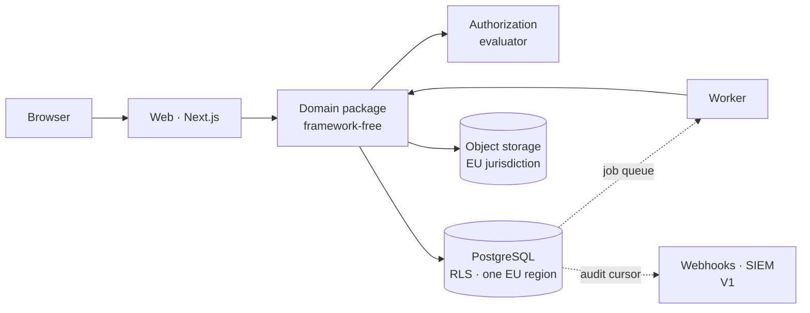

# Architecture

One page, for someone who needs to understand this system without reading the
specification.

> **Status: designed, not built.** There is no application code yet. This describes what
> Phase 2 will construct, and everything below is a commitment rather than a report. Where
> a claim depends on a vendor's behaviour, it is listed as unverified rather than
> asserted.

## What the system is

A policy operations system of record for regulated European organisations. It answers, for
any past or present instant, **which document version governed whom, under what authority,
and with what evidence.**

Architecturally that reduces to four hard problems, and the design is shaped around them:
tenant isolation, immutable released content, exactly one effective version per scope, and
an audit ledger that can be reconstructed deterministically.

## Shape

Two processes, one database, one language. A modular monolith rather than services —
INV-AUTH-001 requires exactly one authorization evaluator with no path around it, and
every service boundary is an opportunity to create a second one.

| Component | Role |
|---|---|
| **Web** | Both experiences from `information-architecture.md`: the reader path and the governance console |
| **Worker** | Effectivity transitions, reminders, campaign enrolment, evidence assembly, retention disposal |
| **Domain package** | The state machines, the evaluator and the invariants. Imports no web framework, so background jobs cannot get their own copy of the rules |
| **PostgreSQL** | The system of record, including the audit ledger and the job queue |
| **Object storage** | Controlled files and generated evidence packs, content-addressed and tenant-partitioned |

## Where the guarantees live

The specification registers 149 invariants and ranks enforcement by strength: structural,
then database constraint, then type system, then a single code path, then tests. The
design target is that **forgetting an invariant should not be sufficient to violate it.**

| Guarantee | Mechanism |
|---|---|
| No cross-tenant reference | Composite primary and foreign keys carrying `tenant_id` — the state is unrepresentable |
| No cross-tenant read | Row-level security, forced, with a transaction-scoped tenant setting |
| At most one effective version per scope | A Postgres exclusion constraint over the effective interval |
| Released content is immutable | Triggers refusing updates to governed columns past approval |
| The audit ledger is append-only | `UPDATE`, `DELETE` and `TRUNCATE` revoked from the application role |
| Deterministic evidence chronology | A gapless, commit-ordered per-tenant sequence |
| Nothing auto-approves | No code path exists. Automation reminds and escalates only |

`data-model.md` maps every level-1 and level-2 invariant to its specific mechanism, and
records the ones that could not reach that level, with reasons.

## Identity and access

- **Sessions are server-side rows**, not tokens, so deactivation is immediate rather than
  eventual.
- **One authorization evaluator**, called by every surface — UI, API, jobs, search,
  evidence assembly. An architecture test fails the build on a second data path.
- **Default deny.** Explicit deny beats any allow, regardless of specificity.
- **Time-bounded grants expire at the check**, not by a cleanup job.
- **Enterprise identity (V1)**: OIDC, SAML and SCIM. The identity provider never owns
  authorization — its groups map to product groups, and grants are made in the product and
  audited.
- **No standing operator access.** Break-glass only: justified, expiring, separately
  audited, and visible to the tenant.

## Data

| | |
|---|---|
| **Residency** | One EU region, complete — application data, object storage, backups, search, audit, evidence packs, queues, DR replicas and observability containing customer data |
| **Encryption** | In transit and at rest, by the platform. Digests are `SHA-256` with an algorithm prefix so a future change is expressible |
| **Personal data** | Deliberately minimal. No reading telemetry, no IP address or user agent on attestations by default, no session replay, no behavioural analytics |
| **Retention** | Configured by the customer per record class. The product ships defaults and never claims a statutory period |
| **Export** | Evidence packs verify against their own digests with a hash utility, without the vendor |
| **Subprocessors** | Database, object storage, transactional email, error tracking — each EU-region, each named in the buyer-readiness pack |

## What we do not claim

Stated here because a reviewer will ask, and the answers are better given than discovered.

| | |
|---|---|
| **Append-only is a contract, not cryptography** | Enforced by revoked database privileges. A superuser can grant them back. Hash chaining and signed checkpoints are a later, separate claim |
| **Evidence cannot be fabricated *invisibly*** | A tenant administrator with sufficient capability can record a governance sequence. They cannot make it appear to have happened earlier. The fabrication is itself evidence |
| **The operator is a trusted party today** | Break-glass, audit and role separation raise the bar; they do not remove the trust relationship. Independent verification of exported packs is what reduces it |
| **An acknowledgement is not a signature** | Not a qualified electronic signature under eIDAS, and never presented as one |
| **Using this product does not make a customer compliant** | It is a system of record, not a certification |

## Reading order

| Document | For |
|---|---|
| `docs/domain/invariants.md` | The 149 rules everything else serves |
| `data-model.md` | The schema, and which constraint enforces which invariant |
| `threat-model.md` | Assets, actors, abuse cases, and the accepted residual risks |
| `adr/0000` | Stack selection, and why PostgreSQL specifically |
| `adr/0001`, `adr/0003` | Tenancy and authorization — read together |
| `adr/0005`, `adr/0006` | Effectivity and the audit ledger — the two hardest guarantees |
| `machine-access.md` | Constraints for the day an integration or AI agent asks what governs someone |
| `docs/product/product-blueprint.md` | What the product is, and what it refuses to become |

### Decision record

| ADR | Decision |
|---|---|
| [0000](adr/0000-stack-selection.md) | TypeScript modular monolith, PostgreSQL, hand-written SQL migrations |
| [0001](adr/0001-tenancy-enforcement.md) | Composite keys and forced row-level security |
| [0002](adr/0002-identity-and-sessions.md) | Server-side sessions; IdP never owns authorization |
| [0003](adr/0003-authorization-evaluator.md) | One evaluator returning a reason, not a boolean |
| [0004](adr/0004-content-storage-and-canonicalisation.md) | Content-addressed objects, server-computed digests |
| [0005](adr/0005-effectivity-and-supersession.md) | Interval claimed at publication; exclusion constraint on the variant |
| [0006](adr/0006-audit-ledger-and-outbox.md) | Same-transaction ledger; gapless per-tenant sequence |
| [0007](adr/0007-job-execution.md) | At-least-once with idempotency in the domain transaction |
| [0008](adr/0008-evidence-pack-generation.md) | Resolve, assemble, publish; availability is a database fact |
| [0009](adr/0009-migrations-and-environments.md) | Forward-only SQL, no down migrations, three database roles |
| [0010](adr/0010-observability.md) | Ledger and telemetry permanently separate; no session replay |

## Unverified

Every ADR carries a *verify at repository bootstrap* list. These depend on vendor
behaviour and were written from a specification rather than from a running system:

- PostgreSQL platform: EU region, `btree_gist`, a non-owner application role, `FORCE ROW
  LEVEL SECURITY`, `REVOKE … TRUNCATE`, a separate retention role, `SET LOCAL` semantics
  through the connection pooler, `CREATE INDEX CONCURRENTLY`.
- Object storage, error tracking and transactional email: an EU-jurisdiction option for
  each, against the residency commitment.
- Transactional enqueue in the chosen job queue — the property the design rests on.
- Whether the architecture test can fail the build in the chosen tooling.

Any of these failing is a Decision Request, not a quiet substitution. They are checked in
Phase 2, where the accounts are created.
