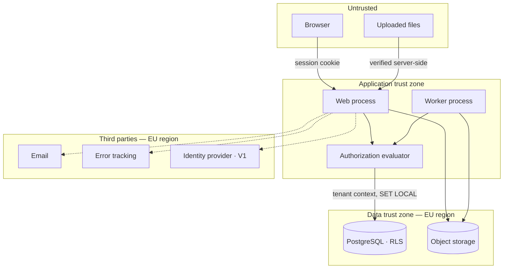

# Threat Model

What is worth attacking here, who would attack it, what stops them, and — the part most
threat models skip — **what does not**.

## Scope and purpose

This document exists to do three things: direct engineering effort at the failures that
actually matter, answer a security reviewer without a sales call, and make the residual
risks explicit enough that accepting them is a decision rather than an oversight.

It is not a penetration test, a certification, or a claim that the product is secure. It
is a statement of what has been considered.

Most of the mitigations below already exist as invariants, because the specification was
written with these attacks in mind. That makes this model's real job the opposite of the
usual one: not to enumerate defences, but to find the places where **no defence exists**
and say so.

## Assets, in order of what an attacker would want

| Asset | Why it is valuable | Worst outcome |
|---|---|---|
| **Evidence integrity** | The product's entire proposition is that its records can be trusted | An organisation's proof is fabricated, or a regulator concludes it cannot be relied upon |
| **Another tenant's data** | Competitors' policies, org charts, control gaps | The severe defect of a multi-tenant compliance product (INV-TEN-001) |
| **Attestation records** | Named employees, what each was required to do, and whether they did | Concentrated personal data, and a discipline or dismissal record by implication |
| **Unpublished draft content** | Restructurings, acquisitions, incident responses | Material non-public information leaking before it is announced |
| **Sensitive documents** | Investigation procedures, conflict-of-interest cases | The reason explicit deny exists (INV-AUTH-002) |
| **Evidence packs** | All of the above, in one downloadable file | The highest-value single object in the system (INV-EVD-008, INV-EVD-010) |
| **Availability** | Attestation deadlines, approval workflows, audit responses | Disruptive, and rarely the attacker's goal here |

Availability is last deliberately. For most SaaS it is the top risk; for a system of
record, being *wrong* is worse than being *down*. A product that is unavailable for four
hours is an incident. A product that confidently reports the wrong effective version is a
liability.

## Actors

| Actor | Capability | Motivation |
|---|---|---|
| **Unauthenticated internet** | Public surfaces only | Opportunistic |
| **Authenticated employee** | Reader capabilities in one tenant | Curiosity, or seeing what a policy says about them before it is published |
| **Malicious tenant administrator** | Broad capability within their tenant | Concealing a control gap by fabricating approvals or reviews |
| **Departing employee** | Whatever they held until deactivation | Taking records with them |
| **External auditor** | Deliberately narrow, temporary access | Overreach beyond what was granted |
| **Compromised account** | Whatever the victim held | Anything the victim could do |
| **Another tenant** | Full capability in their own tenant, identifiers possibly guessed | Competitive intelligence |
| **Us — the operator** | Database access, deployment access | Included as a first-class adversary. See below |
| **An agent writing our code** | Whatever passes CI and review | Not malicious. Wrong in plausible ways, at volume |

The last two are unusual to list, and both are real.

## Trust boundaries

| Boundary | Assumption |
|---|---|
| Browser → application | Nothing from the client is trusted, including digests, tenant identifiers and scope claims |
| Uploaded file → extraction | **Actively hostile input.** Parsed by libraries with a history of vulnerabilities |
| Application → database | The application role is not an owner, cannot bypass RLS, and cannot update or delete append-only tables (`ADR-0001`, `ADR-0009`) |
| Tenant → tenant | The hard boundary. Composite keys, RLS, not-found responses |
| Application → third parties | Data minimised before it crosses. Allowlist logging, no content in email |
| Operator → customer data | Currently a trust relationship, not a technical control. See residual risks |
| Agent → repository | CI is the gate. No AI in the required-check path (`AGENTS.md`) |

---

## The three that matter

### 1. Cross-tenant access

The most severe possible defect, and the one with the most defence in depth.

| Attack | What stops it |
|---|---|
| Guessing another tenant's document identifier | RLS filters the row; the response is not-found, with no timing or count difference (INV-TEN-002, INV-TEN-005) |
| A query missing its tenant predicate | RLS supplies it. The forgotten `WHERE` returns nothing rather than everything (`ADR-0001`) |
| A background job without a tenant context | Cannot open a transaction at all — the helper requires one (INV-TEN-004) |
| Writing a cross-tenant foreign key | Structurally impossible: composite keys make the state unrepresentable (INV-TEN-003) |
| A pooled connection retaining a previous tenant's setting | `SET LOCAL`, scoped to the transaction, never the session |
| Search returning another tenant's document | Authorization at retrieval, never index filtering (INV-AUTH-011) |
| Inferring existence from counts, facets or timing | INV-AUTH-012, INV-TEN-005 |
| Deduplicated object storage revealing a file's existence by digest | Deduplication stops at the tenant boundary, deliberately (`ADR-0004`) |

**Residual:** a defect in the RLS policy definition itself, or a migration that adds a
table and forgets to enable RLS. The mitigation is CI — a test asserting that every table
with a `tenant_id` column has RLS enabled and forced, which is cheap and should exist from
the first migration.

### 2. Fabricated evidence

The threat the product's value depends on, and the one where honesty matters most.

The realistic attacker is **a tenant administrator concealing a control gap**: an auditor
asks for the approval of a policy that was never properly approved, and the administrator
would like one to exist.

| Attack | What stops it |
|---|---|
| Editing an approved version's content | No code path exists; a trigger refuses the update (INV-VER-003) |
| Altering a recorded decision | `revoke update, delete` — corrections are compensating events (INV-APR-007) |
| Deleting an inconvenient audit event | `revoke update, delete, truncate` from the application role (INV-AUD-002) |
| Backdating a board resolution | A resolution date before the revision's submission is refused (INV-APR-022) |
| Claiming a body approved when a person clicked | The body and the recorder are separate columns, both required (INV-APR-021) |
| Reclassifying a material change to avoid re-attestation | Elevated capability and a recorded reason (INV-VER-015) |
| Weakening a control, then complying with the weaker rule | The configuration version in force is recorded with every action, so the old rule and the moment it changed both remain (INV-CFG-003, INV-CFG-005) |
| Quietly removing a mandated approver | `document_type.changed` and `configuration.weakened` events (INV-CFG-004) |
| Backdating an effective date | Elevated capability, a recorded reason, and a warning about the consequences (INV-EFF-009) |

**Residual, and it should be stated plainly:** a tenant administrator with sufficient
capability *can* create a document, approve it, and set it effective in the past. What
they cannot do is make that sequence look like it happened last year. Every step is an
event, in order, with an actor and a configuration version.

The claim is therefore **not** "evidence cannot be fabricated". It is: *evidence cannot be
fabricated invisibly, and the fabrication is itself evidence.* Marketing the stronger
claim would be false, and an auditor would find out.

### 3. Privilege elevation

| Attack | What stops it |
|---|---|
| A surface that answers authorization itself | One evaluator, plus an architecture test that fails the build on a second path (`ADR-0003`) |
| Reaching data without a principal | Repository functions require a context; nothing else holds a connection |
| A narrow grant used to browse ancestors | Direct grants expose their target only (INV-AUTH-008) |
| An expired grant surviving in a session | Expiry is evaluated at check time; sessions are server-side rows (INV-AUTH-003, `ADR-0002`) |
| Delegating a task to gain a capability | Delegation moves a task, never a capability (INV-APR-014) |
| Adding oneself to an IdP group to gain approval rights | IdP groups map to product groups; grants are made in the product and audited (`ADR-0002`) |
| Applicability used as an access path | Applicability never implies access (INV-AUTH-005) |
| Campaign targeting used to obtain a document | Preflight fails; nobody is granted access to resolve it (INV-AUTH-006, INV-AUTH-007) |
| Evidence generation used to read beyond scope | Every record checked with the requester's principal (INV-EVD-010) |
| Standing operator access | Break-glass only: justified, expiring, separately audited, and visible to the tenant (INV-AUTH-013) |

**Residual:** a capability granted too broadly by a customer's own administrator. That is
the customer's decision to make, and the product's job is to make it visible — which is
what the grant audit trail and the access-review views are for.

---

## Other categories

### Hostile uploaded content

The most under-appreciated surface, because the product invites customers to upload
arbitrary files and then parses them.

| Attack | Status |
|---|---|
| Malware distributed through the register | **Accepted risk in the Pilot** (`ADR-0004`), with compensating controls: authenticated upload requiring `document.edit_draft`, `Content-Disposition: attachment`, served off-origin. Scanning is a Decision Request |
| A crafted `.docx` exploiting the extraction library | Extraction runs in the worker, not the web process, with time and memory limits and no network access. The library is a dependency with an update cadence, not a trusted component |
| Zip bombs and decompression exhaustion | Size limits before extraction; extraction is resource-capped |
| XXE or entity expansion in document XML | Extraction configured with external entities disabled — a configuration to assert in a test, not to assume |
| Content that renders as active markup | Content is never rendered into the application's own origin |
| A file whose digest the client controls | Digests are computed server-side, always (`ADR-0004`) |

Extraction deserves emphasis: it is the one place the product deliberately parses hostile
input in depth, and it exists only to serve comparison and materiality warnings. That it
runs in the worker rather than the request path is a deliberate blast-radius decision.

### Prompt injection

Agents write this product's code, and the product handles documents whose text is written
by customers and possibly by their adversaries.

The structural mitigation is already a product rule: **no runtime LLM in any domain
operation** (`AGENTS.md` rule 6). Document content never reaches a model in production, so
there is no runtime prompt-injection surface. That rule was adopted for cost and
determinism; its security value is a genuine side benefit.

What remains is development-time. An agent reading a customer document — during a support
investigation, or a migration — could be influenced by text inside it. The mitigations are
that agents work from the repository rather than from production data, and that CI, not an
agent's judgement, decides what merges.

There is a third case, and it belongs to the customer rather than to us. Where an
organisation connects its own assistant to this product through the API, our documents
reach their model. That surface is theirs, and the honest boundary is: we control which
records a principal may retrieve (INV-AUTH-010, INV-AUTH-018) and we return the version
identity and digest behind every answer, so what their model was given is reconstructable.
We do not control what their model then does with it, and no claim to the contrary should
ever be made. See `machine-access.md`.

### Agent-introduced defects

Not an attacker, but the same effect: plausible-looking code with a subtle authorization
gap, at volume.

| Mitigation | Where |
|---|---|
| Invariants enforced by the database rather than by code | The enforcement ladder, and the data model's map |
| An architecture test failing the build on a second data path | `ADR-0003` |
| Tenant-isolation and authorization-matrix suites blocking every PR | The CI gate list |
| Review against the specification, not against style | `CLAUDE.md` |
| Reviewer never the implementer | `AGENTS.md` |
| Dependency review, secret scanning, static analysis | The CI gate list |

This is the reason so much of the specification pushes enforcement into schema
constraints. An agent that forgets an invariant should be unable to violate it.

### Data exfiltration through legitimate features

| Vector | Control |
|---|---|
| Evidence packs | Bounded by the requester's capabilities, expiring links enforced at retrieval, every request and download audited (INV-EVD-005, INV-EVD-008, INV-EVD-010) |
| Bulk export | Same evaluator, audited as `export.generated` |
| Audit export | `audit.exported` is itself an event |
| Email notifications | Content is not embedded in email — a link and a reason only |
| Webhooks (V1) | Scoped like any principal; payloads carry identifiers, not content |
| A departing employee downloading before notice | Deactivation is immediate on the next check; detection is the audit trail, not prevention |

### Availability and integrity of scheduled work

Distinctive to this product, because a stalled job does not look like an outage.

| Failure | Consequence | Control |
|---|---|---|
| Effectivity job stops | The register misdescribes reality; **resolution stays correct** because it reads the range | Alert on transition delay (`ADR-0005`, `ADR-0010`) |
| Review scheduling stops | Missed reviews nobody knows are missed | Alert on dead-lettered governance jobs |
| Audit sequence gap | The gaplessness property evidence packs advertise stops being true | Highest-severity alert (`ADR-0006`) |
| Queue backlog | Reminders late, deadlines missed | Queue age thresholds |

### Backup and restore

A restore rolls back the gapless per-tenant sequence, and could resurrect withdrawn
content or reverse a disposal performed under retention rules.

A restore is therefore a **governed operation**, not an infrastructure one: it requires a
recorded reason, it emits an event once the system is back, and any divergence between the
restored state and events delivered to external consumers is reconciled explicitly. This
is written down here because it is exactly the procedure nobody writes until they need it.

### Authentication

| Attack | Control |
|---|---|
| Credential stuffing | Rate limiting and lockout; breached-password check where feasible (`ADR-0002`) |
| Session theft | `HttpOnly`, `Secure`, `SameSite`, host-scoped; tokens stored hashed |
| Session fixation | New session identifier on authentication |
| Token replay after deactivation | Server-side sessions, deleted on deactivation (INV-AUTH-014) |
| Password database disclosure | Argon2id with measured parameters |
| MFA bypass | Not applicable in the Pilot — no MFA. V1 delegates to the customer's IdP |

**Residual for the Pilot: no MFA on local accounts.** Acceptable while the Pilot has a
handful of named users and no production customer data; not acceptable at general
availability, where SSO carries it.

---

## Residual risks, accepted

The list this document exists for.

| Risk | Why accepted | What would change it |
|---|---|---|
| **The operator can read and, with database access, alter customer data** | An unavoidable property of hosted software without cryptographic provenance. Break-glass, audit and role separation raise the bar and do not eliminate it | Signed audit checkpoints or external anchoring — the "advanced cryptographic provenance" item in the Later backlog. This is the honest answer to *"what stops you fabricating our evidence?"*, and the answer today is *"our controls and your ability to export and verify independently"* |
| **Append-only is a contract, not cryptography** | Enforced by revoked privileges, which a database superuser can grant back | Hash chaining or signed checkpoints. The glossary already forbids marketing this as cryptographic immutability |
| **No malware scanning in the Pilot** | Every option costs money; compensating controls are in place (`ADR-0004`) | A design partner importing a real estate. It is a Decision Request already |
| **No MFA on local accounts in the Pilot** | Small named user set, no production customer data | The first real customer, or SSO arriving in V1 |
| **Single region, single provider** | Free tier, one EU region, complete (decision 7) | A customer requiring physical separation or multi-region resilience — a Decision Request |
| **A tenant administrator can fabricate a governance sequence** | Inherent: someone must be able to record decisions. It cannot be done invisibly | Nothing, and the honest framing is what matters |
| **Text extraction parses hostile input** | Required by comparison and materiality warnings, isolated in the worker | A sandbox with stronger isolation if a real exploit appears |
| **Most code is written by agents** | The premise of the project; mitigated by making invariants unbreakable rather than remembered | Sustained evidence that the CI gates miss a class of defect |

## What is not modelled here

- **Physical and platform security** — inherited from the hosting providers, and stated in
  the buyer-readiness pack rather than re-derived.
- **Denial of service beyond application limits** — rate limiting and resource caps are in
  scope; volumetric attacks are the provider's layer.
- **Supply-chain compromise of a dependency** — dependency review, lockfiles and secret
  scanning are in the CI gate list; a deliberate upstream compromise is not something this
  model claims to defeat.
- **Legal compulsion** — a transparency question, not a technical one.

## Review triggers

This model is re-examined when any of these happens, rather than on a calendar:

- the first production customer with real data;
- SSO, SCIM or the public API shipping — each adds a trust boundary;
- any runtime AI dependency being proposed, which would reintroduce prompt injection as a
  production surface;
- a second region, a second provider, or a subprocessor;
- an actual incident.
