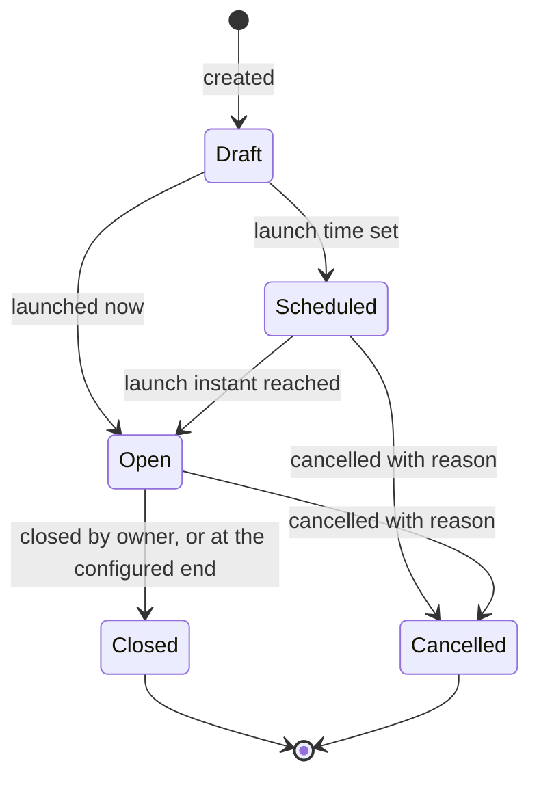

# Attestation Model

Distribution with proof. A campaign takes one exact version, resolves who must acknowledge
it, and records what each of them did.

Two things attestation is not, stated first because both are routinely oversold in this
category:

- **Not a signature.** An acknowledgement is not a qualified electronic signature under
  eIDAS, and the product does not present it as one. The glossary forbids the word *sign*
  for this reason. Customers who need qualified signatures need a different instrument,
  and saying so is more valuable than implying otherwise.
- **Not proof of understanding.** It is evidence that a named person was presented with an
  exact text and performed the configured acknowledgement. Knowledge checks are a separate
  feature and a separate claim.

## A campaign binds a version, never a document

> **INV-ATT-001 — A campaign binds exactly one Document Version, never a Document or "the
> latest".**

If a campaign pointed at a Document, the meaning of every response in it would change the
next time the document was revised, and nobody could state what any individual actually
acknowledged. The binding is to a version identifier and its content digest.

## Campaign lifecycle

| Field | Purpose |
|---|---|
| `document_version_id` | The exact version. Fixed at creation and never changed |
| `audience_definition`, `audience_mode` | Who is targeted, and how the population is resolved |
| `attestation_statement_id` | The exact statement version presented |
| `launch_at`, `due_at`, `closed_at` | Chronology |
| `reminder_offsets`, `escalation_rule` | Operational automation |
| `owner_user_id`, `origin_reason` | Accountability, and why the campaign exists — a first publication, a material change, an emergency |

### Preflight

> **INV-AUTH-007 — A campaign cannot launch while any target lacks access to the exact
> Version. Preflight fails.**

Launching resolves the audience and checks, for every resolved principal, that they can
read the version. Where any cannot, the launch is refused and the failing assignments are
listed.

The resolution is to fix the targeting or grant access deliberately. It is never to grant
access implicitly as a side effect of launching, because that turns a mis-typed audience
rule into a disclosure event (INV-AUTH-006).

## Audience modes

| Mode | Population | Phase |
|---|---|---|
| `SNAPSHOT` | Resolved once, at launch. Later joiners are not added | MVP |
| `DYNAMIC` | Continuously evaluated during an enrolment window. Qualifying joiners receive an assignment | V1 |

Snapshot is the Pilot's mode because its evidence is trivially explainable: *these are the
people who were in scope on the day this launched, and here is what each did.* Dynamic
campaigns answer the joiner problem — everyone entering Payments Operations must
acknowledge the current mandatory set — and need an explicit enrolment window so that the
obligation cannot silently persist for years.

> **INV-ATT-006 — Changing departments or groups never rewrites an existing snapshot
> campaign's assignments.**

Snapshot means snapshot. Somebody who moves out of scope keeps the obligation they were
given; somebody who moves in does not acquire one retroactively. Both facts remain
inspectable.

> **INV-ATT-004 — Each assignment retains why the principal was targeted — entity, org
> unit, role, group or explicit.**

Auditors ask how an audience was derived. A list of user identifiers cannot answer that
question a year later, once the org chart has moved.

> **INV-ATT-012 — A principal holds at most one assignment per campaign.**

Someone caught by three separate clauses of an audience rule has one obligation, not
three.

## Assignment

| State | Meaning |
|---|---|
| `PENDING` | Outstanding |
| `COMPLETED` | Acknowledged on or before the due instant |
| `COMPLETED_LATE` | Acknowledged after the due instant |
| `DECLINED` | The principal explicitly refused to acknowledge |
| `EXEMPTED` | An authorised exemption was recorded |
| `CANCELLED_DEPARTURE` | The principal left before completing |
| `CANCELLED_CAMPAIGN` | The campaign was cancelled |

`DUE_SOON` and `OVERDUE` are **derived** from `due_at` and the current instant, not
stored. They drive reminders and dashboards; they are not facts about the assignment that
could drift out of step with its deadline. This follows the same discipline as `Scheduled`
on a version and `Due` on a review case — see `consolidation-notes.md`.

### Lateness is frozen at the moment of response

> **INV-ATT-003 — A response after the due instant is recorded as `COMPLETED_LATE` and
> never rewritten as on-time.**

> **INV-ATT-011 — Extending a campaign's due date never rewrites an outcome already
> recorded.**

Deadline extensions are a legitimate operational act — a campaign launched over a holiday
period, an outage on the last day. What they must never do is retroactively convert people
who were late into people who were on time. Lateness is evaluated once, against the
deadline that applied when the person answered, and stored.

This is why `COMPLETED_LATE` is a stored outcome rather than a derived comparison: the
comparison's inputs can legitimately change afterwards, and the fact must not.

### Declines and exemptions

A decline is a governance fact, not an absence of one. Someone refusing to acknowledge a
code of conduct is information the organisation needs immediately, and it is materially
different from someone who has not got round to it.

| | Decline | Exemption |
|---|---|---|
| Who records it | The principal | An authorised administrator |
| Requires a reason | Yes | Yes |
| Effect on the obligation | Unmet, and escalated to the campaign owner | Discharged, with an expiry |
| Appears in evidence | As a decline with its reason | As an exemption with its authority, reason and expiry |

Exemption is never self-service, and never permanent by default.

## Response — the evidence

> **INV-ATT-002 — A response records the exact Version, its content digest, the statement
> wording and version presented, the responder and the timestamp.**

| Recorded | Why |
|---|---|
| `document_version_id` and `content_digest` | Exactly what text was acknowledged, verifiable years later |
| `attestation_statement_id` | Exactly what wording they agreed to. "I acknowledge I have read" and "I confirm I will comply" are different statements |
| `locale_presented` | Which language they read it in |
| `responder_user_id`, `responded_at` | Who and when |
| `response_type` | Acknowledged or declined |
| `session_assurance` | Authentication assurance, where the tenant configures it |

Deliberately **not** recorded by default: IP address, user agent, device fingerprint, time
spent reading, scroll depth. Products in this category collect these because auditors
*might* ask. That is not a lawful basis, and a compliance product that becomes an employee
surveillance system has failed its own principles. A tenant with a documented need can
enable network metadata; the default is off.

> **INV-ATT-007 — Responses are append-only. A correction adds evidence rather than
> overwriting it.**

> **INV-AUD-003 — Audit events never contain document bodies, arbitrary form payloads or
> unnecessary personal data.**

## Departure and lifecycle

> **INV-ATT-005 — Departure cancels outstanding obligations without deleting completed
> responses or the record that the obligation existed.**

When someone leaves, their outstanding assignments become `CANCELLED_DEPARTURE`. They are
not deleted, because *"we required this person to acknowledge the AML policy and they had
not done so when they left"* is exactly the kind of fact an investigation asks about.
Completed responses are untouched.

## Re-attestation

> **INV-ATT-008 — A new campaign never alters an earlier campaign, nor implies earlier
> readers acknowledged the new text.**

> **INV-ATT-009 — Material changes generate re-attestation for the affected audience
> only.**

| Change | Default |
|---|---|
| `EDITORIAL` | No re-attestation |
| `NON_MATERIAL` | None unless configured |
| `MATERIAL` | New campaign for the affected audience |
| `EMERGENCY` | New campaign, accelerated deadline |
| A replacement variant affecting one country | That country's population only |
| A translation corrected with no normative change | No new attestation |

Defaults are configuration; the class definitions are not. An administrator may override a
default, with a justification that is recorded.

The second invariant is a product-quality rule as much as a governance one. Re-attesting
the entire organisation for every change is the fastest way to make acknowledgement
meaningless: people click through eleven documents in a morning and remember none of them.
Compliance fatigue is a real failure mode, and targeting is the mitigation.

> **INV-ATT-010 — Duplicate notification delivery never produces duplicate assignments or
> duplicate governance transitions.**

Email is at-least-once. Obligations are exactly-once.

## What attestation never does

| Never | Instead |
|---|---|
| Grants access to the version it targets | Preflight fails and the campaign does not launch (INV-AUTH-006, INV-AUTH-007) |
| Implies applicability | Applicability is resolved separately, and someone can be governed without being asked to attest |
| Establishes understanding or consent to terms | It records that a named person acknowledged an exact text |
| Rewrites an earlier campaign's results | A new campaign is a new fact (INV-ATT-008) |
| Completes on someone's behalf | Not on departure, not on manager approval, not on timeout. There is no automatic acknowledgement, for the same reason there is no automatic approval |
