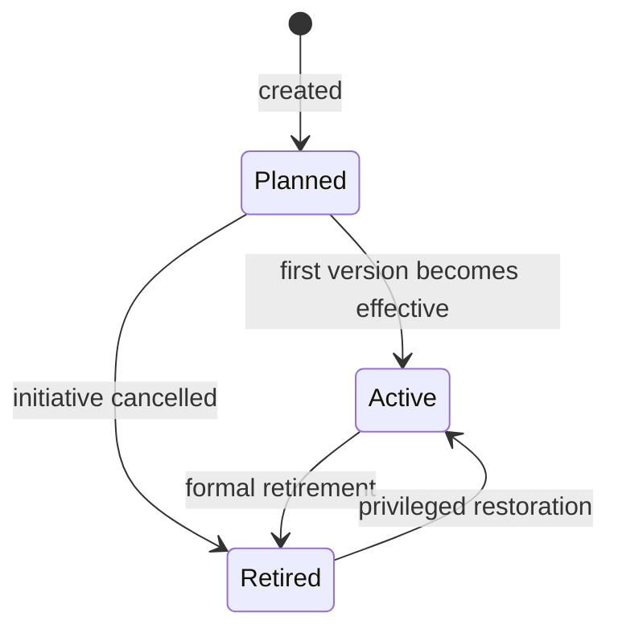
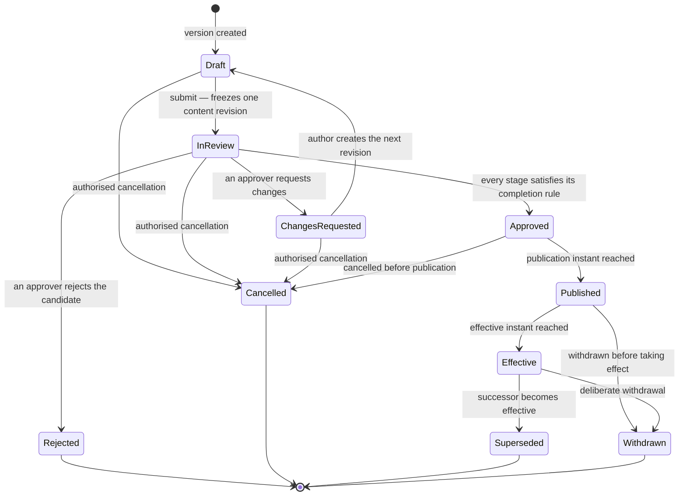

# Document Lifecycle

Two state machines, deliberately unequal. `Document` is boring on purpose: it holds
identity and accountability, and it has three states. `DocumentVersion` carries every
governance transition that matters.

Conflating them is the most common modelling error in this category, and it is what makes
a system unable to answer *"what applied on 14 February 2027"* — because the answer lives
on a version, and a document that carries workflow state has already lost it.

> **INV-DOC-002 — Document lifecycle is only `Planned → Active → Retired`. Draft, review
> and approval states belong to versions.**

## `Document`

| From | To | Trigger | Capability | Guards | Audit event |
|---|---|---|---|---|---|
| — | `Planned` | Document created | `document.create` | Unique `document_code` within tenant; a `DocumentType` is assigned; a `BASELINE` variant is created with it | `document.created` |
| `Planned` | `Active` | A version of any of its variants becomes Effective | — derived, never set by hand | Transition is a consequence of `version.effective`, in the same transaction | `document.activated` |
| `Planned` | `Retired` | Initiative cancelled before anything took effect | `document.retire` | Reason required | `document.retired` |
| `Active` | `Retired` | Formal retirement | `document.retire` | **No version of any variant may be Effective.** Each must first be withdrawn or superseded, as a deliberate act | `document.retired` |
| `Retired` | `Active` | Privileged restoration | `document.restore` | Creates a new controlled version. Never reactivates a historical one | `document.restored` |

> **INV-DOC-007 — A Document becomes Active only by derivation, when a version of it first
> becomes Effective. The transition is never set directly.**

> **INV-DOC-008 — A Document cannot be Retired while any of its versions is Effective.**

The second rule exists because retirement must not be a quiet way to end a policy. Ending
what governs people is `version.withdrawn` — an act with a reason, an actor and, where no
successor exists, a `governance.policy_gap` event (INV-EFF-005). Retiring the Document afterwards is
bookkeeping.

> **INV-DOC-003 — Restoring a retired Document never reactivates a historical version; it
> requires a new controlled version.**

## `DocumentVersion`

Ten states, four of them terminal. There is no `Scheduled` state and no `Archived` state;
both are explained under [Conditions that are not
states](#conditions-that-are-not-states).

### Transition table

| # | From | To | Trigger | Capability | Guards | Audit event |
|---:|---|---|---|---|---|---|
| 1 | — | `Draft` | A version is created, whether the first or a successor | `document.edit_draft` | No other pre-release version exists for this variant (INV-VER-012). `version_sequence` is assigned and never reused | `version.created` |
| 2 | `Draft` | `InReview` | Author submits | `document.submit` | Exactly one content revision is frozen with its digest and attachments (INV-VER-002). Materiality is classified by a human (INV-VER-014). Applicability is set. The resolved workflow satisfies the type's mandated authority (INV-APR-020) | `version.submitted`, `approval_run.started` |
| 3 | `InReview` | `ChangesRequested` | An approver records `REQUEST_CHANGES` | `document.approve` at the resolved task | The run terminates and the submission snapshot dies with it (INV-APR-003) | `approval.changes_requested` |
| 4 | `ChangesRequested` | `Draft` | Author creates the next content revision | `document.edit_draft` | The frozen revision stays immutable; editing produces a new one (INV-VER-010) | `content_revision.created` |
| 5 | `InReview` | `Approved` | Every stage has satisfied its completion rule | — derived from the final decision | Serial ordering held (INV-APR-008). The completion threshold is satisfied exactly once (INV-APR-009) | `version.approved` |
| 6 | `InReview` | `Rejected` | An approver records `REJECT` | `document.approve` at the resolved task | Reason required where configured. **Terminal** — continuing requires a new version, deliberately created | `approval.rejected`, `version.rejected` |
| 7 | `Draft`, `InReview`, `ChangesRequested`, `Approved` | `Cancelled` | Authorised cancellation | `document.cancel_version` | Reason required. An active run is cancelled with it | `version.cancelled` |
| 8 | `Approved` | `Published` | Publication instant reached, or published immediately | `document.publish` | Visible to those permitted to see it, and **not yet normative** (INV-EFF-001) | `version.published` |
| 9 | `Published` | `Effective` | Effective instant reached | — scheduler, or the publishing transaction | Not withdrawn or cancelled, checked transactionally (INV-EFF-008). Exactly one event however many times the scheduler fires (INV-EFF-007). The predecessor's interval closes in the same transaction (INV-EFF-003) | `version.effective`, and `version.superseded` for the predecessor |
| 10 | `Published` | `Withdrawn` | Withdrawn before taking effect | `document.withdraw` | Reason required. The version never becomes effective, including under a race with the scheduler | `version.withdrawn` |
| 11 | `Effective` | `Superseded` | A successor becomes effective | — derived from transition 9 | Atomic with the successor's transition. No gap, no overlap | `version.superseded` |
| 12 | `Effective` | `Withdrawn` | Deliberate withdrawal from effect | `document.withdraw` | Reason required. No predecessor is resurrected (INV-EFF-004). If no other version is effective for the scope, a high-severity `governance.policy_gap` event is emitted (INV-EFF-005) | `version.withdrawn`, possibly `governance.policy_gap` |

Transitions 8 and 9 always occur in that order, even when a version is approved and made
effective in one operation. The sequence `APPROVED → PUBLISHED → EFFECTIVE` is recorded in
full inside a single transaction rather than short-circuited, because evidence must be
able to state when a version became visible and when it became binding, and those are
different facts even when they share a timestamp.

### What each state permits

| State | Normative content editable | Visible to readers | Normative | Can carry approval decisions |
|---|:---:|:---:|:---:|:---:|
| `Draft` | yes | no | no | no |
| `InReview` | **no** | no | no | yes |
| `ChangesRequested` | only by returning to `Draft` | no | no | no — the run has ended |
| `Approved` | no | governance roles only | no | no |
| `Published` | no | yes, where access permits | **not until the effective instant** | no |
| `Effective` | **no** | yes | **yes** | no |
| `Superseded` | no | historical access only | no | no |
| `Withdrawn` | no | historical access only | no | no |
| `Rejected` | no | governance roles only | no | historically, yes |
| `Cancelled` | no | governance roles only | no | historically, yes |

> **INV-VER-004 — Content is not editable while an Approval Run is active.**

This is the SharePoint failure mode stated as a rule: in a document library, editing an
item under approval silently cancels the approval. Here, the edit is refused. The
difference matters because a silently cancelled approval looks exactly like an approval
that never happened, and neither the author nor the approver is told.

### Request changes, reject, and cancel

Three ways for a candidate to stop moving, and they are not interchangeable.

| Outcome | Who | What happens to the candidate | What happens to the version |
|---|---|---|---|
| **Request changes** | An approver, mid-run | The submission snapshot is terminated. Prior decisions remain visible as history and never carry over to the next run (INV-APR-004) | Returns to drafting. The same version continues, with a new content revision |
| **Reject** | An approver, mid-run | The candidate is terminated | The version is terminal. Continuing requires deliberately creating a new one |
| **Cancel** | The owner or an administrator | Any active run is cancelled with a reason | The version is terminal |

Requesting changes is *iterative*: the work is expected to come back. Rejection is a
*decision*: this candidate should not proceed, and restarting is a deliberate act rather
than a continuation. Collapsing them — as several products in the category do — loses a
governance distinction that regulated customers actually use.

### Conditions that are not states

| Condition | How it is derived | Why not a state |
|---|---|---|
| **Scheduled** | `Published` and `effective_from > now` | Duplicates information already in the timestamp, and adds a transition that can disagree with it |
| **Archived** | A retention disposition recorded separately, with its own instant and access consequences | A superseded version stays superseded permanently. Overwriting that with `Archived` would make evidence say the wrong thing about how the version ended |
| **Current** | The version whose effective interval contains the instant, for the resolved scope | A mutable `is_current` flag drifts, and cannot answer historical questions at all (INV-EFF-006) |
| **Overdue for review** | A `ReviewCase` past its `due_at` | Review health is a property of the review, not of the version. An overdue review never changes which version is effective (INV-REV-001) |

### Transitions that do not exist

Stating these explicitly, because each is a plausible-looking shortcut that would break
something specific.

| Tempting transition | Why it does not exist |
|---|---|
| `Effective → Draft` | Released content is immutable. A change is a new version (INV-VER-003) |
| `Withdrawn → Effective` | Withdrawal is deliberate. Re-establishing the same text requires a new controlled version, approved again |
| `Superseded → Effective` | Nothing resurrects a predecessor — not withdrawal of the successor, not an error, not a rollback (INV-EFF-004) |
| `Rejected → Draft` | Rejection terminates the candidate. Restarting is deliberate, and visible as such |
| `Approved → Effective` | Publication is a distinct, recorded step even when it is instantaneous (INV-EFF-001) |
| `InReview → Draft` without a decision | The only exits from review are a recorded decision or an authorised cancellation. Silent withdrawal from review would leave approvers wondering what happened to what they were reading |
| Any transition out of a terminal state | Terminal means terminal. The register shows history; it does not rewrite it |

## Concurrency, scheduling and time

Effectivity is the only transition driven by the clock rather than by a person, which
makes it the one most exposed to the classic failure modes.

| Situation | Required behaviour | Invariant |
|---|---|---|
| The scheduler fires twice for the same version | Exactly one `version.effective` event; the second attempt is a no-op | INV-EFF-007 |
| A version is withdrawn seconds before its effective instant | The scheduler checks authoritative state inside the transaction. The withdrawn version never becomes effective | INV-EFF-008 |
| Two versions race to become effective for the same scope | Optimistic concurrency means one succeeds and one conflicts. Never both | INV-EFF-002, INV-TIME-003 |
| Supersession | Successor becomes effective and predecessor's interval closes in one transaction. A gap and an overlap are both governance failures | INV-EFF-003 |
| An effective instant falls in a DST transition | Instants are UTC. Local-time display is a presentation concern, and scheduled transitions are tested across DST boundaries | INV-TIME-001, INV-TIME-002 |
| An effective date is set in the past | Elevated capability and a recorded reason. Backdating rewrites who was governed when, and the system must make that visible rather than convenient | INV-EFF-009 |
| A reader has an old page open when a successor takes effect | The next resolution returns the new effective version. An attestation already in progress stays bound to the version that was presented | INV-ATT-002 |

## Lifecycle and evidence

Every transition in both tables emits exactly one canonical audit event (INV-AUD-001),
carrying the actor, the instant in UTC, the outcome and the configuration version in force
(INV-CFG-003). The chain of those events is what an evidence pack reconstructs; a
transition that happens without one is a change nobody can prove.

The reverse also holds and is worth stating: an event without its state change is equally
useless. Both are emitted in the same transaction, or through an outbox that guarantees
eventual emission (INV-AUD-004).
