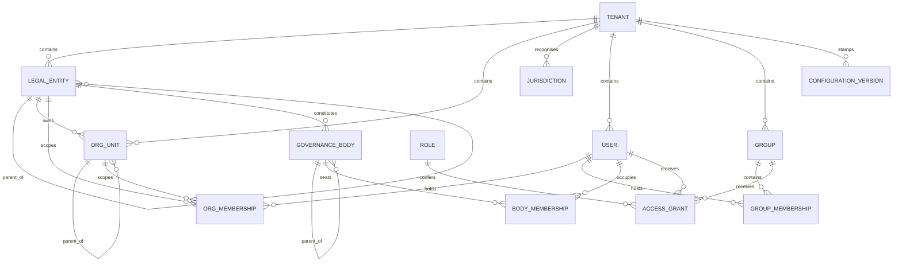
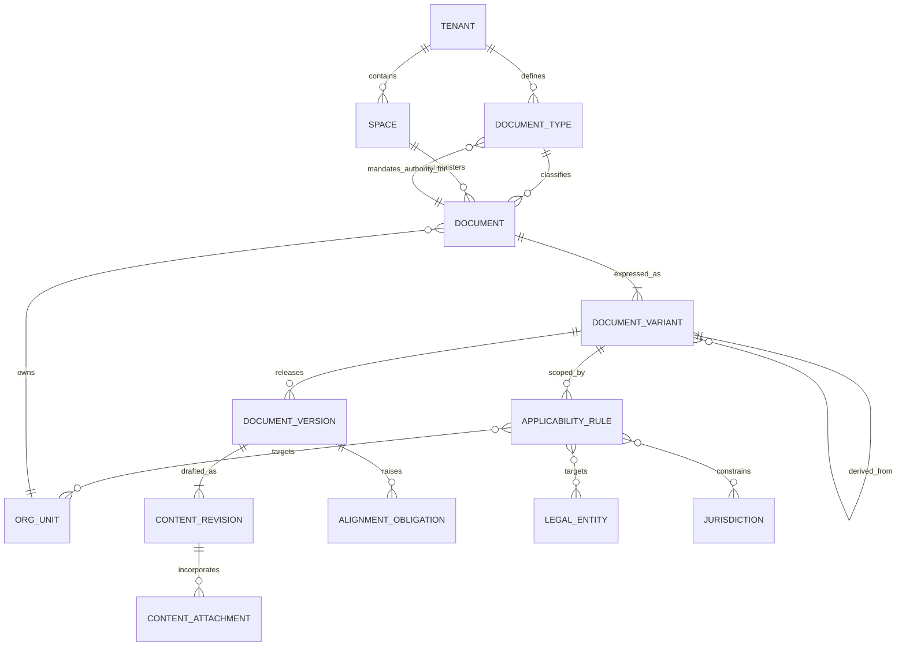
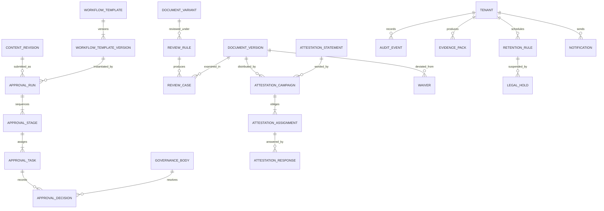

# Domain Model

The consolidated entity model. Every concept the specification relies on appears here
once, with its attributes, its relationships and the invariants that constrain it.

This model is **storage-agnostic**. It names entities, not tables; attributes, not
columns. Phase 1 turns it into a physical data model, and that is where questions of
normalisation, partitioning, indexing and polymorphic keys are settled. Nothing here
should be read as a schema.

Read `glossary.md` first — the terms used below are defined there and are not redefined.

## How to read this

Each entity block gives its purpose, its attributes, the invariants that govern it, and
the phase in which it must exist. Attributes are the ones the domain depends on;
housekeeping columns that every record needs are covered once, in [Cross-cutting
structure](#cross-cutting-structure), rather than repeated forty times.

| Phase | Meaning |
|---|---|
| **MVP** | Must exist and behave correctly in the Pilot |
| **V1** | Commercial V1. Where the entity exists in the MVP schema with reduced behaviour, that is stated. |
| **Later** | Modelled so the schema does not have to be retrofitted. Not built. |

An entity marked V1 whose *identity* is needed earlier says so explicitly. The rule
throughout: introduce the concept early enough that the migration is cheap, and the
behaviour late enough that the Pilot ships.

## Shape at a glance

Three diagrams rather than one, because the model has three distinct halves and a single
diagram of forty entities is decoration rather than documentation.

**Who and where — identity, organisation, authority.**

**What is governed — taxonomy, identity, content.**

**What happens to it — approval, review, distribution, proof.**

---

## Tenancy and identity

### `Tenant` — MVP

One customer organisation, and the hard security and data-isolation boundary.

| Attribute | Purpose |
|---|---|
| `id` | Opaque identity. Never derived from the customer's name or domain. |
| `name`, `status` | Display and lifecycle (`ACTIVE`, `SUSPENDED`, `CLOSED`) |
| `default_timezone` | Presentation and deadline calculation default. Never authoritative storage. |
| `default_locale` | Presentation default for readers with no preference |
| `residency_profile` | Which data-residency commitment applies to this tenant |
| `governance_profile_code` | The profile whose configuration was **copied** at onboarding, recorded for provenance only |

**Rules:** INV-TEN-001…005, INV-CFG-002. The tenant is the root of every tenant-owned
record; `governance_profile_code` is a historical fact, not a live link.

### `User` — MVP

A human principal within exactly one tenant.

| Attribute | Purpose |
|---|---|
| `id` | Opaque identity, stable across name changes and re-employment |
| `external_identity_id` | Subject identifier from the identity provider, where SSO is in use (V1) |
| `display_name`, `contact_email` | Presentation and notification |
| `status` | `INVITED`, `ACTIVE`, `DEACTIVATED` |
| `locale`, `timezone` | Presentation preferences |
| `deactivated_at` | When authority ended. Historical attribution survives it. |

**Rules:** INV-AUTH-014, INV-ATT-005, INV-RET-004. A user is never deleted while any
governed record attributes an action to them; erasure obligations are met by
pseudonymisation that preserves chronology.

### `Group` and `GroupMembership` — MVP

A managed set of users, maintained locally or synchronised from an identity provider.

| Attribute | Purpose |
|---|---|
| `id`, `name` | Identity and display |
| `source` | `LOCAL` or `SCIM` (V1). A synchronised group is not editable in-product. |
| `external_id` | Identity-provider identifier where synchronised |
| `status` | Active or retired |

`GroupMembership` records `group_id`, `user_id` and a dated interval.

**Rules:** Group membership is an input to authorization and to audience resolution. It is
never an input to applicability *scope* — see INV-AUTH-005. Membership changes never
rewrite a snapshot campaign's assignments (INV-ATT-006) or a completed approval run
(INV-APR-012).

---

## Organisation and governance structure

### `LegalEntity` — MVP schema, V1 behaviour

A company, subsidiary or branch. Answers *which company is governed*.

| Attribute | Purpose |
|---|---|
| `id`, `legal_name` | Identity |
| `registration_number`, `country_of_registration` | Statutory identification |
| `parent_legal_entity_id` | Forms a tree within the tenant |
| `status` | `ACTIVE`, `DORMANT`, `CLOSED` |
| `closed_at` | When it ceased. Historical resolution still uses it. |

**Rules:** INV-ORG-001, INV-ORG-003, INV-ORG-004, INV-APL-009. The Pilot creates one
default entity per tenant and does not exercise hierarchy or inheritance-based resolution;
the entity nevertheless exists from the first migration, because retrofitting an entity
dimension into a governance model is a rewrite, not a migration.

### `OrgUnit` — MVP

Department, function, team or division. Answers *which organisational population is
involved*, and — separately — which administrative branch owns a document.

| Attribute | Purpose |
|---|---|
| `id`, `name`, `code` | Identity and display |
| `parent_org_unit_id` | Forms a tree within the tenant |
| `legal_entity_id` | The entity this unit belongs to |
| `status` | Active or inactive |

**Rules:** INV-ORG-001, INV-ORG-003. An org unit is the unit of *administrative
containment* for authorization inheritance (INV-AUTH-017) and a possible *target* of
applicability. Those two uses are unrelated and must not be collapsed.

### `Jurisdiction` — MVP schema, V1 behaviour

Legal or regulatory geography. Answers *which legal context applies*.

| Attribute | Purpose |
|---|---|
| `id`, `code`, `name` | Identity — `EE`, `PL`, `EU`, or a customer-defined regime |
| `level` | `SUPRANATIONAL`, `NATIONAL`, `REGIONAL`, `SECTORAL` |
| `status` | Active or retired |

**Rules:** INV-ORG-004. A jurisdiction is never inferred from a legal entity's country of
registration. A Lithuanian entity may employ someone operating under Finnish rules, and a
sectoral regime may cut across every entity in the group.

### `OrgMembership` — MVP schema, V1 behaviour

A user's dated assignment to a legal entity and org unit.

| Attribute | Purpose |
|---|---|
| `user_id`, `legal_entity_id`, `org_unit_id` | The assignment |
| `valid_from`, `valid_until` | Half-open interval, UTC |
| `is_primary` | Which membership answers "where does this person principally work" |
| `jurisdiction_ids` | Operating jurisdictions, where they differ from the entity's |

**Rules:** INV-ORG-002, INV-APL-009, INV-EVD-007. Ended memberships are retained
permanently within retention rules, because *"who was in the Warsaw branch on 14 February
2027"* is a question the product exists to answer.

### `GovernanceBody` and `BodyMembership` — MVP

A collective decision-making authority: Management Board, Supervisory Board, AML
Committee. Fully specified in `document-taxonomy.md`.

| Attribute | Purpose |
|---|---|
| `id`, `code`, `name` | Identity — `MANAGEMENT_BOARD`, `AUDIT_COMMITTEE` |
| `legal_entity_id` | Bodies belong to an entity; a group may have several boards |
| `parent_body_id` | Optional hierarchy |
| `quorum_rule` | Informational in the Pilot; the recorded resolution is authoritative |
| `status` | Active or dissolved |

`BodyMembership` records `user_id`, `body_id`, an optional `seat_role` (`CHAIR`,
`SECRETARY`, `MEMBER`) and a dated interval.

**Rules:** INV-ORG-005, INV-APR-021…023. Memberships are dated because evidence must be
able to state who sat on the body when a resolution was passed.

### `Space` — MVP, minimal

An administrative grouping of documents. **Nothing more.**

| Attribute | Purpose |
|---|---|
| `id`, `name`, `code` | Identity and display |
| `owning_org_unit_id` | Default administrative owner for documents created in it |
| `status` | Active or archived |

**Rules:** INV-AUTH-015, INV-APL-010. A Space never grants a capability, never denies one,
never scopes a grant, and never determines applicability. It organises the register and
nothing else. Whether a tenant runs one Space or many is an open decision — see
`docs/plans/open-decisions.md` — but no answer to that question changes the two invariants
above.

---

## Authorization

### `Role` — MVP

A named bundle of capabilities. Answers *what*, never *where*.

| Attribute | Purpose |
|---|---|
| `id`, `code`, `name` | Identity and display |
| `capabilities` | The closed set of capability codes this role confers |
| `is_system` | System roles ship with the product and are not editable |

**Rules:** INV-AUTH-016. A role carries no scope. A role that has not been granted at a
scope authorises nothing.

### `AccessGrant` — MVP

The single authorization primitive: an effect, for a principal, of a capability set, at a
scope, over an interval. Both roles and one-off exceptions are expressed through it.

| Attribute | Purpose |
|---|---|
| `id` | Identity |
| `effect` | `ALLOW` or `DENY` |
| `principal_type`, `principal_id` | `USER` or `GROUP` |
| `role_id` **or** `capability` | A role's bundle, or one explicit capability |
| `scope_type`, `scope_id` | `TENANT`, `LEGAL_ENTITY`, `ORG_UNIT`, `DOCUMENT`, `DOCUMENT_VARIANT`, `DOCUMENT_VERSION`, `GOVERNANCE_BODY` |
| `valid_from`, `valid_until` | Half-open interval, UTC. `valid_until` null means open-ended. |
| `granted_by`, `granted_at`, `reason` | Accountability. Required for `DENY` and for every time-bounded grant. |

**Rules:** INV-AUTH-001…003, INV-AUTH-008, INV-AUTH-015…017. `SPACE` is deliberately
absent from `scope_type`. Fully specified in `authorization-model.md`.

### `AccessRequest` — V1

A user's request for a resource they cannot currently reach.

| Attribute | Purpose |
|---|---|
| `requester_id`, `scope_type`, `scope_id`, `capability` | What is being asked for |
| `justification`, `requested_until` | Why, and for how long |
| `status`, `decided_by`, `decided_at`, `decision_reason` | Outcome |
| `resulting_grant_id` | The `AccessGrant` an approval created, where it did |

**Rules:** An approved request *creates* a grant; it is never itself an authorization
input. Denied and expired requests remain as evidence.

### `BreakGlassSession` — V1

Time-bounded, justified elevation, separately audited.

| Attribute | Purpose |
|---|---|
| `actor_id`, `started_at`, `expires_at` | Who, and for how long |
| `justification`, `approved_by` | Why, and on whose authority where configured |
| `scope_type`, `scope_id` | What it reaches |
| `ended_at`, `end_reason` | Closure, whether by expiry or by hand |

**Rules:** INV-AUTH-013, INV-AUD-006. Every action taken inside the session records the
session identifier alongside the effective and originating actor.

---

## Document taxonomy and content

### `DocumentType` — MVP

Tenant-configurable classification carrying rank and mandated authority. Fully specified
in `document-taxonomy.md`.

| Attribute | Purpose |
|---|---|
| `id`, `code`, `name` | The tenant's own vocabulary |
| `rank` | Integer precedence. Lower rank means higher authority. |
| `mandated_authority` | The **minimum** approval authority this type requires |
| `default_workflow_template_id` | Starting workflow for new documents of this type |
| `default_review_rule` | Default cadence |
| `requires_attestation_by_default` | Whether material versions normally trigger a campaign |
| `mandated_by_document_version_id` | Which Governing Framework version prescribes these rules |
| `status` | Active or retired |

**Rules:** INV-DOC-005, INV-DOC-030, INV-APR-020.

### `Document` — MVP

The permanent logical identity of one governed instrument. Carries no content, ever.

| Attribute | Purpose |
|---|---|
| `id` | Opaque, permanent identity |
| `document_code` | Customer-visible register code, unique within the tenant |
| `canonical_title` | Display name. Never parsed for type or version. |
| `document_type_id` | Authoritative classification |
| `owner_user_id` | The accountable owner. Null is permitted and is a visible governance exception. |
| `owning_org_unit_id` | Administrative containment for authorization inheritance |
| `space_id` | Administrative grouping only |
| `lifecycle_status` | `PLANNED`, `ACTIVE`, `RETIRED` |
| `is_governing_framework` | Marks the internal constitution. An ordinary document in every other respect. |
| `retired_at`, `retirement_reason` | Closure |

**Rules:** INV-DOC-001…009. Content lives on versions; workflow state lives on versions;
the Document holds identity and accountability.

### `DocumentVariant` — MVP for `BASELINE`, V1 for the rest

A scoped expression of one Document.

| Attribute | Purpose |
|---|---|
| `id`, `document_id` | Identity and parent |
| `variant_type` | `BASELINE`, `REPLACEMENT`, `SUPPLEMENT`, `TRANSLATION` |
| `source_variant_id` | The variant this one derives from. Null only for `BASELINE`. |
| `locale` | Required for `TRANSLATION`, informational otherwise |
| `status` | Active or retired |

**Rules:** INV-APL-002, INV-APL-005…008, INV-APL-011. Every Document has exactly one
`BASELINE` variant, created with it. A variant is never a free-standing Document: that was
contradiction 1 in `consolidation-notes.md`, and the shared identity is what makes
cross-border resolution possible at all.

### `ApplicabilityRule` — MVP as explicit scope, V1 as rules

Determines whom a variant governs. Never who may see it.

| Attribute | Purpose |
|---|---|
| `id`, `document_variant_id` | Identity and parent |
| `effect` | `INCLUDE` or `EXCLUDE` |
| `legal_entity_ids`, `org_unit_ids`, `jurisdiction_ids` | Structural targets |
| `group_ids`, `user_ids` | Explicit targets, used by the Pilot's simple audience mode |
| `inheritance_mode` | `MANDATORY`, `DEFAULT`, `LOCAL_ONLY` — whether descendants inherit and may replace |
| `valid_from`, `valid_until` | Half-open interval, UTC |

**Rules:** INV-APL-001, INV-APL-010, INV-APL-012, INV-AUTH-005. How much rule complexity
the Pilot ships is an open decision; the separation from access is not.

### `DocumentVersion` — MVP

An immutable released revision of one variant, and — before release — the candidate that
will become one.

| Attribute | Purpose |
|---|---|
| `id`, `document_variant_id` | Identity and parent |
| `version_sequence` | Monotonic integer per variant. The only ordering authority. |
| `display_label` | The tenant's own convention — `3.1`, `2027.02`. Never identity, never ordering. |
| `lifecycle_state` | See `document-lifecycle.md` |
| `document_type_id` | The type as at submission, recorded so evidence stays interpretable |
| `approved_revision_id` | The frozen `ContentRevision` that was approved |
| `content_digest` | Digest of that revision's canonical manifest |
| `materiality` | `EDITORIAL`, `NON_MATERIAL`, `MATERIAL`, `EMERGENCY` |
| `change_summary` | Human description of what changed and why |
| `approved_at`, `published_at` | Governance instants |
| `effective_from`, `effective_until` | Half-open normative interval, UTC |
| `superseded_by_version_id` | The successor that closed the interval |
| `withdrawn_at`, `withdrawal_reason` | Deliberate removal from effect |
| `configuration_version_id` | The configuration in force when it was approved |

**Rules:** INV-VER-003, INV-VER-006…014, INV-EFF-001…008, INV-DOC-009. There is no
`is_current` flag: effectivity is derived from the interval and applicability
(INV-EFF-006).

### `ContentRevision` — MVP

An editable pre-release snapshot of content. Many revisions precede one released Version.

| Attribute | Purpose |
|---|---|
| `id`, `document_version_id` | Identity and parent |
| `revision_sequence` | Monotonic integer within the version |
| `content_ref` | Reference to the stored content. Its representation is an open decision. |
| `canonical_manifest` | The canonicalised description of content and attachments that is hashed |
| `canonicalisation_schema_version` | Which canonicalisation produced the manifest |
| `content_digest` | Digest over the canonical manifest |
| `created_by`, `created_at` | Authorship |
| `submitted_at` | Set when submission freezes it. Immutable thereafter. |

**Rules:** INV-VER-001, INV-VER-002, INV-VER-009, INV-VER-010. Fully specified in
`versioning.md`.

### `ContentAttachment` — MVP

A file incorporated into a content revision. There is no other kind.

| Attribute | Purpose |
|---|---|
| `id`, `content_revision_id` | Identity and parent |
| `filename`, `media_type`, `byte_size` | Description |
| `storage_ref` | Where the bytes live |
| `digest` | Hash of the bytes, included in the revision's canonical manifest |

**Rules:** INV-VER-009, INV-VER-013. Every attachment is governed content and participates
in the digest. An attachment that is not part of what was approved does not belong on a
content revision.

### `AlignmentObligation` — V1

The record that something downstream has become stale because something upstream changed.
One mechanism, three uses: stale translations, stale local variants, and document types
whose Governing Framework has moved on.

| Attribute | Purpose |
|---|---|
| `id` | Identity |
| `subject_type`, `subject_id` | `DOCUMENT_VARIANT` or `DOCUMENT_TYPE` |
| `source_version_id` | The upstream version whose publication raised it |
| `raised_at`, `reason` | When and why |
| `status` | `OPEN`, `RESOLVED` |
| `resolved_by`, `resolved_at`, `resolution_note`, `resolving_review_case_id` | The governance action that closed it |

**Rules:** INV-APL-007, INV-APL-008, INV-DOC-030. Nothing clears an obligation except a
recorded governance action. Publishing upstream never rewrites downstream content.

---

## Approval

### `WorkflowTemplate` and `WorkflowTemplateVersion` — MVP fixed, V1 configurable

Stable identity, and immutable snapshots of stages and decision rules.

| Attribute (template) | Purpose |
|---|---|
| `id`, `name`, `purpose` | Identity |
| `active_version_id` | Which version new runs start under |
| `status` | Active or retired |

| Attribute (template version) | Purpose |
|---|---|
| `id`, `workflow_template_id`, `version_sequence` | Identity |
| `stages` | Ordered stage definitions: completion rule, participant specification, due offsets, escalation |
| `separation_of_duties_rules` | Which combinations of roles one person may not fill |
| `published_at`, `published_by` | When it became available to new runs |

**Rules:** INV-APR-010, INV-APR-020. A template version is immutable. Editing produces a
new version and never touches an active or historical run.

### `ApprovalRun` — MVP

One approval process against exactly one submitted Content Revision.

| Attribute | Purpose |
|---|---|
| `id`, `content_revision_id` | Identity and the exact candidate |
| `workflow_template_version_id` | The snapshot this run is bound to |
| `resolved_participants` | Participants as resolved at start, frozen |
| `status` | `RUNNING`, `BLOCKED`, `COMPLETED`, `CHANGES_REQUESTED`, `REJECTED`, `CANCELLED` |
| `started_at`, `completed_at`, `cancelled_reason` | Chronology |
| `configuration_version_id` | The configuration in force at start |

**Rules:** INV-APR-001…004, INV-APR-012. Fully specified in `approval-workflows.md`.

### `ApprovalStage` and `ApprovalTask` — MVP

A stage is an ordered step in a run; a task is one participant's obligation within it.

| Attribute (stage) | Purpose |
|---|---|
| `id`, `approval_run_id`, `stage_order` | Identity and serial position |
| `completion_rule` | `ALL`, `ANY_ONE`, `AT_LEAST_N`, `BODY_RESOLUTION` |
| `threshold` | The N in `AT_LEAST_N` |
| `status`, `due_at`, `completed_at` | Progress |

| Attribute (task) | Purpose |
|---|---|
| `id`, `approval_stage_id` | Identity and parent |
| `participant_type`, `participant_id` | `USER`, `ROLE_AT_SCOPE`, `GROUP` or `GOVERNANCE_BODY` |
| `status` | `PENDING`, `DECIDED`, `REASSIGNED`, `UNRESOLVABLE`, `CANCELLED` |
| `assigned_at`, `due_at` | Chronology |
| `delegated_from_user_id` | Set where a delegation produced this task |

**Rules:** INV-APR-005, INV-APR-008, INV-APR-013. Stages run serially; tasks within a
stage run in parallel.

### `ApprovalDecision` — MVP

An immutable recorded decision bound to an exact Content Revision and its digest.

| Attribute | Purpose |
|---|---|
| `id`, `approval_task_id` | Identity and parent |
| `decision` | `APPROVE`, `REQUEST_CHANGES`, `REJECT` |
| `decided_by_type`, `decided_by_id` | `USER` or `BODY` |
| `recorded_by_user_id` | Who entered it. For a body, never presented as the approver. |
| `recorded_at` | System instant |
| `content_revision_id`, `content_digest` | Exactly what was decided upon |
| `comment_ref`, `reason_code` | Rationale, where required by configuration |
| `resolution_reference`, `resolution_date`, `minutes_attachment_id`, `attending_members` | Body-resolution evidence, required per configuration |
| `configuration_version_id` | Which evidence rules were in force |

**Rules:** INV-APR-001, INV-APR-007, INV-APR-021…024. Corrections create compensating
events; a decision is never edited.

---

## Review

### `ReviewRule` — MVP

A recurring or event-triggered requirement to reconsider a document.

| Attribute | Purpose |
|---|---|
| `id`, `document_variant_id` | Identity and subject |
| `cadence_months` **or** `fixed_calendar_date` | Periodic or calendar-anchored |
| `anchor` | `EFFECTIVE_DATE` or `LAST_COMPLETED_REVIEW` |
| `event_triggers` | Incident, audit finding, regulatory change, organisational change, upstream update, owner departure |
| `reminder_offsets`, `escalation_offsets` | The configurable ladder |
| `owner_user_id`, `secondary_reviewer_id` | Accountability |
| `status` | Active or suspended |

**Rules:** INV-REV-004, INV-REV-006.

### `ReviewCase` — MVP

One actual scheduled or triggered review.

| Attribute | Purpose |
|---|---|
| `id`, `review_rule_id` | Identity and parent |
| `trigger` | `SCHEDULE` or the event that raised it |
| `document_version_id` | The exact version examined |
| `due_at`, `started_at`, `completed_at` | Chronology |
| `status` | `SCHEDULED`, `IN_PROGRESS`, `COMPLETED`, `CANCELLED` |
| `outcome` | `NO_CHANGE`, `CHANGE_REQUIRED`, `SCOPE_CHANGE_REQUIRED`, `RETIREMENT_RECOMMENDED` |
| `completed_by`, `rationale` | Who decided, and why |
| `resulting_version_id` | The draft a change outcome opened, where one was opened |
| `configuration_version_id` | Configuration in force at completion |

**Rules:** INV-REV-001…003, INV-REV-005, INV-REV-007. A completed case is immutable: it is
evidence.

---

## Attestation

### `AttestationStatement` — MVP

The wording a responder is shown. Versioned, immutable, and recorded on every response.

| Attribute | Purpose |
|---|---|
| `id`, `statement_key`, `version_sequence` | Identity, grouped across versions |
| `locale`, `body` | The exact wording presented |
| `created_by`, `created_at` | Provenance |

**Rules:** INV-ATT-002. Editing a statement creates a new version. A campaign in flight
keeps the version it launched with.

### `AttestationCampaign` — MVP

A distribution effort binding one exact Document Version to an audience and a deadline.

| Attribute | Purpose |
|---|---|
| `id`, `document_version_id` | Identity and the exact version. Never a Document. |
| `audience_definition` | The rule or explicit list defining who is targeted |
| `audience_mode` | `SNAPSHOT` (MVP) or `DYNAMIC` (V1) |
| `enrolment_window_end` | When a dynamic campaign stops enrolling |
| `attestation_statement_id` | The exact statement version presented |
| `launch_at`, `due_at`, `closed_at` | Chronology |
| `reminder_offsets`, `escalation_rule` | Operational automation |
| `status` | `DRAFT`, `SCHEDULED`, `OPEN`, `CLOSED`, `CANCELLED` |
| `owner_user_id`, `origin_reason` | Accountability, and why the campaign exists |
| `configuration_version_id` | Configuration in force at launch |

**Rules:** INV-ATT-001, INV-ATT-008, INV-ATT-011, INV-AUTH-007.

### `AttestationAssignment` — MVP

One principal's obligation within a campaign.

| Attribute | Purpose |
|---|---|
| `id`, `campaign_id`, `user_id` | Identity |
| `state` | `PENDING`, `COMPLETED`, `COMPLETED_LATE`, `DECLINED`, `EXEMPTED`, `CANCELLED_DEPARTURE`, `CANCELLED_CAMPAIGN` |
| `targeting_basis` | Why this person was targeted — entity, org unit, role, group or explicit |
| `due_at` | The deadline that applies to this assignment |
| `exempted_by`, `exemption_reason`, `exemption_expires_at` | Where exempted |

**Rules:** INV-ATT-003…006, INV-ATT-012. `DUE_SOON` and `OVERDUE` are derived from
`due_at`, not stored states — see `attestation-model.md`.

### `AttestationResponse` — MVP

The recorded acknowledgement. This is the evidence.

| Attribute | Purpose |
|---|---|
| `id`, `assignment_id` | Identity and parent |
| `response_type` | `ACKNOWLEDGED` or `DECLINED` |
| `responded_at` | The authoritative instant |
| `document_version_id`, `content_digest` | Exactly what was acknowledged |
| `attestation_statement_id` | Exactly what wording was presented |
| `locale_presented` | Which language they read |
| `responder_user_id` | Who acted |
| `session_assurance` | Authentication assurance, where the tenant configures it |

**Rules:** INV-ATT-002, INV-ATT-007. Append-only: a correction adds evidence rather than
replacing it.

---

## Waivers

### `Waiver` — V1, modelled from the start

A formally approved, time-bound deviation from a requirement. Many organisations call this
a *policy exception*; the interface uses the tenant's own label.

| Attribute | Purpose |
|---|---|
| `id`, `document_id`, `document_version_id` | What is being deviated from |
| `subject_scope` | Who or what the deviation covers |
| `rationale`, `compensating_controls` | Why it is tolerable |
| `owner_user_id`, `approved_by`, `approved_at` | Accountability |
| `status` | `DRAFT`, `SUBMITTED`, `UNDER_REVIEW`, `APPROVED`, `REJECTED`, `EXPIRED`, `REVOKED` |
| `expires_at`, `next_review_at` | Time bound. A waiver without one is a defect. |

**Rules:** A waiver never alters document content. When the version it references is
superseded it requires revalidation rather than transferring silently.

---

## Configuration

### `ConfigurationVersion` — MVP

The stamp that makes historical evidence interpretable.

| Attribute | Purpose |
|---|---|
| `id`, `tenant_id`, `sequence` | Identity |
| `effective_from` | When this configuration took force |
| `changed_by`, `change_reason` | Accountability |
| `weakening` | Whether the change removed or reduced a control |
| `payload_digest` | Digest over the configuration state |

**Rules:** INV-CFG-003…006. Every governed action records the `configuration_version_id`
in force when it happened. How the payload is stored — snapshot or event log — is Phase
1's decision; the identifier on the action is not.

### `RetentionRule` and `LegalHold` — V1

| Attribute (retention rule) | Purpose |
|---|---|
| `record_class` | `DOCUMENT_CONTENT`, `APPROVAL_EVIDENCE`, `ATTESTATION_EVIDENCE`, `WAIVER_EVIDENCE`, `BUSINESS_AUDIT`, `SECURITY_LOG`, `NOTIFICATION_DELIVERY`, `EVIDENCE_PACK`, `ACCESS_HISTORY` |
| `duration`, `anchor` | How long, measured from what |
| `disposition` | `DELETE` or `PSEUDONYMISE` |

| Attribute (legal hold) | Purpose |
|---|---|
| `id`, `reason`, `authorised_by`, `legal_owner` | Why and on whose authority |
| `scope_selector` | What it preserves |
| `started_at`, `review_at`, `released_at` | Chronology |

**Rules:** INV-RET-001…004, INV-AUTH-009. A hold suspends disposal and grants visibility
to nobody.

---

## Evidence, audit and delivery

### `AuditEvent` — MVP

The append-only record of a governance-relevant action. Fully specified in
`audit-event-catalogue.md`.

| Attribute | Purpose |
|---|---|
| `event_id`, `tenant_id`, `event_type`, `event_schema_version` | Identity and contract |
| `occurred_at`, `recorded_at`, `sequence` | Chronology and deterministic ordering |
| `actor_type`, `actor_id`, `originating_actor_id`, `elevation_session_id` | Who, including delegation and elevation |
| `subject_type`, `subject_id` | What it is about |
| `document_id`, `document_variant_id`, `document_version_id` | Governance coordinates, where applicable |
| `action`, `outcome`, `reason_code` | What happened |
| `request_id`, `correlation_id`, `source_channel` | Correlation |
| `safe_before`, `safe_after` | Minimal before/after metadata. Never content. |
| `configuration_version_id` | Configuration in force |

**Rules:** INV-AUD-001…009.

### `EvidencePack` — MVP

A deterministic point-in-time artefact. Fully specified in `evidence-model.md`.

| Attribute | Purpose |
|---|---|
| `id`, `pack_type`, `request_parameters` | What was asked for |
| `as_of`, `generated_at` | The instant reconstructed, and when it was assembled |
| `requested_by`, `privacy_profile` | Who asked, and under which disclosure profile |
| `status` | `REQUESTED`, `GENERATING`, `AVAILABLE`, `FAILED`, `EXPIRED` |
| `manifest_digest`, `storage_ref`, `download_expires_at` | Integrity and delivery |

**Rules:** INV-EVD-001…010.

### `Notification` — MVP

An operational delivery record. Never authoritative governance state.

| Attribute | Purpose |
|---|---|
| `id`, `template_code`, `recipient_id`, `channel` | What was sent to whom |
| `triggering_event_id` | The governance event that caused it |
| `sent_at`, `delivery_status`, `failure_reason` | Delivery outcome |
| `idempotency_key` | Prevents a retried send producing a second obligation |

**Rules:** INV-ATT-010. A failed notification never changes whether an obligation exists.
A duplicate notification never creates a second assignment.

### `ApiClient` and `WebhookSubscription` — V1

Machine principals and outbound event delivery.

| Attribute | Purpose |
|---|---|
| `id`, `name`, `status` | Identity |
| `capabilities`, `scope_type`, `scope_id` | What it may do, and where |
| `credential_metadata` | Rotation and expiry state. Never the secret itself. |
| `endpoint_url`, `event_types`, `signing_key_ref` | Webhook delivery configuration |

**Rules:** INV-AUTH-010, INV-TEN-004. A machine principal is authorised by the same
evaluator as a human one.

### `DocumentRelationship` and `ExternalReference` — Later

`DocumentRelationship` records an explicit link between documents (`IMPLEMENTS`,
`SUPERSEDES`, `REFERENCES`) with a rationale, supporting impact analysis and the
rank-consistency checks described in `document-taxonomy.md`. `ExternalReference` links a
document to a regulation, standard or control identifier.

Both are modelled now and built later, so the schema does not have to be retrofitted when
policy-to-control mapping arrives.

---

## Cross-cutting structure

Rules that apply to every entity above, stated once.

| # | Rule | Enforcement | Invariant |
|---|---|---|---|
| 1 | Every tenant-owned record carries `tenant_id`, and every foreign key between tenant-owned records is composite with it | Structural | INV-TEN-003 |
| 2 | Identity is opaque and system-generated. Customer-visible codes and labels are attributes, never identity | Structural | INV-VER-006 |
| 3 | Governed records are never hard-deleted. Lifecycle status and retention disposal are the only removal paths | Constraint + one enforcement point | INV-DOC-004 |
| 4 | All authoritative instants are stored in UTC. Local time is presentation | Type system | INV-TIME-001 |
| 5 | Dated intervals are half-open `[valid_from, valid_until)`, so no instant belongs to two consecutive intervals | Type system + constraint | INV-TIME-005 |
| 6 | Every governed action records the `configuration_version_id` in force when it happened | Structural | INV-CFG-003 |
| 7 | Every mutating operation carries optimistic concurrency or an idempotency key | Constraint | INV-TIME-003 |
| 8 | Append-only entities — `AuditEvent`, `ApprovalDecision`, `AttestationResponse`, completed `ReviewCase`, submitted `ContentRevision` — have `UPDATE` and `DELETE` revoked from the application role | Database privilege | INV-AUD-002, INV-APR-007, INV-ATT-007, INV-REV-005, INV-VER-010 |

## What is deliberately not an entity

| Not modelled | Because |
|---|---|
| **Current version** | Derived from the effective interval and applicability. A mutable `is_current` flag drifts and cannot answer historical questions — INV-EFF-006. |
| **Scheduled** | A derived condition, `effective_from > now` on a Published version. Modelling it as a state duplicates the timestamp and adds a transition to get wrong. |
| **Due soon**, **overdue** | Derived from `due_at`. Reminders and escalations are actions taken when the condition becomes true, not states stored on the record. |
| **Governance exception** | A view over authoritative records — overdue reviews, unowned documents, unresolved conflicts, policy gaps. The one exception is `AlignmentObligation`, which is stored precisely because INV-APL-008 requires a governance action to clear it. |
| **Content tree / folder** | Organisation of the estate never determines obligation or permission. `Space` administers; it does not govern. |
| **Effective permission** | Computed by one evaluator at check time. A materialised permission table is a cache, and a cache that outlives a grant is an access-control failure — INV-AUTH-003. |

## Open decisions that touch this model

These are recorded in `docs/plans/open-decisions.md` and are **not** resolved here. Each
one changes the physical model, so Phase 1 cannot begin on the affected area until the
founder has answered.

| Area | What is undecided | What it blocks |
|---|---|---|
| `ContentRevision.content_ref` | Native editor versus file-centric authoring | Canonical content representation, and therefore what participates in hashing |
| `LegalEntity` | How much entity capability the Pilot ships | Whether entity hierarchy and dated memberships are exercised in MVP migrations |
| `Space` | One Space per tenant, or many | Register navigation and default ownership. Not authorization, and not applicability — those are settled. |
| `WorkflowTemplate` | Fixed workflow or configurable templates in the Pilot | Whether template versioning is exercised in MVP |
| `ApplicabilityRule` | Explicit audience lists, or rules | The complexity of the Pilot's resolution path |
