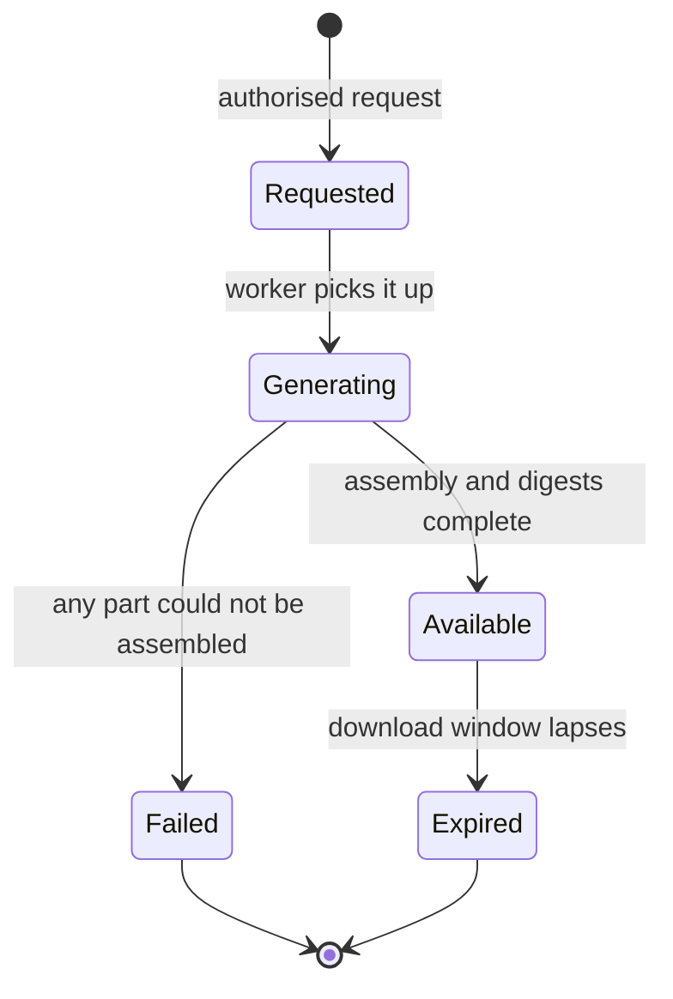

# Evidence Model

An evidence pack is a deterministic, verifiable artefact assembled from authoritative
records. It is the product's primary output when someone external asks the organisation to
prove something.

> **INV-EVD-001 — An evidence pack is assembled from authoritative records, never from
> rendered screens or cached summaries.**

Screenshots are not evidence. Neither is a PDF export of a dashboard, a spreadsheet
maintained alongside the system, or a report whose numbers were computed once and stored.
Everything in a pack is derived, at generation time, from the records that governed the
behaviour it describes.

## Pack types

| Type | Answers | Phase |
|---|---|---|
| **Document** | Everything about one document: lineage, approvals, reviews, campaigns, waivers, audit | MVP |
| **Version** | The same, narrowed to one released version and its approval | MVP |
| **Campaign** | One distribution effort: audience derivation, assignments, responses, exceptions | MVP |
| **Point-in-time** | What governed a scope at an instant, and how it got there | V1 |
| **Estate** | Register-wide governance posture for a period — ownership, review health, campaign completion | V1 |

## Generation

Packs are generated asynchronously, and a pack that did not fully assemble is never
presented as one that did.



> **INV-EVD-004 — A partially generated pack is marked failed and never made available as
> complete.**

An incomplete pack presented as complete is worse than no pack at all: the recipient draws
conclusions from an absence that was an assembly bug rather than a fact about the
organisation.

> **INV-EVD-005 — Requesting, generating, failing and downloading a pack each emit audit
> events.**

Evidence access is itself evidence. Who asked for what, when, and who took a copy are
governance facts — particularly when the pack contains attestation records for hundreds of
named employees.

## The manifest

> **INV-EVD-002 — Every pack contains a manifest with schema version, generation and as-of
> instants, requester, included objects and per-file digests.**

```json
{
  "schemaVersion": 1,
  "packId": "…",
  "packType": "DOCUMENT",
  "tenantId": "…",
  "generatedAt": "2027-03-04T11:02:44Z",
  "asOf": "2027-02-14T00:00:00Z",
  "generatedBy": { "userId": "…", "capabilities": ["evidence.generate"] },
  "privacyProfile": "STANDARD",
  "request": {
    "documentId": "…",
    "scope": { "legalEntityId": "…", "orgUnitId": null, "jurisdictionId": "…" },
    "includes": ["lineage", "approvals", "reviews", "attestations", "waivers", "audit"]
  },
  "includedObjects": [
    { "type": "DOCUMENT_VERSION", "id": "…", "versionSequence": 4,
      "title": "…", "classification": "CONFIDENTIAL",
      "contentDigest": "sha-256:…", "canonicalisationSchemaVersion": 1 }
  ],
  "configurationVersions": ["…"],
  "workflowTemplateVersions": ["…"],
  "fileDigests": { "document/document.pdf": "sha-256:…", "audit/events.jsonl": "sha-256:…" },
  "eventRange": { "fromSequence": 1, "toSequence": 918273 },
  "exclusions": [
    { "type": "DOCUMENT_VERSION", "id": "…", "reason": "REQUESTER_NOT_AUTHORISED" }
  ],
  "generatorVersion": "…"
}
```

> **INV-EVD-009 — Every governed action included in a pack carries the configuration
> version and, where applicable, the workflow template version in force when it
> happened.**

This is what makes a 2027 approval judgeable in 2031. Without it the pack shows that a
Management Board resolution reference was recorded, but not that a resolution reference
was *required* at the time — and a control satisfied is a different claim from a field
that happened to be filled in.

## Layout

```text
evidence-<pack-id>.zip
├── README.pdf              what this pack is, how to verify it, what each file contains
├── manifest.json
├── document/
│   ├── document.pdf        human-readable rendering of the governed text
│   └── original/           the controlled source files, byte-identical
├── approvals/
│   ├── workflow.json       template version, stages, resolved participants
│   └── decisions.csv       decisions, actors, instants, digests, resolution references
├── reviews/
│   └── review-history.csv  due dates, reminders, escalations, outcomes, rationales
├── attestations/
│   ├── summary.pdf         completion, lateness, declines, exemptions
│   └── assignments.csv     per-principal assignments, targeting basis, responses
├── waivers/
│   └── waivers.csv         deviations in scope, with compensating controls and expiry
├── access/
│   └── access-history.csv  grants in force and their changes, where the profile includes it
├── audit/
│   └── events.jsonl        the authoritative event slice, in deterministic order
└── integrity/
    └── SHA256SUMS
```

Four formats, each doing a job PDF alone cannot: **PDF** for a human reading it, **CSV**
for the auditor who will pivot it, **JSONL** for machine processing and re-ingestion, and
the **original controlled files** for fidelity. A PDF-only export is not portable
evidence, and customers who have tried to defend one in an audit know it.

## Contents by category

| Category | Included |
|---|---|
| Identity | Document code, canonical title, type and rank, owner, owning org unit |
| Scope | Variant type, applicability, legal entities, jurisdictions, populations, inheritance mode |
| Exact content | The rendering, the original files, and every digest with its canonicalisation schema version |
| Lineage | Predecessor and successor versions; the publish, effective, supersede and withdraw instants |
| Approval proof | Workflow template version, stages, resolved participants, every decision with instant and digest, body resolutions with their configured evidence |
| Review proof | Schedule, reminders, escalations, cases, outcomes and rationales |
| Attestation proof | Campaign definition, statement version, audience derivation, assignments with targeting basis, responses, declines, exemptions |
| Waiver proof | Active and historical deviations in scope, with compensating controls |
| Access evidence | Grants and grant history, where the privacy profile includes it |
| Localisation lineage | Source version, derived variants, alignment obligations and how they were resolved |
| Audit | The authoritative event slice, ordered by `(occurred_at, sequence)` |
| Integrity | Per-file digests, the manifest digest, and `SHA256SUMS` |

## Integrity

> **INV-EVD-003 — Every file in a pack validates against its recorded digest.**

Verification must not require the vendor. A recipient with a hash utility can check every
file against `SHA256SUMS`, check `SHA256SUMS` against the manifest, and check each
governed version's content digest against the digest recorded at approval. Nothing in that
chain needs the application to be running, the tenant to still exist, or the vendor to
still be in business — which is exactly the property that makes an artefact evidence
rather than a report.

What this does not yet provide is tamper-*evidence* against someone who can rewrite both
the files and the manifest. Signed manifests, hash chaining or external anchoring are the
answer to that, and they are deliberately a later claim rather than an implied one.

## Privacy profiles

Packs concentrate personal data: hundreds of named employees, what each was required to
do, and when they did it. The profile is chosen at request time and recorded in the
manifest.

| Profile | Contains | Typical use |
|---|---|---|
| `MINIMAL` | Governance facts without individual-level personal data — version lineage, approvals identified by role and body, review outcomes, attestation completion statistics | Third-party assurance, customer security reviews, anything where individuals are not the question |
| `STANDARD` | Default. Individual-level records for governance actors and attestation responses. No network or device metadata | Internal audit, regulator requests, most real use |
| `FULL` | Everything in `STANDARD`, plus access history and any session or network metadata the tenant has chosen to collect | Investigations. Requires elevated capability and a recorded justification |

The default is not the most complete profile. That is deliberate: GDPR's minimisation
principle applies to the compliance function too, and "the auditor might want it" is not a
lawful basis for including every employee's IP address in a ZIP file that will be emailed
around.

## Point-in-time reconstruction

> **INV-EVD-007 — An as-of query resolves the Version, memberships and audience that were
> in force at that instant.**

An as-of pack is not a filter over today's state. Every input is resolved as it was:

```text
Given as_of = T and a scope S:

1. Entity structure, org units and memberships as they stood at T          (INV-ORG-002)
2. Applicability rules in force at T
3. The version whose effective interval contained T, resolved through
   the specificity ladder for S                                            (INV-APL-009)
4. The audience that resolved at T, and the campaign assignments that existed
5. The grants that were in force at T, where the profile includes access evidence
6. The configuration version and workflow template versions in force at T   (INV-EVD-009)
7. The audit slice up to T, plus the later events that closed the intervals
   described — the supersession that ended the version's effect belongs in the
   pack even though it happened after T
```

Step 7 is a judgement worth stating: a pack about February 2027 that omits the March
supersession leaves the reader unable to tell whether the version was still effective when
they read the pack. The as-of instant bounds what *was true then*, not what the pack is
allowed to mention.

> **INV-EVD-006 — Regenerating a pack for the same specification yields the same
> substantive records; only packaging metadata may differ.**

`packId`, `generatedAt` and archive byte layout may differ between generations. Nothing
else may. Determinism is what makes the artefact evidence rather than a snapshot of a
query that happened to run on a Tuesday — and it depends directly on the deterministic
event ordering of INV-AUD-009 and on nothing in the pack being derived from mutable
current state.

## Authorization and expiry

> **INV-EVD-010 — A pack never contains records the requester was not authorised to read
> at request time.**

Evidence generation is not a privilege escalation path. A requester with
`evidence.generate` scoped to one entity gets that entity's records; the pack is bounded
by the same evaluator that bounds every other read (INV-AUTH-001). Where a request would
include records the requester cannot read, the pack is generated without them and the
manifest records the exclusion — a truthful partial pack, clearly labelled, rather than
either a silent omission or an unauthorised disclosure.

> **INV-EVD-008 — Pack download links expire, and expiry is enforced at retrieval.**

Enforced at retrieval, not by a sweep job — the same rule as expiring access grants
(INV-AUTH-003), for the same reason.

## What a pack never contains

| Never | Why |
|---|---|
| Rendered screens or dashboard exports as the source of a fact | INV-EVD-001. Assembled from records, always |
| Data the requester could not read | INV-EVD-010 |
| Personal data the profile excludes | The profile is a commitment, not a suggestion |
| Reader telemetry the tenant has not enabled | It does not exist to include |
| A recomputed digest | Digests come from the approval record. Recomputing one to make verification pass destroys the only signal that something is wrong |
| An unverifiable claim | If it cannot be traced to an authoritative record, it does not go in the pack |
