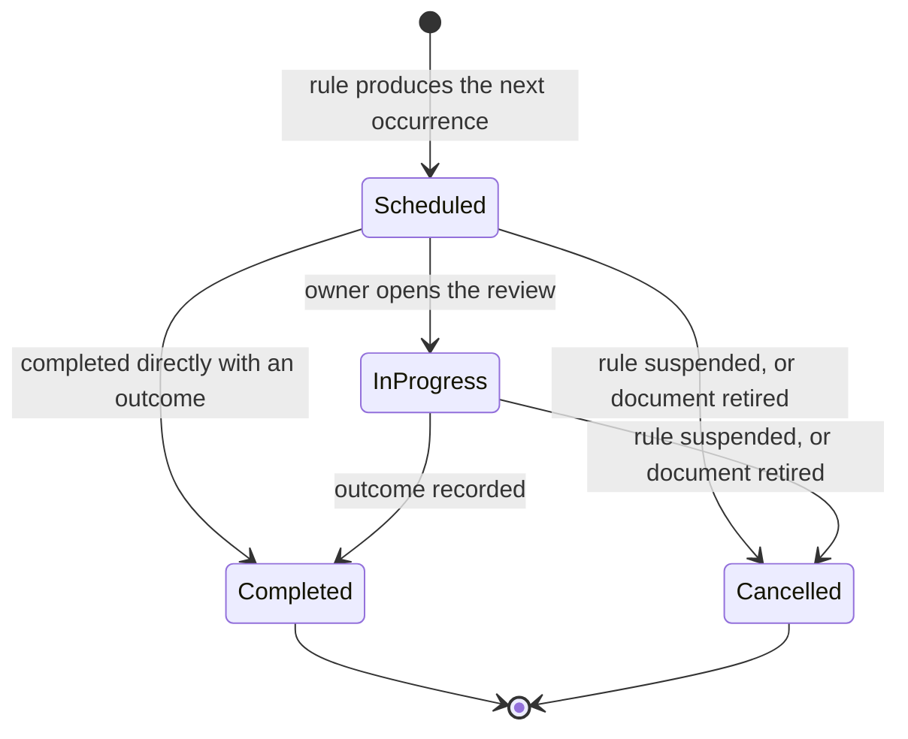

# Review Model

Reviewing a document and changing it are different governance acts. A great many
organisations conflate them, which is why their registers are full of documents last
touched four years ago that nobody can say are still correct.

The point of a review is to produce an accountable statement — *this was examined on this
date by this person and remains appropriate* — whether or not a single word changes.

> **INV-REV-003 — A `NO_CHANGE` outcome records a completed review without creating a new
> Version.**

## `ReviewRule`

A rule attaches to a document variant and produces review cases.

| Cadence | Definition | Typical use |
|---|---|---|
| **Periodic** | Every N months from an anchor | The common case: annually, or every 24 months for stable instruments |
| **Fixed calendar** | A specific date each year — every 15 January | Organisations that align reviews with a governance calendar or board cycle |
| **Event-triggered** | On a named event, with a configured lead time | Incident, audit finding, regulatory change, organisational change, upstream document update, owner departure |

Periodic rules take an anchor:

| Anchor | Next due date measured from |
|---|---|
| `EFFECTIVE_DATE` | The instant the current version became effective |
| `LAST_COMPLETED_REVIEW` | The completion of the previous review case |

The distinction matters more than it looks. Anchoring to the effective date keeps a fixed
annual rhythm regardless of when reviews actually happen. Anchoring to the last completed
review means a review finished three months late pushes the next one three months out.
Regulated customers usually want the first; operational teams usually want the second. The
shipped default is `EFFECTIVE_DATE`, because a cadence that holds regardless of how late the
last review ran is the one an auditor can check against a calendar.

Hard-coding "annual review" would be wrong even as a simplification. DORA, for one,
requires the ICT risk-management framework to be reviewed at least yearly **and** after
major incidents, supervisory instruction and relevant audit conclusions — a cadence plus
event triggers, which is exactly the shape above.

> **INV-REV-004 — Completing a review schedules the next occurrence deterministically from
> the configured anchor.**

### Scheduling arithmetic

Deterministic means the calculation is specified, not merely consistent.

| Rule | Behaviour |
|---|---|
| Month arithmetic | Add N calendar months to the anchor date, then clamp to the last day of the target month. 31 January plus one month is 28 or 29 February, and the following occurrence returns to the 31st rather than drifting |
| Time of day | The tenant's configured review-due time, in the tenant's timezone, converted to a UTC instant for storage |
| Timezone or DST change | The stored instant is recomputed from the calendar rule, never shifted by an hour because a boundary moved |
| Leap years | Handled by the clamp, not by special cases |

> **INV-TIME-001 — All authoritative instants are stored in UTC; local time is a
> presentation concern.**

> **INV-TIME-002 — Scheduled transitions behave correctly across DST boundaries and
> timezone configuration changes.**

## `ReviewCase`

One actual review.



`Due` and `Overdue` are **not** states. They are derived from `due_at` and the current
instant, for the same reason `Scheduled` is not a version state: a stored copy of a fact
already implied by a timestamp is a second source of truth that can disagree with the
first.

> **INV-REV-006 — At most one open Review Case exists per Review Rule at any instant.
> Rescheduling never produces a second open case.**

Without this, a scheduler retry or a cadence change produces two live cases for the same
obligation, and the register shows an overdue review that has, in fact, been completed on
its twin.

> **INV-REV-007 — A completed Review Case records the exact Document Version reviewed and
> the configuration version in force.**

*"The Information Security Policy was reviewed in March 2027"* is a weaker statement than
*"version 4, digest `sha-256:…`, was reviewed on 12 March 2027 by the named owner"*. Only
the second survives the question *which text did they actually look at*.

> **INV-REV-005 — Review Cases are immutable once completed.**

### The reminder ladder

Product defaults, entirely configurable, and not regulatory requirements:

```text
T − 60 days   owner notified
T − 30 days   owner and delegate
T − 14 days   owner
T −  7 days   owner and their manager
T             due
T +  1 day    overdue
T +  7 days   compliance escalation
T + 30 days   critical governance exception
```

Reminders are notifications. They change no governance state, and a failed delivery never
alters whether the review is due (`Notification` is an operational record — see
`domain-model.md`).

## Outcomes

| Outcome | What it records | What it produces |
|---|---|---|
| `NO_CHANGE` | The document was examined and remains appropriate | A completed case. No new version. The next occurrence is scheduled |
| `CHANGE_REQUIRED` | Content must change | A completed case, linked to the draft version it opened |
| `SCOPE_CHANGE_REQUIRED` | Applicability or variant structure must change, whether or not the text does | A completed case, linked to the resulting draft or variant work |
| `RETIREMENT_RECOMMENDED` | The document should cease to exist as an instrument | A completed case and a recommendation. Nothing else |

Every outcome requires a rationale. `NO_CHANGE` requires it most of all: an unexplained
"still fine" repeated four years running is the exact pattern an auditor probes, and the
system should make the reviewer commit to a sentence.

The fourth outcome is a recommendation and never an action.

Retirement means withdrawing effective versions (a deliberate act with a reason, possibly
producing a `governance.policy_gap` under INV-EFF-005) and then retiring the Document (INV-DOC-008).
A review case cannot do either. Automation that retires documents because a reviewer
selected a dropdown value is exactly the kind of authority-invention that AGENTS.md rule 5
forbids.

### Re-anchoring after a change

When the outcome opens a draft that later becomes effective, and the rule's anchor is
`EFFECTIVE_DATE`, the new effective instant re-anchors the schedule. The review case
completed when the review happened; the schedule follows the document.

## Overdue means overdue, not invalid

This is the most important rule in the chapter, and the one most often got wrong.

> **INV-REV-001 — An overdue review never changes which Version is effective.**

> **INV-REV-002 — Overdue review produces a visible governance exception and escalation.**

A missed review deadline is a failure of a compliance control. It is not evidence that the
organisation has no security policy. Products that expire content back into review — a
common pattern in document-workflow tooling — create a period in which the answer to *what
applies now* is *nothing*, because somebody was on leave.

That failure mode is worse than the one it prevents. Employees still need the guidance,
the organisation is still bound by it, and a regulator asking what governed a process in
that window would be told the system had no answer.

So the document stays effective, and it becomes conspicuously, escalatingly overdue:

| Register view | What it shows |
|---|---|
| Reader | The effective version, unchanged. Review health is not the reader's problem |
| Owner | Their overdue review, at the top of their tasks |
| Governance dashboard | Overdue reviews as a governance exception, with age and escalation state |
| Evidence pack | Both facts — that the version was effective throughout, and that its review was late. Concealing the second would make the pack a marketing document |

An organisation whose own rules genuinely require withdrawal on missed review can
configure a review rule that raises the exception and requires a human to act. What no
configuration can do is make the withdrawal automatic, because that is authority invented
by a timer.

## What a review interacts with

| Related mechanism | Interaction |
|---|---|
| **Alignment obligations** | An upstream publication raises an `AlignmentObligation` (INV-APL-007) and can trigger an event-driven review of the dependent variant. Completing the review is one of the recorded actions that can resolve the obligation (INV-APL-008) |
| **Waivers** | Active waivers against the document appear in its review, because a review that ignores standing deviations is examining a fiction |
| **Attestation** | A review is not a campaign. `NO_CHANGE` never triggers re-attestation; there is no new version and nobody's obligations changed |
| **Governing Framework** | When it is superseded, every affected `DocumentType` is flagged for alignment review (INV-DOC-030). That is configuration review, not document review, and it is tracked with the same obligation record |
