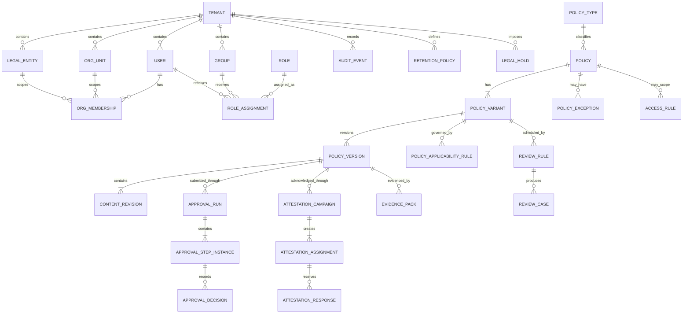
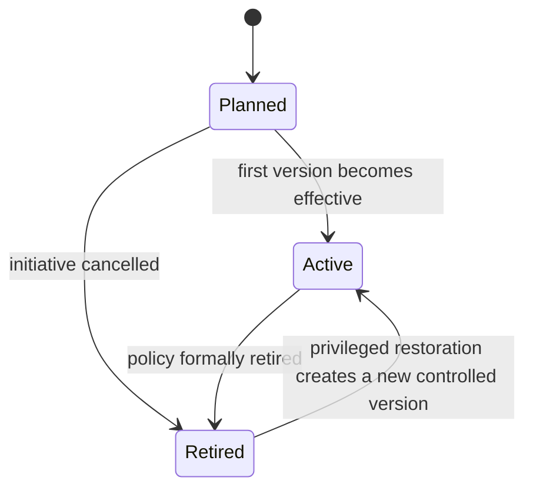
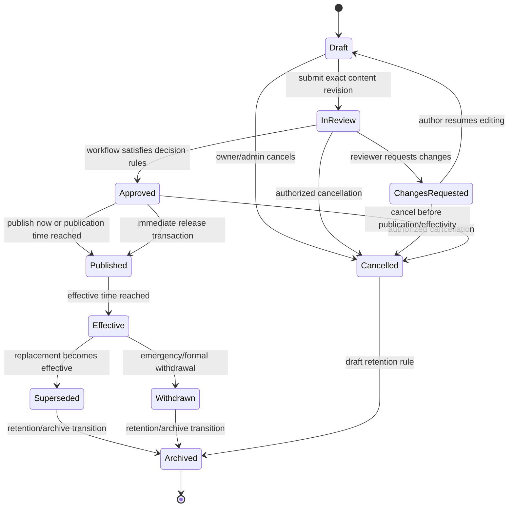

# Policy Operations Platform for Regulated European Companies — Master Product Blueprint v0.1 and Policy Operations Domain Specification v0.1

## Executive summary

The product should be designed as a **policy operations system of record**, not as a wiki, shared drive, generic document-management product, or full GRC suite. Its core job is to answer, reliably and historically, five questions:

1. **What policy applies to this person, legal entity, function, jurisdiction, and date?**
2. **What exact text was approved and effective at that point in time?**
3. **Who reviewed and approved it, under which workflow?**
4. **Who was required to receive or acknowledge it, and what happened?**
5. **Can the organization prove all of the above quickly to an auditor, regulator, customer, or internal investigator?**

That is consistent with the strategic direction established in the earlier project research: the opportunity is not “another place to store policies,” but a controlled lifecycle layer combining approvals, attestations, access, review cadence, evidence and multi-entity governance. fileciteturn0file0 Current category evidence supports that framing: G2’s July 2026 policy-management definition centers specifically on creating, managing and automating policies and procedures in a centralized platform, rather than generic document authoring alone. citeturn13search4turn13search0

The most important original design decision in this blueprint is to separate three concepts that many simpler systems blur together:

**`Policy`** is the permanent logical identity, such as “Information Security Policy.”

**`PolicyVariant`** expresses where and how that policy applies, such as the global baseline, a Poland replacement, an Estonia supplement, or a Finnish translation.

**`PolicyVersion`** is an immutable released revision of one variant, such as version 3.0 effective from 1 October 2026.

That distinction lets the system answer historical and cross-border questions without treating copied documents in different folders as unrelated objects.

A second important design principle is to separate **access** from **applicability**. A person may be allowed to read a document without being governed by it; conversely, a campaign must never assign someone a policy they cannot access. Permissions therefore answer “may this user see/do this?” while applicability answers “does this policy govern this user/entity/jurisdiction?” Attestation targeting is a third layer: “must this user perform an acknowledgement action?”

A third key decision is that **publication and effectivity are distinct**. A policy can be approved and made visible before it becomes normative. Thus:

`Approved → Published → Effective → Superseded/Withdrawn`

rather than treating “published” as synonymous with “current.”

A fourth is that **approved/effective policy content is immutable**. Reviewers approve an exact submitted content revision whose identity and cryptographic digest are preserved. Any normative content change creates another controlled version. The product should permit ordinary administrative metadata corrections without generating needless policy versions, but those changes remain audited.

A fifth is that **automation must fail safely**:

- An overdue approval never becomes automatically approved.
- An overdue review does not silently invalidate an otherwise effective policy.
- Withdrawal does not resurrect an older superseded version.
- Two conflicting local replacements cannot both become effective.
- Deactivating an approver cannot silently substitute an unauthorized person.
- Updating a master does not automatically rewrite or translate localized variants.
- Attestation assignment does not implicitly grant access.
- Failed current-version resolution returns a governance error rather than arbitrarily selecting a document.

These rules are more important than the eventual technology stack.

The competitive research also shows why this wedge remains credible in 2026. MetaCompliance provides approval rules and locks policy files during review; PowerDMS provides document workflows, review cycles, acknowledgements, version control and audit trails; NAVEX explicitly models master/localized copies and rolled-up attestations. Meanwhile, broad document systems have increasingly added governance capabilities: Microsoft now has modern approvals in SharePoint document libraries, and Confluence now has native page approvals on Premium and Enterprise. citeturn14search0turn15search3turn14search2turn14search1turn16search0 This means our differentiation cannot simply be “we have approvals.” It must be the **coherence of policy-native state, applicability resolution, multi-entity governance and evidence generation**.

The proposed release strategy is therefore:

| Release | Product thesis |
|---|---|
| **MVP / pilot** | Prove the entire controlled loop: author → review → approve → publish/effective → distribute → attest → review → evidence |
| **Commercial V1** | Add the enterprise layer: SSO/SCIM, configurable workflows, multi-entity/jurisdiction variants, localization, temporary access, retention/legal holds, APIs and advanced evidence |
| **Later** | Add regulatory intelligence, policy-to-control relationships and carefully bounded AI on top of trustworthy governed records |

No implementation stack is selected in this report. The domain model is intentionally **technology-agnostic**. Architecture and stack selection should follow this specification rather than constrain it prematurely.

## Market evidence and product principles

The current market divides into two useful reference groups.

**Policy specialists** demonstrate that buyers value controlled workflow, acknowledgement, version history and evidence. MetaCompliance currently supports named approvers, simple-majority, unanimous approval and a combined named-approver-plus-majority rule, and it prevents PDF replacement while a policy is under review. citeturn14search0 PowerDMS supports workflows containing owners/reviewers, steps assigned to users, roles or groups, reusable workflow templates, one-time edit rights, electronic acknowledgement and access levels; its product materials also emphasize automated review notifications, version comparison and audit history of changes, comments, approvals, reads and signatures. citeturn15search3turn15search0 NAVEX PolicyTech's localization functionality keeps regional or translated copies linked to a master, permits independent review/approval, notifies local owners after master approval and rolls attestations from copies into consolidated reporting. citeturn14search2turn14search5

**General document/knowledge systems** increasingly cover pieces of the same surface area. SharePoint supports modern document-library approvals, but editing an item while approval is in progress cancels that approval; approvers also need underlying document permissions separately. Its modern approval system is not integrated with SharePoint's older content-approval/request-signoff mechanisms. citeturn14search1 Confluence now supports formal page approvals, required approvers and approval-before-publishing on Premium and Enterprise, while also exposing hierarchical space/content permissions and audit logging. citeturn16search0turn16search1turn16search12 Notion provides increasingly sophisticated enterprise access infrastructure—private teamspaces, granular page sharing, SAML, SCIM, audit logs and EU data-residency options—but the first-party documentation reviewed for this analysis establishes those horizontal controls rather than the policy-specific lifecycle/evidence model proposed here. citeturn17search4turn17search5turn17search0turn17search1turn16search16turn16search5

### Competitive comparison

| Platform | Current strengths established by primary documentation | Structural limitation relative to this blueprint | Design lesson |
|---|---|---|---|
| **MetaCompliance / MetaPolicy** | Four approval-rule types; reviewer/approver reminders; policy locked during review; reporting/attestation records. citeturn14search0turn14search7 | Current documented behavior can require creating a new version after rejection; lifecycle semantics are tied closely to its publishing model. citeturn14search3 | Preserve strict review snapshots, but distinguish *draft content revisions* from released *policy versions* so “changes requested” does not create fake released versions. |
| **PowerDMS / PowerPolicy** | Reusable workflow steps; owners/reviewers; user/group/role assignment; acknowledgements; review automation; one published version with previous versions archived; comparison and audit history. citeturn15search3turn15search10turn15search8 | Strongly optimized around public-safety/healthcare operational contexts in current positioning. citeturn15search4turn15search3 | Match the depth of lifecycle and proof, but model European company/entity/jurisdiction semantics directly. |
| **NAVEX PolicyTech** | Role-oriented workflow, master/localized copies, independent local review/approval, automatic local-owner notifications and roll-up attestations. citeturn14search2turn14search5 | “Copies of a master” is understandable operationally but can become ambiguous when local content supplements rather than replaces the master. | Make relationship semantics explicit: baseline, replacement, supplement and translation. |
| **Microsoft SharePoint** | Strong document libraries, general approval, versioning, permissions and Microsoft ecosystem integration. Modern approvals became available for document libraries, but edits cancel in-flight approvals and underlying permissions remain separate. citeturn14search1turn14search16 | Generic documents and approvals do not themselves define policy applicability, attestation campaigns, point-in-time normative resolution or regulator-ready lineage. | Integrate with Microsoft; do not try to beat Microsoft at general-purpose authoring/storage. |
| **Confluence Cloud** | Spaces/content permissions, archives, audit logs and, now, native page approvals with required approvers and approval-before-publish on Premium/Enterprise. citeturn16search9turn16search0 | Approval is page-centric; general collaboration remains the primary domain model rather than policy applicability/evidence. | “We have approvals” is no longer differentiation. Complete policy semantics are. |
| **Notion** | Flexible knowledge UX, teamspaces/page access, guests, SAML, SCIM, audit logs and regional data storage for specified customer-data categories. citeturn17search3turn17search4turn17search1turn16search16turn16search5 | Reviewed first-party materials establish sophisticated horizontal enterprise controls, not the end-to-end policy-governance state machine defined here. | Use the usability/search bar set by modern knowledge products while keeping governance controls opinionated. |

The category itself is mature enough that “central repository + workflow” cannot be a durable moat. G2’s current 2026 category and theme descriptions treat centralized policy creation, management and automation as baseline characteristics. citeturn13search0turn13search4 The product therefore needs to win on **resolution, evidence and regulated cross-border operations**, not on raw checklist length.

### Product principles

The proposed product should follow these rules.

| Principle | Product consequence |
|---|---|
| **There must always be an answer to “what applies now?”** | Current-version resolution is a core domain service, not a UI filter. |
| **History is first-class** | Users can ask what applied on an arbitrary historical date and retrieve the exact released record and evidence. |
| **Released content is immutable** | A released version is never edited in place. |
| **Review is not publication** | Reviewer comments and revisions occur before an immutable released version exists. |
| **Publication is not effectivity** | Future-effective policies can be distributed in advance without becoming normative early. |
| **Permissions are not applicability** | Read access and policy obligations are calculated separately. |
| **Applicability is deterministic** | The same inputs must produce the same applicable policy set every time. |
| **Ambiguity blocks governance actions** | Conflicting variants block publication/effectivity rather than producing an arbitrary winner. |
| **Automation reminds and escalates; it does not invent authority** | No automatic approval because somebody missed a deadline. |
| **Evidence is generated from source records** | Evidence packs are deterministic snapshots with manifests and hashes, not hand-built screenshots. |
| **Privacy data is intentionally minimized** | Auditability does not justify recording every possible employee action forever. |
| **AI remains advisory** | Later AI can summarize or propose classifications but cannot silently approve, change applicability or rewrite controlled records. |

The privacy principle is particularly important in Europe. GDPR requires personal data to be limited to what is necessary and retained in identifiable form only as long as necessary for its purpose; the EDPB also frames data protection by design/default around minimizing amount, processing, storage and accessibility. citeturn18search13turn20search7 Consequently, “audit everything forever” is not a defensible default simply because the product serves compliance teams.

## Master Product Blueprint v0.1

### Product mission and boundaries

**Mission:** give regulated and compliance-heavy European organizations one trustworthy operational system for governing policies throughout creation, approval, applicability, distribution, acknowledgement, review, retirement and evidence retrieval.

**Primary target:** organizations with formal compliance obligations, multiple functions and increasingly multiple legal entities or jurisdictions, especially those currently stitching together shared drives, Microsoft 365, Confluence/Notion, email approvals and spreadsheets.

**Primary outcome:** materially reduce the time and uncertainty required to determine current policy obligations and produce defensible evidence.

**The product is not initially:**

- A general wiki.
- A Microsoft Office replacement.
- A contract-lifecycle-management platform.
- A complete enterprise GRC suite.
- A learning-management system.
- A regulatory legal-advice engine.
- An e-signature platform for statutory qualified signatures.
- A records-management system for every corporate document.
- An AI policy-writing product.

### Personas and buyer roles

The buyer and user map should be modeled explicitly because the same person can occupy multiple roles in a smaller company.

| Persona | Commercial / domain role | Primary goals | Product pain to eliminate |
|---|---|---|---|
| **Head of Compliance / Chief Compliance Officer** | Economic buyer, often executive sponsor | Know governance status; reduce overdue controls; answer regulators rapidly | Spreadsheet chasing, unknown ownership, evidence scramble |
| **Chief Risk Officer / COO** | Alternative economic buyer | See organization-wide accountability and overdue risk | Compliance work hidden in disconnected tools |
| **Policy / Compliance Manager** | Champion and operational administrator | Coordinate ownership, reviews, approvals, campaigns and reporting | Manual follow-up and duplicated reporting |
| **Policy Owner** | Accountable business owner | Ensure assigned policies remain appropriate and current | Forgotten review dates and unclear accountability |
| **Author / Editor** | Content producer | Draft changes efficiently without damaging approved evidence | Fear of editing wrong version; email feedback |
| **Reviewer** | SME, security, privacy, HR, legal, local compliance | Examine an exact proposal and request changes | Reviewing different attachments/versions |
| **Approver** | Authorized decision-maker | Approve or reject exactly what was presented | Weak evidence of what they approved |
| **Local Entity Compliance Lead** | Local governance operator | Adapt global policies where local law/business requires it | Copy proliferation and master/local drift |
| **Required Reader / Employee** | Policy subject | Quickly know what applies and acknowledge required material | Too many irrelevant documents and repeated attestations |
| **Auditor / Regulator liaison** | Evidence consumer | Reconstruct state at a historical date | Screenshots, exports and manually assembled timelines |
| **IT / Identity Administrator** | Platform gatekeeper | Provision users/groups, SSO, offboard cleanly | Manual account administration |
| **CISO / Security reviewer** | Procurement/security gatekeeper | Verify tenant isolation, identity, logging, residency and vendor controls | Unclear SaaS architecture/security posture |
| **DPO / Legal** | Privacy/legal gatekeeper | Ensure data minimization, lawful retention and transfer posture | Compliance tools themselves becoming unnecessary surveillance systems |
| **External auditor / consultant** | Temporary outsider | Inspect assigned evidence without broad tenant access | Excessive access granted merely to perform an audit |

### Jobs to be done

| Situation | Job to be done | Success condition |
|---|---|---|
| A regulator asks what policy governed a process six months ago | “Show me the exact applicable version as of that date and its governance history.” | Answer in minutes without reconstructing folders/email |
| A policy is being revised | “Route one exact proposal through the people whose approval is required.” | No approver signs a moving target |
| A material policy update takes effect | “Tell only affected people what changed and obtain required acknowledgement.” | Correct population receives the correct immutable version |
| An employee moves from Estonia to Poland | “Recalculate which policies and variants apply.” | New obligations appear; irrelevant ones disappear; historical evidence remains |
| A subsidiary has stricter local requirements | “Preserve the global baseline while governing the local divergence.” | Local rule is explicit and traceable to its master |
| An approval is overdue | “Escalate visibly without fabricating consent.” | Workflow remains blocked and accountability is clear |
| A policy reaches review date | “Force an accountable review even if no content change is needed.” | Review outcome is itself evidenced |
| An employee leaves | “Remove access and future tasks while preserving lawful historical proof.” | No active access; historical governance evidence remains according to retention rules |
| An external auditor needs access | “Give precisely limited, temporary access to evidence.” | Auditor cannot navigate unrelated tenant content |
| Compliance prepares an audit | “Generate a reproducible evidence package.” | Pack contains exact source records, manifest and integrity information |
| Management asks “what is broken?” | “Show overdue approvals, reviews, missing attestations and governance conflicts.” | Dashboard represents actionable exceptions, not vanity metrics |

### Information architecture

The administrator and employee experience should deliberately differ. An employee should not encounter a GRC cockpit just to find the travel or information-security policy.

```mermaid
flowchart TD
    A[Policy Operations] --> H[Home]
    A --> P[Policies]
    A --> W[Approvals]
    A --> T[Attestations]
    A --> E[Entities & Jurisdictions]
    A --> V[Evidence & Audit]
    A --> R[Reports]
    A --> S[Administration]

    H --> H1[My tasks]
    H --> H2[Needs attention]
    H --> H3[Governance overview]

    P --> P1[Policy catalogue]
    P --> P2[Current policies]
    P --> P3[Drafts & in review]
    P --> P4[Upcoming / overdue reviews]
    P --> P5[Archived history]

    W --> W1[My approvals]
    W --> W2[Workflow runs]
    W --> W3[Workflow templates]

    T --> T1[My attestations]
    T --> T2[Campaigns]
    T --> T3[Completion & exceptions]

    E --> E1[Legal entities]
    E --> E2[Org units]
    E --> E3[Jurisdictions]
    E --> E4[Variant alignment]

    V --> V1[Evidence packs]
    V --> V2[Audit explorer]
    V --> V3[Point-in-time reconstruction]

    S --> S1[People & groups]
    S --> S2[Roles & access]
    S --> S3[Policy types]
    S --> S4[Identity & integrations]
    S --> S5[Retention & security]
```



The **reader-facing default** should be closer to:

```text
Home
├── My policies
├── My attestations
├── Recently changed
└── Search
```

The **governance-facing default** should prioritize exceptions:

```text
Needs attention
├── approvals overdue
├── reviews due / overdue
├── campaigns below target
├── unowned policies
├── stale local variants
├── unresolved applicability conflicts
└── access grants expiring
```

### Core product experiences

**Policy catalogue.** Searchable structured registry showing policy code, title, owner, type, current version, entities/jurisdictions, effective date, review status and lifecycle status.

**Policy record.** Stable page representing the logical policy rather than a particular version. Tabs should include Current, Variants, History, Approvals, Attestations, Reviews, Access and Evidence.

**Policy reader.** Extremely clear display of “Current effective version,” scope, owner, effective date and required actions. Historical versions must be visually unmistakable as historical.

**Draft workspace.** Editable candidate content plus structured metadata, change summary and comparison against current version.

**Approval inbox.** Every task shows the exact version/revision, its change summary, scope/effectivity and prior decisions before presenting Approve / Request changes / Reject.

**Attestation experience.** Shows the exact policy version, effective date, change summary when applicable and attestation statement. “Acknowledge” should not imply a statutory electronic signature unless the customer deliberately configures a legally appropriate signing process.

**Evidence workspace.** Lets authorized users request evidence for a policy, campaign or point in time, with configurable privacy profiles.

### Product success measures

The pilot should establish measurable operating outcomes rather than optimize vanity engagement:

| Metric | Meaning |
|---|---|
| Median time to identify current applicable policy | Measures basic system-of-record usefulness |
| Median time to produce complete policy evidence | Core audit-value metric |
| % policies with active owner | Governance hygiene |
| % policies reviewed on time | Operational control health |
| Median approval cycle time | Workflow efficiency |
| % required attestations completed by due date | Distribution/accountability |
| Number of ambiguous applicability conflicts | Domain-quality metric; target should approach zero |
| % current policies reached through search without opening obsolete result | Discovery correctness |
| Number of access/effectivity incidents | High-severity quality metric |
| Evidence-pack validation success rate | Reliability of generated proof |

The product should avoid optimizing “time spent reading” as a general-purpose KPI. MetaCompliance, for example, can track time spent on a policy when enabled, showing such telemetry exists in the category. citeturn14search7 Our default should be more privacy-minimal: record the governance action required, not extensive employee-behavior telemetry unless a customer establishes a legitimate need.

## Policy Operations Domain Specification v0.1

### Canonical domain model

The following is the proposed conceptual data model. Storage technology is intentionally unspecified.

| Entity | Purpose | Important attributes | Principal relationships / invariants | Phase |
|---|---|---|---|---|
| **Tenant** | Customer security boundary | `id`, name, status, default timezone, default locale, residency profile | Root of every tenant-owned record; no cross-tenant references | MVP |
| **LegalEntity** | Company/subsidiary/branch governance scope | `id`, legal name, registration metadata, country, parent entity, status | Tree inside one tenant; closing entity does not delete history | V1 |
| **OrgUnit** | Department/function structure | `id`, name, parent, legal-entity linkage, status | Hierarchical; users may belong to several | MVP |
| **Jurisdiction** | Legal/regulatory geographical dimension | code, name, level/type | Independent from LegalEntity; entity country alone does not determine all applicable jurisdictions | V1 |
| **User** | Human principal | external identity ID, status, locale, timezone | Belongs only to tenant; can have memberships/roles | MVP |
| **Group** | Managed group principal | name, source, external ID | Membership may be local or synchronized | MVP |
| **OrgMembership** | User organizational assignment | user, entity, org unit, start/end dates, primary flag | Historical membership retained | V1 |
| **Role** | Capability bundle | name, capabilities, system/custom flag | Does not itself establish scope | MVP |
| **RoleAssignment** | Role at a scope | principal, role, scope type/id, valid from/to | Produces inherited capability at scope | MVP |
| **PolicyType** | Classification and defaults | name, code, default workflow, default review rule | Examples: corporate, security, HR, privacy | MVP |
| **Policy** | Stable logical policy identity | `id`, policy code, canonical title, type, owner, lifecycle status | Owns variants; identity survives all revisions | MVP |
| **PolicyVariant** | Scope-specific expression of policy | relation type, parent/source variant, locale, applicability rules | Types: baseline, replacement, supplement, translation | V1; baseline MVP |
| **PolicyVersion** | Immutable released revision of a variant | sequence, display label, status, approved revision ID, published/effective/ended timestamps, materiality | Once released, normative payload immutable | MVP |
| **ContentRevision** | Editable/pre-release content snapshot | revision sequence, content/object reference, digest, created by/at | Submission locks one revision for approval; many revisions may belong to same draft version | MVP |
| **PolicyApplicabilityRule** | Determines target organizational/legal population | include/exclude; entities; org units; jurisdictions; roles/groups; effective interval | Separate from AccessRule | V1 |
| **AccessRule** | Persistent allow/deny authorization exception | effect, principal, capability, resource scope, valid dates, reason | Explicit deny wins over ordinary allow | MVP |
| **AccessRequest** | User request for otherwise unavailable resource | requester, resource, capability, reason, status | May create time-bound AccessRule after approval | V1 |
| **WorkflowTemplate** | Stable workflow identity | name, purpose, active version | Owns immutable template versions | V1 |
| **WorkflowTemplateVersion** | Versioned workflow definition | stages, decision rules, conditions, escalation settings | Existing runs remain bound to snapshot | V1 |
| **ApprovalRun** | Approval process for one submitted revision | candidate revision, template snapshot, status, started/completed | Exact candidate cannot change during run | MVP |
| **ApprovalStepInstance** | Runtime step/stage | order, mode, assignees, due date, status | Serial or parallel in V1 | MVP/V1 |
| **ApprovalDecision** | One decision by authorized principal | approver, decision, timestamp, comment, delegated-from | Immutable decision; corrections create events, not overwrite | MVP |
| **ReviewRule** | Recurring/event review requirement | cadence, anchor, lead times, trigger types | Usually attached to policy/variant | MVP |
| **ReviewCase** | Actual scheduled/event-triggered review | due date, owner, state, outcome | Outcome may produce no new version | MVP |
| **AttestationCampaign** | Distribution/acknowledgement effort | exact policy version, audience rule/snapshot, due dates, statement version, state | Must pin exact version | MVP |
| **AttestationAssignment** | Obligation for one principal | campaign, user, due date, status, assigned scope | Historical assignment not rewritten after completion | MVP |
| **AttestationResponse** | Recorded acknowledgement action | assignment, response type, timestamp, policy digest, statement version | Append-only; correction creates additional evidence | MVP |
| **PolicyException** | Approved deviation/waiver from policy | policy/version, subject scope, rationale, owner, approver, expiry, compensating controls | Not the same as access exception | V1 |
| **Notification** | Delivery/reminder record | template/event, recipient, channel, sent/status | Operational record; not authoritative state | MVP |
| **AuditEvent** | Security/governance event | canonical event fields below | Append-only event record; tenant-scoped | MVP |
| **EvidencePack** | Immutable generated evidence snapshot | request parameters, as-of date, manifest, digest, storage ref | Generation/download both audited | MVP |
| **RetentionPolicy** | Configurable retention configuration | record class, duration, disposition action | Cannot override legal hold | V1 |
| **LegalHold** | Prevent disposition of selected records | scope, reason, authority, start/end | Does not grant user visibility | V1 |
| **PolicyDependency** | Explicit related-policy relationship | source, target, relation, rationale | Later supports impact analysis | Later |
| **ExternalReference** | Link to regulation/control/standard | source type, identifier, citation metadata | Enables policy-to-rule traceability | Later |
| **WebhookSubscription / APIClient** | Controlled machine integration | scopes, status, credentials metadata | Subject to same tenant authorization and audit rules | V1 |

The central relationship structure is:



### Policy lifecycle

`Policy` should be intentionally boring. Most workflow state belongs to versions.



| From | To | Trigger | Rules |
|---|---|---|---|
| Planned | Active | First policy variant/version becomes effective | Derived/system transition |
| Planned | Retired | Authorized cancellation | Reason required |
| Active | Retired | Formal policy retirement | Existing effective versions must be withdrawn/ended under controlled action; replacement can be recorded |
| Retired | Active | Restore policy | Never reactivates a historical version directly; must create a new controlled version |

Do **not** add Draft, Review or Approved to the Policy itself. Those belong to `PolicyVersion`.

### Policy-version lifecycle



For a policy that is approved and immediately effective, the system should still record the conceptual sequence:

`APPROVED → PUBLISHED → EFFECTIVE`

even when it occurs transactionally within the same operation.

| State | Editable normative content? | Visible to ordinary readers? | Normative/current? |
|---|---:|---:|---:|
| Draft | Yes | No | No |
| In Review | **No** | No | No |
| Changes Requested | Via transition back to Draft | No | No |
| Approved | No | Usually governance users only | No |
| Published | No | Yes, if access permits | No until effective timestamp |
| Effective | **No** | Yes | Yes |
| Superseded | No | Historical access only | No |
| Withdrawn | No | Historical access only | No |
| Cancelled | No after cancellation | No | No |
| Archived | No | Privileged historical access | No |

MetaCompliance's current locking of policy content during review validates the integrity principle behind this design. citeturn14search0 SharePoint's current modern approval behavior illustrates the alternative: an edit cancels an in-flight approval. citeturn14search1 Our model should make this domain rule explicit rather than letting document-system behavior accidentally define the lifecycle.

### Versioning and immutability rules

**Stable identifiers.** `Policy`, `PolicyVariant`, `PolicyVersion` and `ContentRevision` all have immutable machine IDs. Human-facing labels such as “3.1” are never database identity.

**Sequence versus display label.** Each variant has a monotonically increasing internal `version_sequence`. A tenant may use `1.0`, `1.1`, `2026.2`, or another display convention without affecting ordering.

**Draft revisions are not released versions.** Saving the document ten times during drafting produces content revisions, not policy versions 2.1 through 2.10.

**Submission creates a frozen candidate.** When `Draft → InReview`, the system records the submitted `ContentRevision`, immutable content digest, attachments and material governance fields. Approval decisions bind to that exact candidate.

**Material fields become immutable after approval.** At minimum:

- normative policy body;
- attachments incorporated by reference;
- applicability scope;
- variant relationship;
- source/master linkage;
- effective date where changing it alters the governance effect;
- materiality classification where it drives approval or attestation behavior.

Changing one after approval requires either cancelling before release and starting a fresh approval candidate, or creating a new version if already released.

**Administrative fields may change without a new version** when they do not alter obligations: search tags, internal administrator notes, UI color/category, perhaps operational ownership assignment. Every such change is still audited. Customers may configure owner changes to require review if desired.

**Content hash.** The approved candidate and incorporated attachments receive cryptographic digests. Evidence later verifies against these digests.

**No destructive correction.** An erroneous released version is withdrawn/superseded with reason. It is never silently edited.

**Materiality** should be an explicit classification:

| Change class | Example | Default approval consequence | Default attestation consequence |
|---|---|---|---|
| Editorial | Typo, formatting | May use shortened approval according to tenant policy | None |
| Minor | Clarification not changing employee obligation | Standard or reduced workflow | Usually none |
| Material | New obligation, control, scope or responsibility | Full workflow | Re-attest affected audience |
| Emergency | Immediate risk/legal response | Emergency configured workflow | Re-attest affected audience, possibly accelerated deadline |

The system should not itself decide legal materiality. It should provide structured classification, require an accountable human choice and support organization-defined policy.

### Access-control inheritance model

The authorization design should use **RBAC for capabilities plus resource-scoped assignments/rules** rather than encoding everything as folder membership.

Capabilities might include:

```text
policy.read
policy.create
policy.edit_draft
policy.submit
policy.approve
policy.publish
policy.withdraw
policy.manage_access

attestation.respond
attestation.manage

review.perform
review.manage

evidence.generate
audit.read

tenant.manage_identity
tenant.manage_security
```

Authorization operates across these scopes:

```text
Tenant
  └── Legal Entity
       └── Org Unit
            └── Policy / Policy Variant
                 └── Policy Version
```

The conceptual decision is:

```text
effective_permission =
    same_tenant
    AND active_identity
    AND capability_from_role
    AND applicable_allow
    AND NOT applicable_explicit_deny
    AND grant_currently_valid
```

**Rules:**

**Tenant isolation is absolute.** No role, support capability or object identifier crosses a tenant boundary through normal authorization.

**Role answers “what.”** Scope answers “where.”

**Parent allow normally inherits downward.** A Compliance Administrator assigned `policy.read` at tenant scope can read governed policy resources throughout that tenant unless a deliberate restricted-resource rule applies.

**Explicit resource allow can grant narrower access.** Someone who cannot access an entire department can receive read access to one policy.

**Explicit deny wins over ordinary allow.** This should be used sparingly for sensitive policy records and conflicts of interest because complex deny trees are hard to administer.

**Temporary grants have start and end times.** Expiry must be enforced by authorization checks, not merely by a cleanup job. A cleanup job then materializes the expired state and audit event.

**Applicability is not permission.** Being governed by a policy does not by itself create broad repository permission semantics. However, before an attestation campaign can launch, the system must prove every target can access the exact policy version through an appropriate reader capability.

**Campaign assignment does not grant access automatically.** Otherwise a mistake in campaign targeting becomes an information-disclosure mechanism.

**Legal hold does not grant visibility.** Retention and access are independent.

**Break-glass access**, when introduced, must be time-limited, explicitly justified and separately audited. Confluence's current admin-key behavior provides a useful general-industry pattern: temporary bypass of restricted content is recorded in the audit trail and surfaced to content owners. citeturn16search11 Our version should be more restrictive for regulated evidence: reason, expiry and tenant-configurable approval should be available.

Examples:

| Situation | Resolution |
|---|---|
| Compliance Manager has Compliance Admin role at tenant | Can manage policies tenant-wide |
| HR reviewer has Reviewer role at `Estonia → HR` org unit | Can perform review actions only inside that scope |
| External lawyer needs one policy for 7 days | Policy-level `read` allow with expiry and purpose |
| User receives broad read through employee role but is conflict-restricted from acquisition policy | Explicit deny on that policy wins |
| Employee is included in an attestation campaign but lacks access | Campaign preflight fails for that assignment; launch cannot silently proceed |
| User's temporary grant expires while session remains open | Next authorization check denies access; session caching must not prolong grant |
| Tenant administrator knows another tenant's policy UUID | Request behaves as unauthorized/not found; no metadata leakage |

Modern enterprise tools already demonstrate hierarchical permission needs—Confluence, for example, evaluates permissions across product, space and content levels. citeturn16search3turn16search12 The proposed model is more policy-specific by adding effectivity, applicability and time-bound grants as separate dimensions.

### Multi-entity, jurisdiction and localization model

Organizational hierarchy and jurisdiction must not be conflated.

A Lithuanian legal entity can employ someone operating in Finland; a group-level policy may be supplemented by country law; a jurisdictional rule may apply across several subsidiaries. Therefore:

```text
Organization dimension:
Tenant → Legal Entity → Org Unit

Legal/application dimension:
Jurisdiction(s)

Presentation dimension:
Language / locale
```

A `PolicyVariant` has one of four relationship types:

| Type | Meaning |
|---|---|
| **BASELINE** | Default normative policy when no more-specific replacement exists |
| **REPLACEMENT** | Substitutes the baseline for its defined scope |
| **SUPPLEMENT** | Adds obligations and coexists with the resolved baseline/replacement |
| **TRANSLATION** | Semantically equivalent presentation of another variant/version; language selection must not alter legal scope |

This makes the model more explicit than treating every regional document as an undifferentiated “copy,” while preserving the real operational need demonstrated by NAVEX's linked master/local versions and localized independent approvals. citeturn14search2turn14search5

**Proposed deterministic resolution algorithm for user `U` at time `T`:**

1. Resolve `U`'s active legal-entity and org-unit memberships at `T`.
2. Resolve jurisdictions applicable to that user/process context.
3. Retrieve effective variants whose applicability rules match.
4. Collect all matching `SUPPLEMENT` variants.
5. Resolve exactly one baseline/replacement branch using specificity:
   - exact legal entity + jurisdiction;
   - exact legal entity;
   - nearest ancestor entity + jurisdiction;
   - nearest ancestor entity;
   - tenant baseline.
6. Apply relevant supplements.
7. Select language from semantically linked translations only after normative scope resolution.
8. If two same-priority replacements overlap at the same time, resolution is **invalid**.
9. Such a conflict must normally be detected before publication/effectivity and block the release.
10. If an impossible conflict nevertheless reaches production because of corruption/race conditions, the reader resolver fails closed and raises a governance alert rather than choosing arbitrarily.

Examples:

| Configuration | Applicable result |
|---|---|
| Global Information Security baseline + Estonia Security Supplement | Estonia users receive both baseline and supplement |
| Global HR baseline + Poland `REPLACEMENT` | In-scope Polish users receive replacement instead of baseline |
| Global Code of Conduct English + linked Finnish `TRANSLATION` | Finnish locale displays Finnish translation of the same normative scope |
| Two Polish HR replacements with identical scope/date | Second publication blocked |
| Global master v4 becomes effective while Estonia adaptation is based on v3 | Estonia variant marked `alignment_review_required`; no automatic overwrite |
| User belongs to both Security and Engineering units | Applicability rules may add multiple supplements; replacement resolution must remain unambiguous |

A master update should never auto-merge into child variants. It creates an **alignment obligation**: local owners are notified, a review case can be created, and the child becomes visibly stale relative to the new master until resolved.

## Governance workflows, evidence, and EU controls

### Approval workflow model

The MVP can start with a constrained workflow engine while preserving a schema that supports richer V1 behavior.

A workflow definition should have **versioned templates**. Editing a template creates another template version; active approval runs retain their original snapshot. Otherwise an administrator changing a workflow halfway through would rewrite the historical meaning of an approval.

**Commercial V1 stage model:**

```text
Stage A — Security Review
  parallel
  require: ALL
  assignees: Security Lead + Architecture Lead

        ↓

Stage B — Legal / Privacy
  parallel
  require: AT_LEAST_N(1)
  assignees: Legal Counsel + DPO

        ↓

Stage C — Final Business Approval
  serial
  require: ALL
  assignee: Policy Owner
```

Supported decision strategies should initially be:

- `ALL`
- `ANY_ONE`
- `AT_LEAST_N`

A future conditional stage can be activated based on policy type, materiality, entity, jurisdiction or sensitivity.

MetaCompliance currently implements several similar voting concepts, including named approver, majority and unanimous behavior, validating that customers need more than one universal approval rule. citeturn14search0 PowerDMS likewise exposes reusable workflow templates, user/group/role routing and different response authority. citeturn15search3turn15search18

**Approval invariants:**

- Decisions refer to exact `ContentRevision`.
- Content is non-editable while the run is active.
- “Request changes” returns the work to drafting after terminating the current submission snapshot.
- A subsequent submission gets a fresh `ApprovalRun`; old decisions remain historical rather than transferring implicitly.
- An approver cannot approve after their authority expires.
- A deactivated approver makes the task unresolved; the workflow does not silently pick someone else.
- Reassignment and delegation are explicit, authorized and audited.
- Separation-of-duty rules can forbid the author from being the sole final approver.
- An overdue step remains pending.
- Escalation may notify, add/reassign an authorized approver according to configured rules, or escalate to a manager.
- **No timeout results in automatic approval.**
- Rejection requires reason when configured.
- Cancellation requires reason and an authorized actor.

### Review schedules

Reviewing a policy is a separate governance action from changing it.

A `ReviewRule` should support:

**Periodic review:** every N months from effective date or most recent completed review.

**Fixed calendar:** for example every 15 January.

**Event-triggered review:** incident, audit finding, regulatory change, organizational change, master-policy update, policy-owner departure.

This flexibility maps well to regulated use. DORA, for example, requires the ICT risk-management framework of relevant financial entities to be documented and reviewed at least yearly, and also following major ICT incidents, supervisory instructions and relevant testing/audit conclusions. citeturn19search6turn19search13 That is a strong reason not to hard-code “annual review” as the only model.

Suggested configurable reminder sequence:

```text
T - 60 days  owner notification
T - 30 days  owner + delegate
T - 14 days  owner reminder
T - 7 days   owner + manager
T            due
T + 1        overdue
T + 7        compliance escalation
T + 30       critical governance exception
```

Those values are product defaults, not regulatory requirements.

A completed `ReviewCase` needs a structured outcome:

- `NO_CHANGE`
- `CHANGE_REQUIRED`
- `SCOPE_CHANGE_REQUIRED`
- `RETIREMENT_RECOMMENDED`

`NO_CHANGE` is important. It records that the accountable party genuinely reviewed the current policy and determined it remains appropriate without manufacturing a fake new content version.

**An overdue review does not automatically make the currently effective policy disappear.** It becomes a governance exception and stays visible as “effective, review overdue” unless the organization's own rules mandate withdrawal. Automatically deleting employee guidance because a compliance owner missed a deadline would create operational risk.

### Attestations and campaigns

An attestation campaign must be pinned to an **exact immutable PolicyVersion**, never merely `Policy.id`.

Campaign fields:

```text
campaign_id
policy_version_id
audience_definition
audience_resolution_mode
resolved_at
launch_at
due_at
statement_id / statement_version
locale behavior
reminder schedule
late-response behavior
status
```

Two audience modes are useful:

**Snapshot campaign.** Population is resolved at launch. New hires are not automatically added.

**Dynamic campaign.** Population is continuously evaluated during an enrollment window. New joiners matching the rule receive an assignment.

Each `AttestationAssignment` stores why the person was targeted—entity, org unit, role, group or explicit assignment—so an auditor can later understand audience derivation.

Attestation statuses should include:

```text
PENDING
DUE_SOON
OVERDUE
COMPLETED
COMPLETED_LATE
EXEMPTED
CANCELLED_DEPARTURE
CANCELLED_CAMPAIGN
```

A response should preserve at minimum:

- exact PolicyVersion ID;
- approved content digest;
- attestation statement/version;
- responder identity at that moment;
- timestamp;
- response type;
- locale;
- authentication/session assurance metadata where appropriate;
- optional privacy-configured network/security metadata.

PowerDMS demonstrates the established category behavior of assigning policies for acknowledgement and prompting staff again after a new version; it also preserves signature history in its audit trail. citeturn15search3turn15search0 MetaCompliance similarly records individual completion audits and generates another audit record when an administrator changes a recorded response. citeturn14search7

Our re-attestation model should be more selective:

| Version change | Default |
|---|---|
| Editorial | No re-attestation |
| Minor clarification | Configurable |
| Material | New campaign for affected audience |
| Emergency material change | New campaign, accelerated due date |
| Local replacement affects Poland only | Poland-targeted users only |
| Translation correction without normative change | No new legal attestation by default |

An administrator can override these defaults with justification, but that choice is audited.

### Evidence packs

An evidence pack is not just “export this report to PDF.”

It should be a **point-in-time evidence artifact** derived from authoritative records.

Every pack should contain a machine-readable manifest:

```json
{
  "schemaVersion": "...",
  "packId": "...",
  "tenantId": "...",
  "generatedAt": "...",
  "asOf": "...",
  "generatedBy": "...",
  "packType": "...",
  "filters": {},
  "includedObjects": [],
  "fileDigests": {},
  "privacyProfile": "..."
}
```

Depending on pack type, include:

| Evidence category | Contents |
|---|---|
| Policy identity | Policy code, canonical title, owner, type |
| Scope | Variant type, legal entities, jurisdictions, org populations |
| Exact content | Released policy file/rendering and attachment digests |
| Version lineage | Prior/current/next versions, publish/effective/supersede/withdraw events |
| Approval proof | Workflow snapshot, stages, assignments, decisions, timestamps, comments where permitted |
| Review proof | Due dates, reminder/escalation history, review cases and outcomes |
| Attestation proof | Campaign definition, target population snapshot, assignments, response statuses and evidence |
| Exception proof | Relevant policy waivers/exceptions |
| Access evidence | Optional access grants and access-change history where appropriate |
| Localisation lineage | Master/source version and derived variants |
| Audit subset | Relevant authoritative audit events |
| Integrity | Hash/digest manifest; later, signed provenance |

Recommended export bundle:

```text
policy-evidence-<id>.zip
├── README.pdf
├── manifest.json
├── policy/
│   ├── policy.pdf
│   └── original-files/
├── approvals/
│   ├── workflow.json
│   └── decisions.csv
├── reviews/
│   └── review-history.csv
├── attestations/
│   ├── summary.pdf
│   └── assignments.csv
├── audit/
│   └── events.jsonl
└── integrity/
    └── SHA256SUMS
```

Thus the product provides:

- **PDF** for human consumption;
- **CSV** for ordinary analysis;
- **JSON/JSONL** for machine processing;
- **original controlled files** for source evidence;
- **ZIP bundle** as the portable container.

PDF-only export should be rejected as insufficient for serious evidence portability.

Generation itself creates an audit event. Download links should expire. Re-generating the same historical pack specification should produce the same substantive records, although package timestamps or signing metadata may differ.

DORA strengthens the commercial case for durable export/exit capability for financial customers: its ICT contractual provisions include requirements concerning data-processing/storage locations and provisions for access, recovery and return of data in an accessible format on termination or provider failure. citeturn19search1turn19search2turn19search11

### Audit-event catalogue

All events use a canonical envelope:

```text
event_id
tenant_id
event_type
occurred_at_utc

actor_type
actor_id
delegated_or_impersonated_by
elevation_session_id

subject_type
subject_id

policy_id
policy_variant_id
policy_version_id

action
outcome
reason_code
comment_reference

request_id
correlation_id
source_channel
source_ip_if_configured
user_agent_if_justified

safe_before_metadata
safe_after_metadata

event_schema_version
integrity_metadata
```

**Do not store full policy bodies or arbitrary form payloads inside audit events.** Audit events point to governed records. That reduces duplication and privacy exposure.

The event catalogue should begin with:

| Domain | Required event families |
|---|---|
| Identity | `user.provisioned`, `user.deactivated`, `group.membership_changed`, `session.revoked` |
| Authorization | `role.assigned`, `role.revoked`, `access.granted`, `access.denied`, `access.revoked`, `access.expired`, `access_request.approved/rejected`, `breakglass.started/ended` |
| Policy | `policy.created`, `policy.owner_changed`, `variant.created`, `content_revision.created`, `version.submitted`, `version.approved`, `version.published`, `version.effective`, `version.superseded`, `version.withdrawn`, `version.archived` |
| Approval | `approval_run.started/cancelled/completed`, `approval_step.assigned`, `approval.reminded`, `approval.escalated`, `approval.delegated`, `approval.approved`, `approval.changes_requested`, `approval.rejected` |
| Reviews | `review.scheduled`, `review.due`, `review.started`, `review.completed`, `review.overdue`, `review.escalated` |
| Attestation | `campaign.created`, `campaign.launched`, `assignment.created`, `assignment.overdue`, `attestation.completed`, `attestation.exempted`, `assignment.cancelled` |
| Evidence | `evidence_pack.requested`, `evidence_pack.generated`, `evidence_pack.downloaded`, `export.generated` |
| Administration | `workflow_template.changed`, `retention.changed`, `legal_hold.applied/released`, `integration.changed`, `security_setting.changed` |
| Sensitive reads | Configurable `policy.sensitive_viewed`, `audit.exported`, `evidence.accessed` |

Audit records should be **append-only through the normal application surface**. Incorrect business information is corrected by a new compensating event, not by mutating history.

Retention must be configurable. GDPR does not establish one universal “keep audit logs seven years” period; rather, personal data must be kept no longer than necessary for its purpose. citeturn18search13 Therefore these are **product defaults, not legal prescriptions**:

| Record class | Suggested product default | Rationale |
|---|---:|---|
| Released policy/version evidence | 7 years after supersession/retirement | Long governance history useful to regulated customers |
| Approval/review evidence | 7 years | Closely tied to controlled-policy history |
| Attestation evidence | 7 years or customer-specific employment/regulatory schedule | May be needed for historical proof, but contains personal data |
| Policy exceptions/waivers | 7 years after closure | Governance evidence |
| Security/admin audit | 2 years | Strong investigation value while limiting indefinite employee telemetry |
| Ordinary reader-view telemetry | Disabled by default or ~12 months | Highest privacy/minimization concern |
| Draft/autosave technical history | ~12 months after finalization | Little reason for indefinite retention |
| Evidence-pack binary artifacts | Configurable; pack manifest can outlive download artifact | Avoid unnecessary duplicate personal data |
| Legal hold | Overrides scheduled disposal while hold remains valid | Preservation control |

Customers should be able to configure retention by record class, with validation preventing legal holds from being bypassed.

### EU privacy, residency and security requirements

**EU hosting should be a commercial product posture, not a false legal statement that GDPR requires all data to remain in the EU.** GDPR's transfer regime governs transfers outside the EEA through Chapter V conditions, and the EDPB explains that personal data may be transferred outside the EEA only under the applicable Chapter V mechanisms. citeturn18search2turn18search4

The product should nevertheless support an **EU/EEA residency profile** encompassing more than the main relational database:

- primary application data;
- object/file storage;
- backups;
- search indexes;
- audit storage;
- generated evidence packs;
- queues where payload data exists;
- disaster-recovery replicas;
- observability/logging containing customer data.

Current SaaS competitors illustrate why scope must be stated precisely. Notion's residency documentation specifies EU Central Frankfurt with Ireland as backup for specified at-rest customer-data categories, while also separately describing data that can remain outside the selected region. citeturn16search5 Atlassian's documentation currently warns that data residency is not available for its organization audit log, despite broader residency capabilities elsewhere in its products. citeturn16search6 The lesson is to publish **what exactly is resident**, not merely advertise “EU hosting.”

For DORA-facing customers, the SaaS vendor should be capable of stating the countries/regions where contracted services and data processing/storage occur because DORA expressly includes that information among contractual provisions for ICT third-party services. citeturn19search1turn19search11

GDPR security design should address risk-appropriate confidentiality, integrity, availability and resilience; restore capability; and regular testing of security measures. citeturn20search0turn20search4 This translates into product requirements such as:

- encryption in transit and at rest;
- carefully controlled key/secrets lifecycle;
- strong tenant authorization;
- no anonymous public links by default for controlled content;
- session revocation on deprovisioning;
- restore-tested backups;
- immutable released policy records;
- security-event monitoring;
- data-minimized audit records;
- expiring evidence exports;
- privileged-access controls;
- routine authorization and tenant-isolation testing.

A few especially important privacy/security edge cases:

| Edge case | Required behavior |
|---|---|
| Data subject requests erasure while historical attestation exists | Customer/controller decides lawful disposition. System supports deletion or pseudonymization workflows where appropriate without pretending every governance record must legally be retained forever. |
| IP addresses are not necessary for normal attestations | Tenant can disable/minimize collection; do not collect “because auditors might like it.” |
| Support engineer needs production customer access | No standing broad access; privileged access is time-bounded, justified and logged |
| External auditor needs one evidence package | Evidence-scoped/read-only access rather than tenant-wide administrator role |
| Employee leaves | Revoke sessions/access, cancel future task obligations, retain only historical records governed by retention configuration |
| Policy owner leaves | Mark policies orphaned immediately and route to remediation queue |
| Legal entity is closed | Mark inactive; cannot hard-delete while historical policies reference it |
| Legal hold exists | Suppress destruction, but do not change ordinary authorization |
| Effective version withdrawn with no replacement | Emit high-severity `policy_gap`; do **not** silently revive superseded policy |
| Effective date entered retroactively | Require elevated permission and reason; warn about historic applicability/attestation implications |
| Two updates race to become effective | Transaction/concurrency protection guarantees one valid current replacement |
| Different user timezones | Store authoritative timestamps in UTC; calculate/display user deadlines with explicit timezone |
| Translation becomes stale | Clearly show source version mismatch; optionally prevent it being treated as equivalent until reviewed |
| Search index lags after withdrawal/access revoke | Authorization and current-state filter applied at retrieval time; stale index result must not leak content |
| Export contains personal attestation data | Require appropriate permission, log export, apply privacy profile and expiring access |

## Delivery scope, prioritized backlog, and acceptance criteria

The MVP should not mean “a few CRUD screens.” It should mean the **smallest product that proves the entire governance chain**.

The reference flow is:

```text
Create policy
   ↓
Draft exact content
   ↓
Submit
   ↓
Review / request changes
   ↓
Approve
   ↓
Publish
   ↓
Become effective
   ↓
Assign required audience
   ↓
Attest
   ↓
Scheduled review
   ↓
Generate evidence
```

### MVP / pilot backlog

| Priority | Epic | Scope | Testable acceptance criteria |
|---|---|---|---|
| **P0** | **Tenant and organizational foundation** | Tenant, users, groups, org units, basic statuses and roles | Given two tenants, a user from A cannot read metadata/content from B by guessed IDs or search. Deactivated users cannot establish new sessions. Org-unit deletion is blocked while referenced unless converted to inactive. |
| **P0** | **Policy catalogue** | Stable Policy record, type, owner, code, metadata, search/filter | Authorized user can create unique policy code; catalogue shows owner/status/current version; filters cannot reveal inaccessible policies; unowned policy is visible as governance exception. |
| **P0** | **Draft revisions and immutable versions** | PolicyVersion + ContentRevision, comparison baseline | Multiple draft saves remain one candidate version. Submitting pins exact revision. Approved/effective content cannot be modified. Editing after release creates a new draft version. |
| **P0** | **Controlled approval** | Named/serial approvers, approve/request changes/reject | Approver sees exact submitted revision; content is locked in review; changes request returns workflow to drafting; resubmission starts fresh run while prior decisions remain; overdue never auto-approves. |
| **P0** | **Publication and effectivity** | Approved, published, future-effective, superseded, withdrawn | Future-published version is visible but labeled not-yet-effective; at `effective_at`, new version becomes effective and previous current version is superseded atomically; withdrawal leaves no silent fallback. |
| **P0** | **Scoped access control** | Basic tenant/org/policy roles and direct exceptions | Parent-scope allow inherits; policy-specific allow grants only target resource; explicit deny blocks inherited allow; every grant/revoke/deny is audited. |
| **P0** | **Review scheduling** | Periodic schedule, reminders, review cases | Review case created on schedule; `NO_CHANGE` records review without new PolicyVersion; `CHANGE_REQUIRED` opens draft; overdue review leaves policy effective but visibly overdue. |
| **P0** | **Attestation campaigns** | Fixed audience snapshot, assignments, reminders, completion | Campaign pins exact PolicyVersion; launch resolves users; inaccessible targets fail preflight; completion records exact version/statement/time; response after due date is `COMPLETED_LATE`, not rewritten as on-time. |
| **P0** | **Audit trail** | Canonical event system and audit explorer | Required lifecycle/security actions create event with tenant, actor, subject, UTC time, correlation and outcome; normal application user cannot alter/delete event; sensitive content is absent from event payload. |
| **P0** | **Evidence pack** | Policy-history/basic attestation evidence ZIP | Pack includes manifest, exact version/content digest, approval history, review history, campaign summary and audit subset; generating/downloading pack emits audit event; unauthorized user cannot request/download it. |
| **P0** | **Current-policy search** | Full-text/metadata search against authorized current content | Default search returns current effective controlled content; future/historical content requires explicit mode; result inaccessible by user is never returned; clicking historical version clearly labels it non-current. |
| **P1** | **Governance dashboard** | Overdue reviews/approvals, missing attestation, orphaned owner | Counts reconcile against source records; every tile drills down to exact affected records rather than aggregated unexplained numbers. |
| **P1** | **Basic import/export** | Controlled policy import and customer data export | Import validates required owner/type/code metadata and records provenance; customer can export canonical policy metadata and files without vendor-specific screenshots. |

**MVP exit criterion:** a demonstration must be able to perform the entire reference flow with at least three distinct user roles—author, approver and reader—and then generate an evidence pack that reconstructs what happened without database manipulation.

### Commercial V1 backlog

| Priority | Epic | Scope | Testable acceptance criteria |
|---|---|---|---|
| **P0** | **Enterprise identity** | OIDC/SAML SSO, SCIM users/groups, SSO enforcement, break-glass administration | IdP-deprovisioned user loses sessions/access; group changes propagate without altering historical evidence; SSO outage has a documented secure administrative recovery path. Enterprise systems such as Notion already expose SAML enforcement and SCIM user/group provisioning, making this a credible buyer expectation. citeturn17search0turn17search1 |
| **P0** | **Configurable workflows** | Template versions, serial/parallel stages, `ALL`/`ANY_ONE`/quorum, due dates, delegation, escalation | Parallel stage waits for configured threshold; changing template does not alter active/historical runs; unauthorized delegation fails; timeout escalates but never approves; SoD rule prevents author becoming sole final approver when enabled. |
| **P0** | **Legal entities and jurisdictions** | Entity hierarchy, memberships, jurisdiction dimension, historical scope | User's applicable scope resolves using dated memberships; entity closure preserves old resolution; jurisdiction can differ from entity's registered country. |
| **P0** | **Policy variants and conflict resolver** | Baseline/replacement/supplement model | Exact-scope replacement wins over baseline; supplements coexist; equal-priority replacement collision blocks publication; resolution returns deterministic explanation of why each variant applies. |
| **P0** | **Localization** | Linked translations, local adaptations and alignment review | Translation identifies source version; source material update marks child stale/alignment-required; stale status cannot be silently cleared; local owner can complete alignment review and create independently approved version. |
| **P0** | **Advanced access** | Access requests, temporary grants, external auditors, sensitive policies | Approved temporary grant expires without manual action; expired session cannot continue retrieving resource; resource-specific grant does not expose parent repository; auditor role cannot modify governed records. |
| **P1** | **Dynamic attestations** | Dynamic enrollment, material-change targeting, exemptions | New qualifying employee receives campaign during enrollment window; material update targets only affected audience; exemption records authority/reason/expiry; departure cancels future obligation without deleting old completion. |
| **P1** | **Retention and legal hold** | Record-class policies, disposition jobs, legal holds | Expired data is queued/disposed according to active policy; held record cannot be disposed; releasing hold does not immediately destroy data outside normal disposition workflow; every action audited. |
| **P1** | **Advanced evidence** | Point-in-time packs, JSON/CSV, privacy profiles, hash manifests | Authorized user can ask “as of 2026-03-01”; output resolves the version that was effective then; privacy-minimal profile excludes unnecessary employee fields; all included files validate against manifest. |
| **P1** | **API, webhooks and bulk migration** | Content/reporting API, webhooks, bulk importer/exporter | API authorization matches UI authorization; webhook retries are idempotent; event includes immutable ID; import is resumable and does not generate duplicate policies on retry. |
| **P1** | **Enterprise administration/security** | Security settings, break-glass, policy-defined SoD, privileged audit | Break-glass requires reason/expiry and generates security events; administrators cannot silently use privilege elevation; security-policy changes themselves are audited. |
| **P1** | **Reporting and governance analytics** | Ownership, review, workflow, attestation, variant-alignment reports | Every aggregate can be traced to source records; historical report uses historical population/state rather than current org memberships. |
| **P2** | **Policy exceptions / waivers** | Formal temporary deviation from a policy | Exception requires subject scope, owner, reason, approval, expiry and compensating-control field; expiry produces overdue/remediation task; exception never changes underlying policy content. |

### Later backlog

| Epic | Why later | Acceptance criterion before calling it production-ready |
|---|---|---|
| **AI change summary / semantic diff** | Valuable only after exact version history exists | Generated summary always identifies source and target versions; never edits policy automatically; user can view deterministic underlying diff; hallucinated summary cannot affect approval state. |
| **Regulatory-change intake** | Needs trustworthy source/integration design | Every regulatory signal has provenance; suggested impacted policies remain proposals until human disposition; no automatic normative change. |
| **Policy-to-control/regulation mapping** | Begins expansion toward GRC | Relationship records are versioned/audited; historical evidence can show which policy version supported a control at a given date. |
| **Permission-aware policy Q&A** | High information-leak risk | Retrieval cannot reference content user lacks permission to read; automated red-team test suite demonstrates cross-tenant and restricted-policy isolation. |
| **Advanced cryptographic provenance** | Useful but unnecessary for initial proof | Verification tool detects modified exported files and validates pack provenance independently of application UI. |
| **Customer-managed keys / sovereign deployment options** | Significant operational complexity | Threat model, backup, rotation, DR and support procedures demonstrated end-to-end before sale. |
| **Mobile/offline controlled reading** | Offline revocation/version correctness is difficult | Client clearly marks stale cached policy, honors expiry semantics and synchronizes attestation without duplicate evidence. |

AI should intentionally come late. The first competitive obligation is not to have a chatbot; it is to make the underlying governance records so trustworthy that AI can operate on them without inventing the state of the organization.

## Quality strategy: Playwright, CI, and definition of product readiness

The product's most dangerous bugs will not be “button is the wrong size.” They will be failures of **state, authorization, time and evidence**:

- wrong policy becomes effective;
- old version remains presented as current;
- approval applies to different content than was reviewed;
- wrong subsidiary receives the policy;
- attestation points at the wrong version;
- unauthorized employee sees sensitive policy;
- access expiry is not honored;
- audit history disappears;
- evidence says something the underlying records do not prove.

Those invariants therefore deserve layered automated testing.

### Domain-level invariant tests

Before browser tests, the domain should have high-volume deterministic tests for:

```text
Exactly one valid current replacement per policy/scope/time
Released content cannot mutate
Approval decision candidate digest cannot change
Supersession is atomic
Withdrawn versions never become current through fallback
Expired access cannot authorize
Explicit deny defeats ordinary allow
Cross-tenant relationship impossible
Attestation response always references exact version
Legal hold defeats disposition
Equal-specificity replacement conflict is rejected
Historical resolution uses historical memberships and dates
```

Applicability resolution in particular is a strong candidate for **property-based testing**: generate complex entity/jurisdiction trees and prove that resolution remains deterministic and never produces two mutually exclusive replacements.

### Critical Playwright suite

Playwright's own current guidance recommends testing user-visible behavior, keeping tests isolated, using user-facing locators and web-first assertions, and inspecting traces for CI failures. citeturn21search0turn21search1 Authentication state used by Playwright can contain sensitive impersonation-capable cookies/headers, so its documentation explicitly recommends keeping that state out of version control. citeturn21search3

The initial critical suite should include:

| Scenario | Personas | Essential assertions |
|---|---|---|
| **Complete controlled lifecycle** | Author → reviewer/approver → reader | Draft submitted; reviewer sees same content digest; approval recorded; publish/effectivity displayed correctly; reader gets exact current version |
| **Request changes** | Author + reviewer | In-review content cannot be edited; reviewer requests changes; original run preserved; new revision/resubmission creates fresh run |
| **Future effectivity** | Admin + reader | v2 can be published early while v1 remains current; after controlled clock advances, v2 becomes current and v1 superseded |
| **Emergency withdrawal** | Compliance admin + reader | Withdraw current version; reader no longer sees it as current; no v1 automatic fallback; governance alert generated |
| **Tenant isolation** | Tenant A user + Tenant B fixture | Direct URL/API/search cannot reveal B title, existence, attachment or metadata |
| **Inherited access** | Employee + scoped reviewer | Parent role grants expected descendant resource; unrelated entity remains unavailable |
| **Explicit deny** | Broadly authorized user | Sensitive policy is denied even though parent role grants read |
| **Temporary access** | External lawyer | Access works within interval, stops after expiry without logout/login requirement, expiry appears in audit |
| **Campaign preflight** | Campaign admin | Target user lacking read access blocks/warns according to launch rule; system never silently exposes policy |
| **Attestation completion** | Employee | Exact version and statement shown; response points to digest; late completion recorded as late |
| **Material update** | Compliance admin + two audiences | Re-attestation generated for impacted audience only |
| **Review with no changes** | Policy owner | Complete review as `NO_CHANGE`; current version ID does not change; next review rescheduled |
| **Overdue review** | Policy owner | Policy remains current; overdue status/dashboard escalation appears |
| **Evidence pack** | Auditor/compliance | Pack UI shows exact date/scope; resulting manifest references correct version/approval/campaign; download event logged |
| **Deactivated approver** | Identity admin + workflow admin | Deactivation removes authorization; pending workflow visibly requires reassignment rather than silently completing |
| **External auditor** | Auditor | Can read allowed evidence, cannot edit policy or inspect unrelated tenant content |
| **Variant resolution** | Estonia/Poland/Finland test users | Baseline + supplements/replacements/language resolve exactly as specification |
| **Variant conflict** | Local compliance admin | Second equal-specificity replacement cannot publish; clear conflict explanation displayed |
| **Stale translation** | Local owner | Source release marks translation alignment-needed; stale state visible and cannot be dismissed without governance action |
| **Historical reconstruction** | Auditor | “As of” date returns version/entity memberships/attestation population from that historical date, not today's state |

Tests should be independent rather than relying on one giant test that leaves the environment in a particular state. Playwright explicitly recommends test isolation because it improves reproducibility and prevents cascading failures. citeturn21search0turn21search4

For CI debugging, enable traces on first retry rather than recording expensive traces for every successful run, matching current Playwright guidance. citeturn21search0turn21search5

### Recommended CI quality gates

Because no technology stack has yet been selected, names such as TypeScript linting are examples rather than final prescriptions. The invariant categories are the important part.

| Gate | Pull request | Main/nightly | Why |
|---|---:|---:|---|
| Formatting | ✓ | ✓ | Deterministic repository cleanliness |
| Lint/static quality | ✓ | ✓ | Catch basic defects |
| Type checking where applicable | ✓ | ✓ | Interface correctness |
| Domain/unit tests | ✓ | ✓ | Fast invariant protection |
| Database/integration tests | ✓ | ✓ | Persistence/state transitions |
| Fresh migration test | ✓ | ✓ | New install correctness |
| Upgrade-from-previous-schema migration test | ✓ | ✓ | Release safety |
| Tenant-isolation authorization suite | ✓ | ✓ | Security-critical |
| Authorization matrix tests | ✓ | ✓ | Prevent capability regressions |
| Audit-event contract/completeness tests | ✓ | ✓ | Evidence-critical |
| Evidence-pack schema/hash tests | ✓ | ✓ | Evidence integrity |
| Playwright critical Chromium suite | ✓ | ✓ | Fast user-flow gate |
| Full Chromium/Firefox/WebKit suite | Optional on PR | ✓ | Wider browser assurance; Playwright supports cross-browser project configurations. citeturn21search0 |
| Accessibility checks | ✓ on changed surfaces | ✓ | Enterprise usability |
| Dependency review | ✓ | ✓ | Block introduction of known vulnerable dependencies; GitHub's dependency-review action can fail PRs when newly introduced dependencies have known vulnerabilities. citeturn21search6 |
| Secret scanning | ✓ | ✓ | Credential leakage protection |
| SAST/security analysis | ✓ | ✓ | Additional code-level security signal |
| Container/artifact build | Once deployment stack exists | ✓ | Prove releasable artifact |
| Smoke test against deployed preview | ✓ | ✓ | Prove real deployment works |
| Backup/restore drill | — | Scheduled | GDPR security requirements explicitly include timely restoration capability and regular security-measure testing. citeturn20search0turn20search4 |

A PR that modifies any authorization, applicability, versioning, effectivity, approval, attestation or audit subsystem should require corresponding invariant tests. This can eventually be encoded in repository rules or reviewer guidance rather than relying on memory.

### Definition of product readiness

A policy feature should not be considered “done” merely because its happy-path UI works.

For this project, the Definition of Done for a governance feature should require all of the following:

| Dimension | Requirement |
|---|---|
| **Requirement** | Behavior and acceptance criteria documented |
| **Domain** | State transitions/invariants explicitly defined |
| **Authorization** | Allow and deny paths tested |
| **Tenant security** | Cross-tenant negative case covered |
| **Historical behavior** | Impact on point-in-time reconstruction considered |
| **Auditability** | Required event(s) defined and tested |
| **Privacy** | New personal-data fields justified and retention considered |
| **Failure behavior** | Timeout, duplicate request, race condition and unavailable dependency considered where relevant |
| **Migration** | Schema/data migration validated where applicable |
| **Automated tests** | Domain/integration tests plus Playwright for user-visible critical behavior |
| **Evidence** | Feature's effect on evidence packs considered |
| **Documentation** | Product/domain specification updated if semantics changed |
| **Review** | Independent agent review checks implementation against the specification, not merely code style |
| **CI** | All required deterministic checks green |

The crucial project-management implication is that this blueprint should now become the **normative product/domain specification from which architecture is derived**.

The next architecture phase should not revisit fundamental questions such as whether a Policy and PolicyVersion are different objects, whether publication equals effectivity, whether access equals applicability, or whether an approved document can be edited. Those decisions are now defined here as product-domain invariants.

What remains deliberately open for the architecture phase is **how** to implement them: programming language and framework, database design, object storage, search strategy, job/workflow execution, tenancy enforcement mechanism, content editor/file strategy, identity provider approach, cloud/deployment model, observability stack and infrastructure-as-code. Those choices should be evaluated against the model above rather than selected for resume aesthetics.

The strongest vertical slice remains:

**create policy → draft revision → submit immutable candidate → request changes → re-submit → approve → publish → become effective → assign audience → acknowledge → inspect audit history → complete scheduled review → generate evidence pack.**

When that flow survives adversarial authorization, historical-state and Playwright tests, the project will have something substantially more valuable than a polished CRUD application: it will have a coherent policy-governance kernel upon which the commercial enterprise features can safely be built.