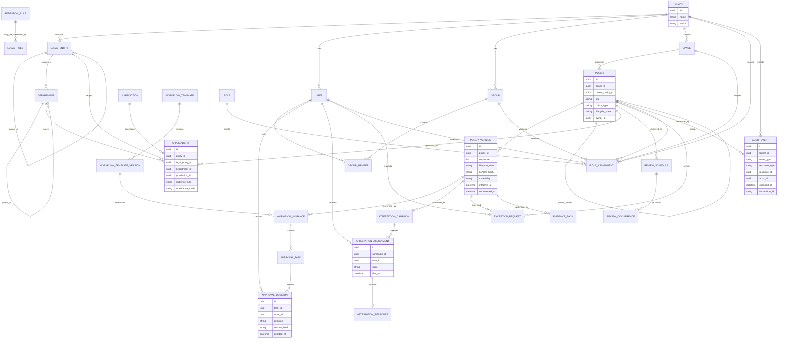
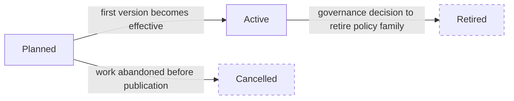
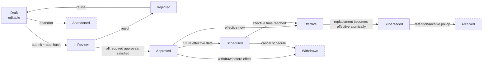
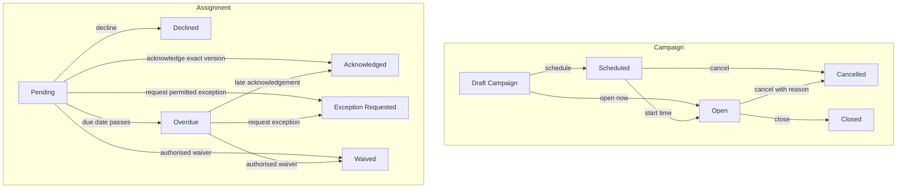
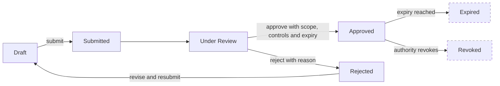
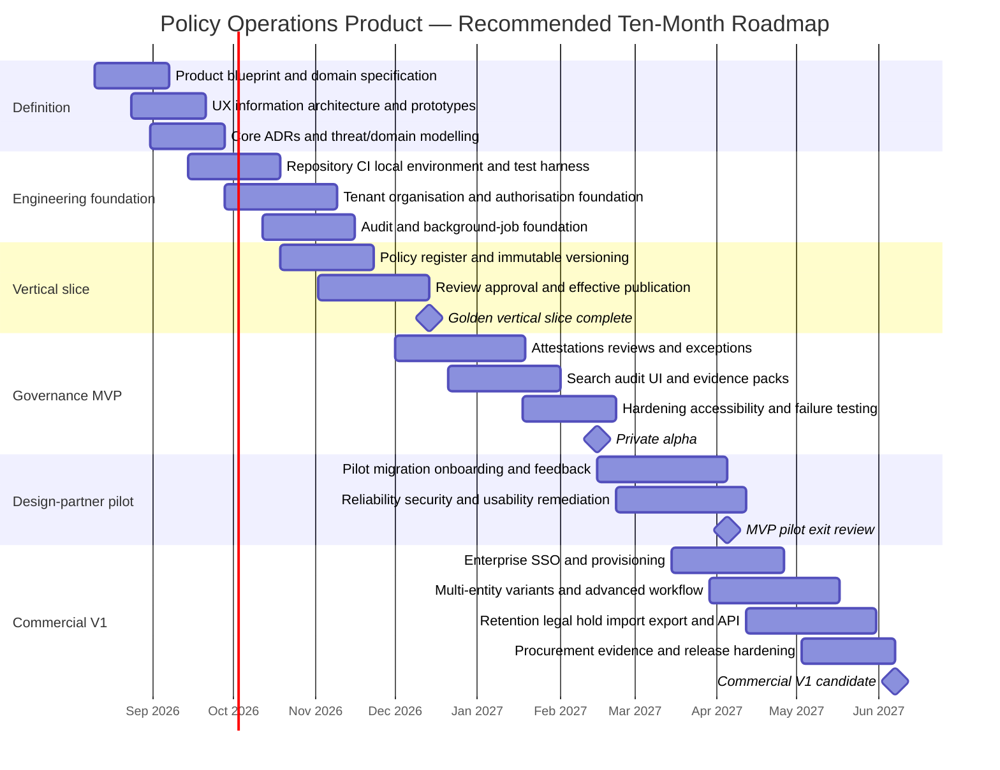

# Product and Domain Blueprint for a European Regulated-Market Policy Operations Platform

## Executive summary

The product should be designed as a **policy operations system of record**, not as a document repository with workflow bolted on. The central object is not a file or wiki page; it is a governed policy with stable identity, explicit applicability, immutable approved versions, accountable owners, configurable approval decisions, review obligations, reader attestations, exceptions, access rules, and evidence that can be reconstructed later. This advances the strategic thesis in the earlier project research, which identified controlled lifecycle, approvals, attestations, access grants, review cadence and regulator-ready evidence as the product’s real wedge. fileciteturn0file0

Current products validate most pieces of this model, but in different ways. Comala adds multi-step review, approval, expiry, e-signatures and lifecycle states to Confluence; NAVEX One Policy & Procedure Management, formerly PolicyTech, combines draft/review/approval/distribution/attestation with approval thresholds, multilingual parent/child workflows and, since late 2025/early 2026, AI-assisted summaries of policy changes; DocRead adds targeted reading, reminders, acknowledgements and audit reporting on top of Microsoft 365/SharePoint; OneTrust combines policy lifecycle management with a much broader controls, frameworks, risk and evidence platform. citeturn17search0turn16search0turn16search9turn16search1turn18search4

The recommended product deliberately sits between those categories:

> **More policy-native and evidence-oriented than Confluence/SharePoint extensions, substantially narrower and easier to operate than broad GRC suites, and unusually strong at European multi-entity, jurisdictional and regulated-company use cases.**

The most important design decision is to separate **`Policy` from `PolicyVersion`**. `Policy` is the enduring logical record: “Information Security Policy”. `PolicyVersion` is an exact, eventually immutable statement of the policy at a point in time. Approval, publication, attestation, exceptions and evidence must always resolve to an exact version, not merely the logical policy. NAVEX explicitly keeps the current version live while a new version is edited, and Comala customers similarly keep approved/published material visible while updated content returns through workflow; these are strong external validations of the pattern. citeturn16search9turn17search11

A second crucial distinction is between **policy validity and review health**. A policy becoming overdue for review should normally **not automatically cease to be the effective policy**. It should remain effective while becoming visibly overdue and triggering escalation. A compliance administrator can then record “reviewed; no change” or initiate a replacement version. Generic document-workflow products often use state expiry to return content into review, which is useful inspiration, but policy operations should avoid accidentally creating a period in which there is no governing policy merely because a recurring review was missed. Appfire’s current Comala model demonstrates the expiry/re-review pattern from which this distinction can be deliberately refined. citeturn17search0turn17search8

A third key decision is to treat **applicability, organisation and access as separate concepts**:

- Legal entities answer “which company is governed?”
- Departments answer “which organisational population is involved?”
- Jurisdictions answer “which legal/regulatory context applies?”
- Spaces answer “where is the policy administered and organised?”
- Applicability answers “to whom does the obligation apply?”
- Access control answers “who is allowed to see or administer it?”

A page hierarchy or folder must never implicitly determine legal applicability.

The proposed access model is **default-deny hybrid RBAC plus attributes/relationships**. Roles provide comprehensible capabilities; scoped relationships and attributes resolve legal entity, department, space, policy, user/group and jurisdiction. This follows the useful distinction in NIST’s role-based and attribute-based access-control models while avoiding an explosion of hundreds of bespoke roles. citeturn9search0turn9search4

The vertical slice that should define the MVP is:

**Create policy → create exact version → submit → review/approve → publish/effective → target readers → attest → review audit history → generate evidence pack.**

Everything else should reinforce that loop.

The MVP should contain organisational hierarchy, a policy register, exact version control, simple configurable approvals, effective-date handling, review schedules, attestations, policy exceptions, scoped access control, search, append-only application audit history, notifications and evidence packs. Enterprise SSO/provisioning, sophisticated multi-entity overrides, localisation, access-request workflows, retention/legal holds, APIs/webhooks and advanced workflow configuration belong in Commercial V1 unless an initial design partner makes one essential.

“Material change” must initially be a **controlled human classification**, aided by deterministic rules. A text-diff percentage cannot tell whether replacing “may” with “must”, changing a reporting deadline or changing an accountable role is materially significant. An author should classify the change as editorial/non-material/material with rationale; an approver should confirm it. Material change should normally trigger re-attestation. NAVEX’s 2026 change-summary feature demonstrates that AI can usefully explain diffs, but NAVEX itself describes human review of AI-created output; this supports treating AI as assistance rather than the authority that determines governance consequences. citeturn16search0turn16search10

The product should also be **fully useful without runtime LLM calls**. Because this project is being developed with subscription-based coding agents rather than a pay-per-request application AI budget, no MVP workflow should depend on an AI API. AI-assisted summarisation, semantic comparison or impact analysis can later be optional, with human confirmation and a provider abstraction rather than a core domain dependency.

European regulatory considerations reinforce this evidence-first architecture without dictating the detailed product workflow. GDPR Article 5 establishes storage limitation, integrity/confidentiality and accountability, including an obligation for controllers to be able to demonstrate compliance; processors also operate under Article 28 relationships. ISO/IEC 27001:2022 describes an information-security management system built around establishing, implementing, maintaining and continually improving security management; ISO/IEC 27002 provides control guidance including access control and incident response. NIST CSF 2.0 provides a governance-oriented cybersecurity outcome framework. None of these means that use of this product would itself make a customer “GDPR compliant” or “ISO compliant”. citeturn15search0turn15search11turn15search2turn15search10turn19search10

For financial-sector buyers, DORA has applied since 17 January 2025 and imposes operational-resilience and ICT third-party governance expectations on in-scope financial entities; its third-party regime includes registers of contractual ICT arrangements. NIS2 similarly raises governance, risk-management and management-accountability expectations across covered critical sectors. These regulations are therefore valuable **buyer-context and procurement-design inputs**, not claims that a policy-management product satisfies DORA or NIS2 by itself. citeturn6search0turn6search2turn7search0

The resulting product should optimise four observable customer outcomes:

**find the current applicable policy; prove exactly who approved it; prove who received/acknowledged it; and identify what governance work is overdue.**

If those four things become dramatically easier than in a wiki, SharePoint library or spreadsheet-driven process, the project has a strong product core.

## Market, users and product shape

**Competitive evidence and lessons**

The comparison below uses current vendor documentation as capability evidence. The “gap/opportunity” column is deliberately an inference about the proposed target market, rather than a claim made by the vendors themselves.

| Product | Current documented strengths | Gap/opportunity for this product | Design lesson |
|---|---|---|---|
| **Confluence + Comala Document Management** | Custom workflow states and transitions, multi-step approvals, page/space workflows, review cycles/expiry, audit logs, notifications and e-signature. Confluence itself has layered global/space/content permissions and audit logging. citeturn17search0turn10search0turn10search1turn0search0 | **Inference:** the primary domain remains governed Confluence content rather than an explicit legal-entity/applicability/attestation/evidence model. | Match the flexibility of reusable workflow templates, but make policy-specific concepts first-class rather than metadata conventions. |
| **OneTrust Tech Risk & Compliance** | Central policy access, audit-ready version control, customised development/approval workflows, attestations, exceptions and automated follow-up; sits alongside 50+ compliance frameworks, controls, risks and automated evidence collection. OneTrust also introduced a Policy Management document-version API in 2025. citeturn18search4turn18search1turn17search1 | **Inference:** its breadth is an advantage to large GRC programmes but creates room for a narrower policy-operations product for mid-market regulated firms. | Design clean future links between `Policy`, `Requirement`, `Control` and `Risk`, but do not build the entire GRC graph for the MVP. |
| **NAVEX One Policy & Procedure Management / PolicyTech** | Full draft-to-approval-to-sign-off lifecycle, custom workflows, current-version continuity during editing, N-of-M approval thresholds, single-policy permissions, attestations, overdue escalation and master/localised child documents. AI-assisted summaries compare updated versions. citeturn16search9turn16search3turn16search4turn16search6turn16search0 | **Inference:** NAVEX positions policy management as one component of an integrated GRC/compliance platform, leaving room for a more focused, modern EU mid-market implementation. citeturn16search7 | N-of-M approval, stable live version during revision, parent/variant linkage and rolled-up reporting are especially valuable patterns. |
| **DocRead** | Microsoft 365/SharePoint-native policy register, targeted distribution by role/department/location/group, automated reminders, acknowledgement tracking, quizzes, joiner assignment and audit-ready reporting. citeturn16search1 | **Inference:** its SharePoint-native approach is attractive to Microsoft-centric organisations but makes SharePoint part of the operating model. | Integrate deeply with customers’ identity/document ecosystems without allowing another platform’s folder/page model to become the product domain model. |

One important market signal is that these products repeatedly converge on **versioning + approval + targeted distribution + acknowledgement + proof**, even though their surrounding platforms differ. That convergence is stronger evidence for the proposed core than any single competitor feature list. citeturn17search0turn18search4turn16search0turn16search1

NAVEX is also a useful warning against assuming that “AI policy management” is itself differentiation. By February 2026 it was already marketing AI-generated summaries of new and changed policies, including additions, deletions and altered language. Therefore a future AI summary button is likely table stakes rather than a defensible architectural moat; governed history, applicability, evidence integrity and usability are the more durable foundation. citeturn16search0

**Buyer roles and personas**

The buying process is multi-party. The person feeling the operational pain is not necessarily the person who can approve procurement.

| Persona / buyer role | Principal concern | What they need from the product | Buying influence |
|---|---|---|---|
| **Head of Compliance / Chief Compliance Officer** | Control gaps, regulator/auditor evidence, ownership and ageing policy estate | Portfolio dashboard, accountable ownership, approvals, attestation status, exceptions, instant evidence | Usually economic buyer or executive sponsor |
| **Compliance Manager / Policy Programme Manager** | Day-to-day administration and chasing people | Fast policy creation, reusable workflows, reminders, bulk actions, overdue queues, clear status | Primary champion and power user |
| **Policy Owner / Business Owner** | Keeping one business policy correct without becoming a GRC expert | Simple authoring/revision experience, responsibilities, review reminders, meaningful diffs | Core contributor |
| **Legal / DPO / CISO / Risk approver** | Knowing exactly what they are approving and what changed | Sealed version, concise change summary, rationale, comments, approval history, conflict-of-interest controls | Required approver or veto role |
| **Employee / contractor / required reader** | Finding the policy that actually applies and completing mandatory actions quickly | Search, “my applicable policies”, clear current version, short summary, acknowledgement | High-volume end user |
| **IT / IAM administrator** | Provisioning, deprovisioning, SSO, groups and support burden | Standards-based identity, scoped admin, role/group mapping, diagnostics | Technical gatekeeper |
| **Internal audit / external assurance** | Verifiable historical evidence without operational write access | Read-only filtered evidence, exports, chronology, integrity metadata | Assurance user and procurement influencer |
| **Security / privacy / procurement reviewer** | Vendor risk, data processing, access, retention, exit and auditability | Security documentation, DPA posture, data-location model, audit controls, export/deletion capability | Procurement gatekeeper |

For many mid-market organisations the first two or three personas may be the same individual. The permissions model nevertheless should represent **responsibilities rather than job titles**, because the organisation may later separate them.

**Jobs to be done**

| Situation | Job to be done | Success condition |
|---|---|---|
| A policy changes | “Get the exact change through the right approvals without losing the currently valid version.” | New candidate is traceable, approved and atomically supersedes old version only when effective |
| A member of staff needs guidance | “Show me the policy that applies to me now.” | One authoritative result, with jurisdiction/entity context and no inaccessible content leakage |
| Compliance publishes a material update | “Make the right people acknowledge this exact version and chase outstanding responses.” | Deterministic audience, completion status, reminders and evidence |
| A review date approaches | “Tell the owner what needs review and escalate it if nothing happens.” | No missed review is invisible; no overdue review accidentally creates a policy vacuum |
| An auditor requests evidence | “Show what was effective, who approved it, who was expected to read it, what exceptions existed and what happened.” | Evidence produced in minutes, not assembled from several systems |
| An employee joins, moves or leaves | “Make their policy access and obligations reflect the new organisational state.” | Provisioning/deprovisioning changes are deterministic and traceable |
| A subsidiary needs a local variation | “Retain corporate control while permitting a justified local or jurisdictional difference.” | Master/variant lineage and conflict-resolution are visible |
| A sensitive document needs one-off access | “Grant only the necessary policy, for a defined purpose/time, without exposing the whole space.” | Least-privilege access and its approval/revocation are evidenced |

**Information architecture**

The application should expose two related experiences rather than giving every employee a compliance-administration console.

The **reader experience** should emphasise:

`Home / My actions → Find policies → My applicable policies → Recent changes → My attestations → My exceptions`

The **governance experience** should emphasise:

`Dashboard → Policies → Reviews → Attestations → Exceptions → Evidence & audit → Organisation → Administration`

“Policies” should expose register views such as current, drafts, awaiting approval, scheduled, superseded and retired. “Organisation” should contain legal entities, departments, users and groups. “Administration” should contain spaces, policy types, workflow templates, access roles, retention configuration, identity/integrations and notification rules.

The decisive IA principle is:

> **Spaces organise administration; applicability governs obligation; permissions govern visibility.**

A policy can reside in the Information Security space, be owned by the Security department, apply to all employees of three legal entities, have a Finnish jurisdictional variant, and be visible to an external auditor through a temporary policy-level grant. Those are independent relationships.

**Canonical glossary**

| Term | Recommended meaning |
|---|---|
| **Tenant** | Hard SaaS security and data-isolation boundary representing one customer organisation. |
| **Legal Entity** | A company, subsidiary, branch or other governed corporate entity within the tenant hierarchy. |
| **Department** | Organisational unit used for responsibility, audience and access resolution; separate from legal-entity identity. |
| **Space** | Administrative grouping for policies, ownership and default access; never the sole source of applicability. |
| **Policy** | Stable logical identity of a governed policy across revisions. |
| **Policy Version** | Exact revision of a Policy with content, metadata snapshot and lifecycle state. |
| **Effective Version** | Version that governs a resolved applicability scope at a particular instant. |
| **Variant** | Linked policy derived from a parent/master for jurisdiction, entity, language or local adaptation. |
| **Applicability** | Structured rule identifying where/to whom a policy governs. |
| **Policy Owner** | Accountable business owner for currency and review of a policy. |
| **Author** | User permitted to prepare or amend a draft. |
| **Reviewer** | Participant who evaluates content but may not provide final approval. |
| **Approver** | Participant whose recorded decision satisfies an approval requirement. |
| **Workflow Template** | Versioned definition of approval stages, task resolution and completion rules. |
| **Workflow Instance** | Frozen execution of a workflow against an exact Policy Version. |
| **Review Schedule** | Rule establishing when governance review must occur. |
| **Review Occurrence** | Historical instance of a completed, overdue or change-required review. |
| **Attestation Campaign** | Distribution operation binding an exact Policy Version to an audience and time window. |
| **Attestation Assignment** | One person’s obligation within a campaign. |
| **Attestation Response** | Evidence of acknowledgement, decline or another supported response to an exact version. |
| **Exception** | Formally requested and governed departure from a policy requirement. |
| **Access Rule** | Persistent rule granting or denying capability at a scope. |
| **Access Grant** | Resolved/direct entitlement, potentially time-limited. |
| **Audit Event** | Append-only record of a governance-relevant action or system transition. |
| **Evidence Pack** | Point-in-time export combining exact governed content and supporting evidence. |
| **Retention Rule** | Rule controlling when a record class becomes eligible for destruction/pseudonymisation. |
| **Legal Hold** | Authorised suspension of otherwise applicable destructive retention for defined records. |
| **Material Change** | Change requiring elevated governance consequences, normally including re-attestation. |
| **Supersede** | Transaction in which a new version becomes effective and the former version ceases to be current. |

This vocabulary should become code-level ubiquitous language: API names, database concepts, test descriptions and UI wording should use the same terms.

## Canonical domain and governance model

The model should favour **explicit relationships and immutable historical references** over convenient mutable fields.

A `Policy` owns many `PolicyVersion` records. Any evidence-critical action points to a version. A `PolicyVersion` can have workflow instances, approvals, attestation campaigns and review outcomes. Applicability is separately modelled. Organisation trees are not embedded in policy content. Access assignments point to scope and role. Variants remain linked to their parent policy rather than becoming unrelated copies.

**Canonical ER model**



The ER diagram deliberately omits implementation-specific persistence details. For example, a `ROLE_ASSIGNMENT` needs a polymorphic scope capable of pointing to tenant, legal entity, department, space or policy even though Mermaid cannot elegantly depict every polymorphic edge. That detail belongs in an ADR and physical data model.

**Policy lifecycle**

The logical policy lifecycle should remain simple.



A retired policy retains all historical versions, evidence, attestations and audit references. “Retired” does not mean deleted.

**Policy-version lifecycle**



`Draft` is mutable. Submission creates a sealed candidate with an exact content/attachment manifest hash. Approval decisions bind to that version ID and hash. A content-changing edit after submission must not silently preserve approvals: the candidate is returned to Draft or replaced by a new Draft revision and prior decisions become historically visible but invalid for publication.

`Approved`, `Scheduled`, `Effective` and `Superseded` content is immutable. Governance metadata can be divided into two categories: fields such as a typo in an internal administrative label may be mutable under audit; applicability, effective date, materiality, policy content and anything an approver relied upon require a new governed change or an explicit controlled correction procedure.

Keeping a valid currently effective version visible while its successor is being edited matches documented behaviour in NAVEX and controlled Confluence/Comala implementations. citeturn16search9turn17search11

**Attestation lifecycle**

Campaign state and individual assignment state should be distinct.



An acknowledgement is evidence that the user made the configured acknowledgement; it must not be marketed as proof that they genuinely understood the policy. DocRead’s optional quizzes and OneTrust’s discussion of knowledge checks illustrate that acknowledgement and understanding can be separate concepts. citeturn16search1turn17search16

**Exception lifecycle**



Risk-bearing exceptions should normally have an expiry or next-review date, accountable owner, rationale, affected requirement, scope and compensating controls. The product should never silently renew one.

**Access-control model**

The `Tenant` is a hard security boundary. A resource identifier from Tenant B presented to Tenant A must behave as absent or unauthorised regardless of any internal role. Tenant scoping should be enforced below the UI so that search, APIs, exports, background workers and eventual integrations inherit the same rule.

The recommended hierarchy is:

`Tenant → Legal entity → Department → Space → Policy`

but this should be understood as **access-scope inheritance**, not necessarily a physical content tree.

| Scope | Example | Recommended inheritance |
|---|---|---|
| Tenant | Compliance Admin | May inherit across all entities/spaces unless constrained |
| Legal entity | Estonian Entity Reader | Inherits to entity-owned departments/spaces/policies |
| Department | HR Author | Inherits to policies governed by HR within scope |
| Space | Security Space Manager | Inherits to policies in that space |
| Policy | External Auditor – ISO Policy | Only that policy and allowed historical evidence |
| Role | Approver | Capability set; only meaningful when attached to a scope |

Recommended roles are **Tenant Admin, Compliance Admin, Entity Admin, Space Manager, Policy Owner, Author, Reviewer, Approver, Reader and Auditor/Read-only**. Customer job titles should map to these capabilities rather than becoming hard-coded role names.

The conflict rules should be deterministic:

| Rule | Required behaviour |
|---|---|
| Default | Deny when no applicable grant exists. |
| Broader grant | Inherits to descendants unless constrained. |
| Explicit deny | Overrides inherited and direct grants. Use sparingly because denies become operationally difficult. |
| Narrower grant | Can add capability not inherited from parent scope. |
| Policy-specific read grant | May expose that policy without granting browse access to unrelated space content. |
| Hidden ancestor | The UI must not leak restricted space/policy names through breadcrumbs, counts, search snippets or errors. |
| Multiple roles | Permissions union, subject to explicit deny and separation-of-duties restrictions. |
| Temporary grant | Has `starts_at`, `expires_at`, reason and issuer; expiry is automatic and audited. |
| Approver capability | Does not automatically grant author capability. |
| Tenant admin | Administratively powerful, but sensitive break-glass/data-access actions should still be auditable. |

Atlassian’s own permission hierarchy distinguishes global/site, space and content controls, with permissions and restrictions resolved across layers. That is useful inspiration, but this product should provide an explicit policy-level evaluator rather than simply reproducing wiki semantics. citeturn10search0turn10search1turn10search6

**Multi-entity inheritance and variants**

A parent-company policy needs a predictable inheritance model:

| Mode | Meaning |
|---|---|
| `MANDATORY` | Descendant entities inherit it. A subsidiary cannot silently hide it; deviation requires an approved variant or exception. |
| `DEFAULT` | Descendant entities inherit it unless an approved local variant overrides it. |
| `LOCAL_ONLY` | Applies only to the specified entity/scope and does not propagate downward. |

Recommended resolution precedence for a user in an entity/jurisdiction is:

1. Exact legal entity + exact jurisdiction variant.
2. Exact legal entity generic variant.
3. Nearest ancestor entity + exact jurisdiction variant.
4. Nearest ancestor generic policy.
5. Tenant/global policy.

A tie at the same precedence is a **configuration error**, not a “pick one” situation. Publication should be blocked until the ambiguity is resolved.

A variant should be a first-class `Policy` linked through `parent_policy_id`, `variant_type` and origin metadata. It should **not** be continuously overwritten from the parent. When a parent version changes, linked variants move to an `UPSTREAM_CHANGE_REVIEW_REQUIRED` condition, allowing local owners to decide whether to adopt, merge or justify divergence. NAVEX’s current localisation model similarly retains linked master and local copies, local review/approval and roll-up reporting; the recommendation here makes the inheritance-resolution rules more explicit for a multi-entity SaaS domain. citeturn16search4turn16search5

A reader belonging to multiple organisational scopes should resolve to **one governing policy version for each policy family and regulatory context**. The resolver must either produce an unambiguous result or expose a configuration conflict. Duplicate attestation assignments for equivalent obligations should not be generated.

**Versioning and material change**

Each version should have both a monotonic internal sequence (`1`, `2`, `3`) and an optional customer-visible version label (`2.1`, `2027.01`, etc.). Business logic must use immutable IDs/sequences rather than parsing customer version strings.

A candidate’s hash should cover a canonical manifest containing:

- Canonical policy content.
- Governed attachments.
- Content-relevant metadata.
- Schema/version of the canonicalisation process.

The exact cryptographic algorithm is an implementation ADR; SHA-256 is a reasonable conventional candidate, but the critical requirement is deterministic canonicalisation.

The “effective version” should preferably be **derived from applicability and effective/superseded timestamps**, not maintained by a fragile mutable `is_current=true` flag. The superseding transaction must make the new version effective and close the old effective interval atomically.

For MVP materiality, require:

`EDITORIAL`, `NON_MATERIAL`, or `MATERIAL`

plus:

- Author rationale.
- Automatic deterministic warning rules.
- Approver confirmation.
- Optional compliance-admin override with reason.

Changes should be forced into or strongly flagged as `MATERIAL` when they alter mandatory obligations, accountable roles, affected population/entity/jurisdiction, control or process requirements, reporting deadlines, disciplinary implications, handling of sensitive information, or exception rules. Text-diff magnitude may inform the user but should never itself be the decision.

Default governance consequence:

`MATERIAL → re-attestation required`

`NON_MATERIAL → no re-attestation unless configured`

`EDITORIAL → no re-attestation`

A customer may override those defaults per policy type.

**Approval workflow semantics**

Workflow templates themselves must be versioned. When a workflow starts, the system stores both the template version and the resolved participants so that later group or template changes do not rewrite historical reality.

A template contains ordered **stages**. Stages execute serially; tasks inside a stage may run in parallel. Completion strategies should be:

`ALL`, `ANY`, or `N_OF_M`.

NAVEX currently advertises threshold approvals such as three of five reviewers, providing direct market validation for `N_OF_M`. citeturn16search9

Example:

```text
Stage: Business review
Completion: ALL
Tasks: Policy Owner, HR Lead

        ↓

Stage: Control review
Completion: 2_OF_3
Tasks: CISO, DPO, Risk

        ↓

Stage: Final approval
Completion: ALL
Tasks: Head of Compliance
```

The engine should support due dates, reminders, escalation, authorised reassignment and temporary delegation. **It should never automatically approve a policy because an SLA expired.** Escalation can notify a manager, create a replacement task or mark the workflow overdue.

A rejection should halt downstream stages. Any substantive content edit after decisions exist invalidates those decisions. Separation of duties should be configurable by policy class: for example, a “high-risk” policy can forbid the final approver from being the author.

## Evidence, audit and operational controls

**Review schedules**

A schedule should support:

- Fixed interval: e.g. every twelve months.
- Explicit next-review date.
- Policy-type default.
- Event-triggered review as a future extension.
- Reminder offsets, e.g. 30/14/7 days.
- Escalation after overdue.
- Named owner and optional secondary reviewer.

When a review is completed there are two principal outcomes:

`NO_CHANGE_REQUIRED` → create immutable `ReviewOccurrence`, capture reviewer/rationale, compute next date.

`CHANGE_REQUIRED` → create or link a new Draft `PolicyVersion`; existing Effective version remains effective.

When the due date passes:

`DUE → OVERDUE`

but the policy stays Effective unless the policy has a separate explicit validity/expiry date. This avoids conflating “governance control is late” with “the organisation has no current policy”.

The dashboard should distinguish:

`Due soon`, `Due`, `Overdue`, `Change in progress`, `Reviewed – no change`.

**Attestation campaigns**

A campaign binds an **exact version**, not “the latest policy”.

Required campaign attributes:

| Attribute | Purpose |
|---|---|
| Policy Version ID/hash | Proves what users acknowledged |
| Audience rule | Describes intended population |
| Resolved audience snapshot | Proves who was actually assigned |
| Start/due dates | Deadline semantics |
| Reminder schedule | Operational automation |
| Escalation rule | Overdue handling |
| Attestation statement/version | Proves what acknowledgement wording was presented |
| Campaign owner | Accountability |
| Status | Operational state |
| Material-change reason | Explains why reassignment occurred |

MVP should use a **snapshot audience**: when the campaign opens, eligible users become explicit assignments. That gives straightforward evidence.

Commercial V1 should add an audience mode for continuing obligations: for example, every new employee joining the “Payments Operations” department automatically receives the current mandatory policy. DocRead’s current “Smart Policy Assignment” for new users demonstrates buyer value in this joiner scenario. citeturn16search1

When someone leaves the organisation, their unfinished assignment is not physically deleted. It becomes something such as `CANCELLED_USER_DEACTIVATED`, retaining the evidence that the obligation once existed. Previously completed attestations remain historical records subject to retention rules.

When a material superseding version becomes effective, a configured rule may automatically generate a replacement campaign. It must not alter the old campaign or pretend earlier readers acknowledged the new text.

**Evidence packs**

Evidence packs should be generated asynchronously and become immutable point-in-time artefacts after successful creation.

A **policy evidence pack** should include:

| Content | Detail |
|---|---|
| Manifest | Pack ID, schema version, generation time, requester, tenant, policy/version IDs and checksums |
| Governed policy | Human-readable rendering and original/source attachment where applicable |
| Version history | Creation, change summary, materiality, predecessor/successor and hashes |
| Approval evidence | Workflow template version, resolved approvers, decisions, comments, timestamps and exact approved hash |
| Publication evidence | Published/effective time and superseding history |
| Applicability | Entity, department, jurisdiction, audience rules and variant lineage |
| Review history | Scheduled dates, overdue history and completed review outcomes |
| Attestations | Campaign metadata, audience snapshot and assignment/response results |
| Exceptions | In-scope active/historical exceptions and compensating controls |
| Access evidence | Applicable grant/rule history and key entitlement snapshots |
| Audit chronology | Relevant audit events ordered deterministically |
| Integrity material | File hashes plus manifest hash |
| Export event | Who requested/generated/downloaded the bundle |

A critical implementation warning is that “who had access on 14 February 2027?” cannot necessarily be reconstructed merely from today’s groups. Historical role/group changes must therefore be retained as events, and high-value milestones can additionally store effective-entitlement snapshots.

Recommended export container:

```text
evidence-pack.zip
├── manifest.json
├── policy.pdf
├── original/
│   └── ...
├── approvals.csv
├── attestations.csv
├── exceptions.csv
├── access-history.csv
├── reviews.csv
├── audit-events.jsonl
└── checksums.txt
```

The PDF serves humans; CSV serves auditors and spreadsheet analysis; JSON/JSONL preserves machine-readable evidence; original source files preserve fidelity. A later V1 can add PDF/A or signed/provenance manifests after a concrete customer or assurance requirement is established.

Generating, downloading and failing to generate an evidence pack are themselves audit events.

**Retention and legal hold**

There is no sensible universal “EU policy-record retention period” to hard-code. GDPR’s storage-limitation principle requires personal data not to be kept longer than necessary for the processing purpose, while accountability and other sector/legal obligations may justify preserving particular evidence. The customer, as controller in the normal SaaS scenario assumed here, therefore needs configurable retention by record class, with the platform enforcing its instructions rather than pretending one period is legally correct for every customer. citeturn15search0turn15search11

Recommended record classes are:

`POLICY_CONTENT`, `APPROVAL_EVIDENCE`, `ATTESTATION_EVIDENCE`, `EXCEPTION_EVIDENCE`, `BUSINESS_AUDIT`, `SECURITY_LOG`, `NOTIFICATION_DELIVERY`, `EVIDENCE_PACK`, `ACCESS_HISTORY`.

A legal hold contains:

`hold_id`, reason, authorising user, legal owner, start time, review/expiry time, scope selector and status.

The retention engine works as:

```text
Record becomes retention-eligible
        ↓
Is an active legal hold applicable?
        ├── No  → purge/pseudonymise according to rule
        └── Yes → mark eligible-but-held; do not destroy
```

Releasing the hold does not immediately delete records; it resumes normal eligibility evaluation. Hold creation, modification and release must be audited.

Where an employee identity may no longer need to remain directly identifiable, the model should permit **pseudonymisation of identity references without destroying governance chronology**, where legally and operationally appropriate. The exact handling requires customer-configurable policy and legal advice rather than a product-level claim.

**Audit-event catalogue**

Business-governance audit events and lower-level security/observability logs should remain conceptually distinct. Not every HTTP request belongs in the evidence ledger.

| Category | Canonical events |
|---|---|
| Identity/access | `USER_PROVISIONED`, `USER_UPDATED`, `USER_DEACTIVATED`, `GROUP_MEMBERSHIP_CHANGED`, `ROLE_ASSIGNED`, `ROLE_REVOKED`, `ACCESS_RULE_CREATED`, `ACCESS_RULE_UPDATED`, `ACCESS_RULE_REMOVED`, `ACCESS_GRANTED`, `ACCESS_REVOKED`, `ACCESS_EXPIRED`, `ACCESS_REQUESTED`, `ACCESS_REQUEST_APPROVED`, `ACCESS_REQUEST_DENIED` |
| Policy/version | `POLICY_CREATED`, `POLICY_METADATA_CHANGED`, `POLICY_RETIRED`, `VERSION_CREATED`, `VERSION_DRAFT_CHANGED`, `MATERIALITY_CLASSIFIED`, `VERSION_SUBMITTED`, `VERSION_REJECTED`, `VERSION_APPROVED`, `VERSION_SCHEDULED`, `VERSION_EFFECTIVE`, `VERSION_WITHDRAWN`, `VERSION_SUPERSEDED`, `VERSION_ARCHIVED` |
| Approval/workflow | `WORKFLOW_STARTED`, `APPROVAL_TASK_ASSIGNED`, `APPROVAL_DECIDED`, `APPROVAL_REASSIGNED`, `APPROVAL_DELEGATED`, `APPROVAL_ESCALATED`, `WORKFLOW_COMPLETED`, `WORKFLOW_CANCELLED` |
| Review | `REVIEW_DUE`, `REVIEW_REMINDER_SENT`, `REVIEW_OVERDUE`, `REVIEW_COMPLETED_NO_CHANGE`, `REVIEW_CHANGE_REQUIRED` |
| Attestation | `CAMPAIGN_CREATED`, `CAMPAIGN_OPENED`, `CAMPAIGN_CLOSED`, `CAMPAIGN_CANCELLED`, `ATTESTATION_ASSIGNED`, `ATTESTATION_REMINDER_SENT`, `ATTESTATION_ACKNOWLEDGED`, `ATTESTATION_DECLINED`, `ATTESTATION_OVERDUE`, `ATTESTATION_WAIVED` |
| Exception | `EXCEPTION_CREATED`, `EXCEPTION_SUBMITTED`, `EXCEPTION_APPROVED`, `EXCEPTION_REJECTED`, `EXCEPTION_REVOKED`, `EXCEPTION_EXPIRED` |
| Evidence/retention | `EVIDENCE_PACK_REQUESTED`, `EVIDENCE_PACK_GENERATED`, `EVIDENCE_PACK_FAILED`, `EVIDENCE_PACK_DOWNLOADED`, `EXPORT_STARTED`, `EXPORT_COMPLETED`, `LEGAL_HOLD_PLACED`, `LEGAL_HOLD_CHANGED`, `LEGAL_HOLD_RELEASED`, `RETENTION_PURGE_COMPLETED`, `RETENTION_PURGE_BLOCKED_BY_HOLD` |
| Administration | `WORKFLOW_TEMPLATE_PUBLISHED`, `RETENTION_RULE_CHANGED`, `POLICY_TYPE_CHANGED`, `TENANT_SETTING_CHANGED`, `INTEGRATION_CONFIG_CHANGED` |

Every evidence-critical event should carry at least:

```json
{
  "eventId": "uuid",
  "eventType": "VERSION_APPROVED",
  "schemaVersion": 1,
  "occurredAt": "2027-01-15T09:42:17.231Z",
  "recordedAt": "2027-01-15T09:42:17.245Z",
  "tenantId": "uuid",
  "actor": {
    "type": "USER",
    "id": "uuid"
  },
  "resource": {
    "type": "POLICY_VERSION",
    "id": "uuid",
    "version": 4
  },
  "outcome": "SUCCESS",
  "reasonCode": null,
  "correlationId": "uuid",
  "source": "WEB",
  "contentHash": "sha256:...",
  "metadata": {}
}
```

For delegation or administrative impersonation, both effective actor and originating/delegating actor must be retained.

Events should be **append-only through the application contract**. Corrections create compensating events; they do not edit historical events. “Append-only” alone should not be marketed as cryptographic immutability: stronger tamper-evidence may later use immutable storage, hash chaining, signed checkpoints or equivalent mechanisms.

Event retention should be controlled by the retention model rather than by one global number. NIST’s log-management guidance treats log management as a lifecycle encompassing generation, transmission, storage, access and disposal, reinforcing the need to define retention and access operationally rather than simply “log everything forever”. citeturn8search13turn8search10

**Failure modes and edge cases**

| Failure/edge case | Required behaviour |
|---|---|
| Two approvers act concurrently | Decision transaction is idempotent; threshold can complete exactly once. |
| Author edits after first approval | Existing approval cannot apply to changed bytes; return to Draft/new candidate and invalidate approval chain. |
| Scheduled version is withdrawn seconds before effective time | Scheduler checks authoritative state transactionally; withdrawn candidate never becomes effective. |
| Scheduler fires twice | Idempotent transition; exactly one `VERSION_EFFECTIVE` business event. |
| New version takes effect while old reader page is open | Subsequent navigation identifies new effective version; an attestation remains bound to the version originally shown. |
| Review is overdue | Policy remains effective; dashboard/escalation changes, not reader validity. |
| Approver leaves company mid-workflow | Task becomes unassignable/escalated and requires authorised reassignment; it never auto-approves. |
| User changes department during open campaign | Snapshot campaign retains original assignment; dynamic future campaigns recalculate according to explicit rules. |
| User belongs to two entities with contradictory variants | Resolver reports conflict and blocks ambiguous publishing/assignment. |
| Parent policy updates while local variant exists | Variant marked upstream-change-review-required; local content is never silently overwritten. |
| Exception is tied to superseded version | New version triggers revalidation; exception does not silently transfer unless its scope says policy-family and approver reconfirms. |
| Legal hold covers record due for deletion | Destruction blocked and event generated. |
| Evidence generation partly fails | No “complete” pack is exposed; job fails atomically or publishes manifest identifying incomplete status. |
| Search index is stale | Authorisation is enforced at result retrieval, not trusted solely to index filtering. |
| User guesses another tenant’s UUID | No data, existence, title or timing information leaks. |
| Notification provider sends twice | Delivery idempotency prevents duplicate governance transitions; duplicate email does not duplicate assignment. |
| Browser retry resubmits approval | Idempotency key/version precondition returns the original logical result. |
| Clock/time-zone change | Domain timestamps use UTC instants; display uses user/tenant zone; scheduled behaviour is tested across DST boundaries. |
| Current policy is deleted by admin | Physical destructive deletion is prohibited while governed records/evidence remain; lifecycle retirement is used instead. |
| Attestation campaign closes while reader submits | Server uses transaction/order rule; UI reports authoritative outcome rather than fabricating success. |

## Scope, acceptance criteria and success measures

**Prioritised scope**

`P0` means necessary to prove the product thesis. `P1` means Commercial V1. `P2` means later or customer-triggered.

| Capability | Priority | MVP | Commercial V1 | Rationale |
|---|---:|:---:|:---:|---|
| Tenant isolation and basic membership | P0 | ✓ | Enhanced | Fundamental security boundary |
| Legal entities and departments | P0 | ✓ | Enhanced | Required for applicability |
| Spaces and policy register | P0 | ✓ | ✓ | Core administration |
| Scoped RBAC/access rules | P0 | ✓ | Advanced | Sensitive-policy requirement |
| Policy + immutable versions | P0 | ✓ | ✓ | Fundamental domain invariant |
| Approval workflow | P0 | Simple serial/parallel | Full template engine | Proves governance loop |
| Effective dates/superseding | P0 | ✓ | ✓ | Establishes authoritative version |
| Review scheduling/overdue | P0 | ✓ | Enhanced escalation | Core compliance operation |
| Attestation campaign/assignment | P0 | ✓ | Dynamic audiences/quizzes | Core evidence |
| Exceptions | P0 | Basic | Advanced | Prevents off-system waiver spreadsheets |
| Search/filtering | P0 | ✓ | Advanced | Reader/administrator usability |
| Business audit trail | P0 | ✓ | Advanced export/SIEM | Evidence foundation |
| Evidence pack | P0 | Single-policy | Advanced bundles/signing | Primary differentiation |
| Notifications/reminders | P0 | Email/in-app basics | Rules/escalation | Reduces chasing |
| Dashboard/reporting | P0 | Operational | Advanced analytics | Shows governance health |
| Enterprise OIDC/SAML SSO | P1 | Optional design-partner need | ✓ | Enterprise procurement |
| SCIM users/groups | P1 | — | ✓ | Joiner/mover/leaver automation |
| Advanced multi-entity inheritance | P1 | Basic explicit applicability | ✓ | Cross-border commercial wedge |
| Linked jurisdiction/language variants | P1 | Basic parent link | ✓ | European differentiation |
| Temporary access/request approval | P1 | Direct admin grant | ✓ | Sensitive cross-functional access |
| Retention policies/legal hold UI | P1 | Data model/hooks | ✓ | Enterprise records governance |
| Bulk import/export | P1 | Minimal CSV/import helper | ✓ | Migration/exit |
| Public customer API/webhooks | P1 | Internal API design | ✓ | Integration |
| SIEM audit export | P1 | — | ✓ | Security buyers |
| Evidence manifest signatures | P2 | — | Optional | Stronger provenance |
| Policy-to-control/risk mapping | P2 | — | Optional starter | Future GRC adjacency |
| AI change summary | P2 | — | Optional | Competitive convenience, not core |
| AI materiality suggestion | P2 | — | Optional human-in-loop | Never authoritative |
| Regulatory-change intelligence | P2 | — | — | Separate later product capability |

For enterprise identity, OIDC is a standard identity layer over OAuth 2.0, while SCIM is a standard HTTP/JSON protocol intended to simplify cross-domain identity provisioning. They are therefore appropriate Commercial V1 interfaces rather than inventing bespoke Microsoft/Okta user-lifecycle APIs. citeturn13search0turn14search0

**MVP acceptance criteria**

These are intended to be testable requirements, not broad feature descriptions.

| MVP capability | Acceptance criteria |
|---|---|
| **Tenant and organisation** | A user authenticated to Tenant A cannot read or mutate a Tenant B resource through UI, API, search or guessed identifier. Legal-entity and department hierarchy can be created and queried. Deactivated users cannot initiate new governed actions; their historical decisions remain attributable. |
| **Spaces and policy register** | An authorised admin can create a policy with stable ID, title, type, owner, space and applicability. Register exposes lifecycle/current-version/review status. A policy can exist before its first effective version. |
| **Scoped access control** | Default deny applies. Broader grants inherit according to documented rules. An explicit policy-level direct read grant can expose one policy without exposing unrelated space content. An explicit deny overrides grants. Every rule change produces an audit event. |
| **Policy/versioning** | Draft content is editable. Submission seals an exact version/hash. Approved/effective content mutation is rejected. A new revision has a distinct version ID. Old versions remain retrievable to authorised governance users. |
| **Approval workflow** | Submission resolves required reviewers/approvers. Serial stage B cannot begin before stage A satisfies its completion rule. Parallel stages support required participants. Rejection halts workflow. A user without the resolved approval task cannot approve. Any substantive edit invalidates prior decisions. |
| **Publication/effective version** | A scheduled version is not returned as effective before `effective_at`. At the instant it becomes effective, the predecessor is superseded atomically. Reader view returns one unambiguous effective version for a resolved scope. Withdrawal prevents scheduled effectiveness. |
| **Review schedules** | A policy can receive next-review date and reminders. Due and overdue status appear in governance views. Overdue review does not remove the effective policy. “Reviewed, no change” creates an immutable occurrence and calculates the next date. “Change required” can start a draft. |
| **Attestations** | Campaign binds one exact version and snapshots its target audience. Each target gets one assignment per campaign. Acknowledgement records user, exact version/hash, statement version and timestamp. Missing assignments become overdue after due time. Late acknowledgement remains distinguishable from on-time acknowledgement. |
| **Exceptions** | Authorised requester can submit rationale, affected policy/version/scope and requested expiry. Only authorised approvers can decide. Approved exception records owner, scope, compensating controls and expiry. Expiry/revocation changes status without deleting history. |
| **Search/discovery** | Readers can search only policies they may access. Reader results default to applicable effective content. Governance users can explicitly include drafts/superseded versions according to permission. Filters include owner, entity, department, policy type, jurisdiction and review status. Restricted names/snippets do not leak. |
| **Audit trail** | Every P0 lifecycle transition creates one canonical business event with required schema fields. Events cannot be altered/deleted through normal application interfaces. Actor/resource/correlation filters work. Failed governed actions are represented where evidentially relevant. |
| **Evidence pack** | Authorised user can request a pack for an exact version. A successful pack includes manifest, policy rendering, version/approval/review/attestation/exception/audit information and checksums. Incomplete generation is marked failed, never complete. Generation and download are audited. |
| **Notifications** | Required reminder/escalation messages are queued from domain events. Retries do not create duplicate assignments or lifecycle transitions. Message failures are observable. Sensitive policy content is not unnecessarily embedded in email. |
| **Operational dashboard** | Compliance administrator can see counts/lists for awaiting approval, review due, review overdue, open campaigns, overdue attestations and active/expiring exceptions. Clicking each metric resolves to its underlying records with permissions enforced. |

**Recommended product success metrics**

These are proposed targets to validate with design partners, not external industry benchmarks.

| Metric | Initial target | Why it matters |
|---|---:|---|
| Time for ordinary reader to find correct current applicable policy | Median <30 seconds in usability test | Core reader outcome |
| Time from evidence-pack request to usable pack | Median <60 sec for ordinary policy; p95 <5 min for large pack | Core audit value |
| Published versions with complete owner/applicability/approval/effective-date/hash | 100% | Data integrity |
| Evidence-critical transitions producing expected audit event | 100% in automated contract tests | Evidential completeness |
| Cross-tenant authorisation negative tests | 100% passing, zero known leakage | Security invariant |
| Attestations completed by due date | ≥95% pilot target, then benchmark by customer | Operational adoption |
| High-priority policies overdue for review | <5% after stabilisation | Governance health |
| Approval-cycle improvement against customer baseline | ≥50% reduction target | Customer ROI |
| Manual audit-evidence preparation time | ≥70% reduction target | Primary business value |
| Time to first governed published policy after tenant setup | <1 working day | Activation |
| Time from employee deactivation to loss of future access | Minutes, then target near-real-time under SCIM | IAM integrity |
| Design-partner pilot to paid conversion | Track from first cohort | Commercial validation |
| Weekly active compliance administrators | Cohort trend, not vanity total | Product stickiness |
| Evidence-pack usage per audit/review period | Increasing with governed adoption | Proof that evidence feature is useful |

The technical metrics should complement rather than replace these product outcomes: authorisation failure rate, background-job age, notification-delivery success, audit-event lag, evidence-generation failure rate, search-index lag and scheduled-transition delay should all be observable.

## API, testing and delivery design

The API should be designed even if the first UI and server ship together. This prevents domain actions from becoming UI-specific controller code and gives coding agents explicit contracts to implement and test.

The tenant should be derived from authenticated security context wherever possible. A client-provided `tenantId` must never be trusted as authorisation.

All mutation endpoints should support optimistic concurrency and/or an idempotency mechanism. A stale write should result in a conflict rather than silently overwriting someone else’s governance decision.

**Minimal initial API surface**

| Stage | Endpoint | Purpose | Illustrative request |
|---|---|---|---|
| MVP | `POST /v1/policies` | Create logical policy | `{"title":"Information Security Policy","spaceId":"...","ownerId":"...","policyType":"SECURITY","applicability":[...]}` |
| MVP | `GET /v1/policies` | Register/search/filter | Query: `state`, `owner`, `entity`, `department`, `jurisdiction`, `reviewStatus` |
| MVP | `GET /v1/policies/{policyId}` | Policy summary and resolved current version | — |
| MVP | `POST /v1/policies/{policyId}/versions` | Create draft revision | `{"basedOnVersionId":"...","changeSummary":"...","materiality":"MATERIAL"}` |
| MVP | `PATCH /v1/policy-versions/{versionId}` | Update Draft only | `{"content":{...},"changeSummary":"..."}` plus `If-Match` |
| MVP | `POST /v1/policy-versions/{versionId}:submit` | Seal candidate/start workflow | `{"workflowTemplateVersionId":"..."}` |
| MVP | `POST /v1/approval-tasks/{taskId}:decide` | Approve/reject exact candidate | `{"decision":"APPROVE","comment":"Reviewed"}` |
| MVP | `POST /v1/policy-versions/{versionId}:schedule` | Set effective instant | `{"effectiveAt":"2027-01-01T00:00:00Z"}` |
| MVP | `POST /v1/policy-versions/{versionId}:withdraw` | Stop approved/scheduled candidate | `{"reason":"Legal requirements changed"}` |
| MVP | `GET /v1/policies/{policyId}/effective` | Resolve governing version | Query: `entityId`, `departmentId`, `jurisdiction` |
| MVP | `POST /v1/review-schedules` | Configure recurring review | `{"policyId":"...","interval":"P12M","nextReviewAt":"..."}` |
| MVP | `POST /v1/reviews/{reviewId}:complete` | Record review outcome | `{"outcome":"NO_CHANGE_REQUIRED","rationale":"..."}` |
| MVP | `POST /v1/attestation-campaigns` | Start/schedule campaign | `{"policyVersionId":"...","audience":{...},"dueAt":"...","statementVersion":"v1"}` |
| MVP | `GET /v1/me/attestations` | Current user’s obligations | — |
| MVP | `POST /v1/attestation-assignments/{id}:respond` | Record acknowledgement/decline | `{"response":"ACKNOWLEDGE","statementVersion":"v1"}` |
| MVP | `POST /v1/exceptions` | Request exception | `{"policyId":"...","policyVersionId":"...","scope":{...},"rationale":"...","requestedUntil":"..."}` |
| MVP | `POST /v1/exceptions/{id}:decide` | Approve/reject exception | `{"decision":"APPROVE","compensatingControls":["..."],"expiresAt":"..."}` |
| MVP | `GET /v1/audit-events` | Filter governance chronology | Query: `resourceType`, `resourceId`, `eventType`, `from`, `to` |
| MVP | `POST /v1/evidence-packs` | Generate evidence bundle | `{"policyVersionId":"...","includeAccessHistory":true}` |
| MVP | `GET /v1/evidence-packs/{id}` | Job/pack state and authorised download metadata | — |
| V1 | `POST /v1/access-requests` | Request temporary/special access | `{"policyId":"...","reason":"...","requestedUntil":"..."}` |
| V1 | `GET /v1/exports/...` | Durable customer export | — |
| V1 | `POST /v1/webhooks` | Register event subscriber | `{"events":["VERSION_EFFECTIVE"],"target":"..."}` |
| V1 | `/scim/v2/Users` | Standard user provisioning | SCIM 2.0 payload |
| V1 | `/scim/v2/Groups` | Standard group provisioning | SCIM 2.0 payload |

SCIM’s IETF protocol defines standard HTTP/JSON resources for cross-domain identity management, including users and resource modification operations, which is exactly the interoperability goal needed here. citeturn14search0

A typical successful policy-version response should make concurrency and evidence identity obvious:

```json
{
  "id": "pv_01...",
  "policyId": "pol_01...",
  "sequence": 4,
  "state": "IN_REVIEW",
  "contentHash": "sha256:abc...",
  "materiality": "MATERIAL",
  "changeSummary": "Updated incident notification duties",
  "submittedAt": "2027-01-15T09:40:00Z",
  "resourceVersion": 8
}
```

**Recommended ADR set**

| ADR | Decision to capture | Why it must be explicit |
|---|---|---|
| `ADR-001` | Logical `Policy` versus immutable `PolicyVersion` | Most important domain boundary |
| `ADR-002` | Tenant isolation enforcement | Prevent accidental UI-only tenancy |
| `ADR-003` | Hybrid RBAC/attribute/relationship authorisation and deny precedence | Avoid role explosion and ambiguity |
| `ADR-004` | Legal-entity inheritance and variant-resolution algorithm | Prevent contradictory policies |
| `ADR-005` | Workflow execution model | Decide app-native state machine vs external workflow infrastructure based on need |
| `ADR-006` | Approval participant snapshot/delegation semantics | Historical decisions must remain reproducible |
| `ADR-007` | Effective-time and supersede transaction | Guarantees exactly one governing version |
| `ADR-008` | Content canonicalisation and version hashing | Approvals/evidence depend on exact bytes/semantics |
| `ADR-009` | Audit event model, transaction/outbox strategy and tamper evidence | Avoid missing or double events |
| `ADR-010` | Attestation audience snapshot versus dynamic membership | Determines evidence semantics |
| `ADR-011` | Material-change classification and re-attestation policy | High-impact governance rule |
| `ADR-012` | Retention/legal-hold semantics | Data lifecycle and privacy |
| `ADR-013` | Evidence-pack schema, formats and integrity | Long-lived external contract |
| `ADR-014` | Search-authorisation strategy | Search is a common permission-leak boundary |
| `ADR-015` | Enterprise identity and break-glass approach | SSO/SCIM/local-account risk |
| `ADR-016` | API idempotency/concurrency conventions | Critical for workflow integrity |
| `ADR-017` | Notification idempotency and escalation | Background automation must be safe |
| `ADR-018` | Native editor versus file/Office-centric authoring | Major UX/storage choice |
| `ADR-019` | AI posture | Product operates without an LLM; future AI is advisory/human-in-loop |

These ADRs do not have to be lengthy. A professional ADR can be one or two pages: **Context → Decision → Alternatives → Consequences → Status**.

**Vertical-slice Playwright plan**

The main browser scenario should execute the whole customer promise rather than testing isolated pages:

```text
Compliance admin creates policy
        ↓
creates Draft v1
        ↓
submits for approval
        ↓
Reviewer/Approver sees exact candidate
        ↓
approves it
        ↓
version becomes Effective
        ↓
Reader can find correct policy
        ↓
Reader acknowledges exact version
        ↓
Compliance admin sees completed attestation
        ↓
opens audit chronology
        ↓
generates and downloads evidence pack
```

Recommended Playwright scenarios:

| Scenario | Principal assertions |
|---|---|
| **Golden vertical slice** | Exact version passes from Draft to Effective; reader sees it; attestation and evidence appear |
| **Rejection and revision** | Reject returns work for revision; old decision is retained but cannot approve changed content |
| **Two-tenant isolation** | Tenant A URLs/search/API-backed screens expose no Tenant B policy |
| **Department access** | In-scope reader sees policy; out-of-scope reader does not |
| **Direct policy grant** | Auditor sees granted policy but cannot enumerate restricted space |
| **Scheduled effectiveness** | Before boundary old version is current; after boundary new one is current |
| **Supersede + material change** | New version supersedes old and creates/requires appropriate re-attestation |
| **Non-material update** | No automatic re-attestation where policy configuration says none |
| **Review overdue** | Governance dashboard says overdue while reader still sees effective version |
| **Exception workflow** | Request → approval → visible compensating controls → expiry |
| **Attestation overdue** | Deadline transition and late acknowledgement recorded correctly |
| **Deactivated user** | Existing history remains; future protected actions fail |
| **Search leakage** | Restricted policy title/content absent from search, suggestions and counts |
| **Evidence pack** | Download reflects exact approved version and expected chronology |
| **Concurrent browser decisions** | Competing approvals/retries produce one authoritative state |
| **Time-zone/DST** | Scheduled dates render and trigger correctly for configured zones |

Playwright’s current guidance recommends testing user-visible behaviour, using resilient locators and web-first assertions, isolating tests, and using trace viewer for CI failures. It recommends traces on first retry rather than tracing every test because always-on tracing is resource intensive. citeturn19search0turn19search7

Authentication state used by Playwright can contain cookies or headers capable of impersonating test accounts, so `playwright/.auth` or its equivalent must be excluded from version control. Test accounts/contexts should be isolated, particularly for state-changing parallel tests. citeturn19search2

Traces and reports should also be treated as potentially sensitive CI artefacts because they may contain tokens, request payloads or application data. citeturn19search11

**CI gates**

For every pull request affecting the vertical slice, the blocking deterministic pipeline should conceptually be:

```text
Locked dependency install
        ↓
Formatting / lint
        ↓
Static typing / compilation
        ↓
Unit tests
        ↓
Domain state-machine tests
        ↓
Authorisation + tenant-isolation integration tests
        ↓
Database constraint / migration validation
        ↓
API contract tests
        ↓
Audit-event completeness / idempotency tests
        ↓
Production build
        ↓
Security and dependency checks
        ↓
Playwright Chromium vertical-slice smoke
        ↓
Preview deployment smoke
```

Particularly valuable non-browser tests are **transition-table tests** for every state machine, authorisation matrix tests, multi-entity resolution tests and concurrency tests around approval/superseding. Browser E2E should prove representative user outcomes rather than shoulder all domain verification.

Cross-browser Playwright testing can run on a nightly/release cadence initially, while Chromium runs on every PR, keeping subscription/CI spend sensible. This aligns with Playwright’s advice to run tests frequently and install only needed browsers in CI. citeturn19search0

Where the GitHub plan permits it, dependency review can block PRs introducing dependencies with known vulnerabilities, while code-scanning results can also participate in required merge checks. GitHub documents both capabilities, with plan-specific availability that should be checked before designing the project around them. citeturn20search3turn20search6

For releases, SBOM/build-provenance attestations are attractive later in the engineering maturity path. GitHub’s artifact-attestation system can establish how and where an artefact was built and can attest SBOM predicates, although private/internal repository availability is plan-dependent. citeturn20search10

The engineering security baseline should follow NIST SSDF principles. As of the current research, NIST labels SSDF 1.2 as an **Initial Public Draft** released in December 2025 rather than a final standard, so it should be monitored rather than inaccurately described as final. citeturn19search1turn19search4

**Agent and subscription-model implications**

AI agents should help produce the product; they should not become required runtime infrastructure.

The repository should therefore make deterministic artefacts the source of truth:

```text
Product/domain specification
        ↓
Issue with acceptance criteria
        ↓
Implementation agent
        ↓
Unit/integration/E2E tests
        ↓
Independent agent review
        ↓
Deterministic CI
        ↓
Merge
```

A Codex/Claude review may identify logic, security or maintainability issues, but **“AI reviewer approved” should not be a required production correctness signal**. A subscription-based coding agent may not be available headlessly on every CI run, can hit usage limits, and is inherently less deterministic than a compiler/test suite. The PR can receive agent review interactively or through subscription-supported integrations, while mergeability should depend on conventional repeatable checks.

Similarly, the runtime product should not require an LLM to determine materiality, resolve permissions, determine the effective policy, approve content, create audit evidence, calculate attestations or generate basic evidence packs. Those are deterministic domain operations.

## Roadmap, assumptions and open decisions

The following plan is deliberately approximately ten months. It prioritises the domain and one end-to-end slice before expanding the enterprise surface.



The overlap is intentional. Product work does not stop when coding starts, but architecture and scope should be sufficiently settled before agents are allowed to produce large amounts of implementation.

**Recommended release gates**

The **vertical-slice gate** is reached only when the complete create → approve → publish → attest → evidence flow runs through UI and tests.

The **private-alpha gate** additionally requires tenant-isolation tests, exception handling, review workflow, core audit completeness, authorised search and evidence-pack generation.

The **pilot gate** additionally requires operational monitoring, backup/restore rehearsal, migration tooling sufficient for a real customer, support procedures and documented known limitations.

The **Commercial V1 gate** additionally requires whichever enterprise identity, retention, multi-entity, privacy/security and procurement capabilities initial customers actually require. It should not be declared “enterprise ready” simply because SAML and a legal-hold button exist.

**Key assumptions**

| Assumption | Consequence if wrong |
|---|---|
| Target is B2B SaaS for regulated/semi-regulated European organisations rather than a consumer product | Tenant, procurement and audit architecture would need reassessment |
| Initial ICP is roughly mid-market organisations with formal compliance ownership | UX and packaging can optimise for one or a few compliance administrators rather than huge GRC departments |
| A customer tenant may contain several legal entities and jurisdictions | Multi-entity concepts belong in the domain from the start |
| Policy readers include employees and potentially contractors | Identity/audience model cannot assume a simple employee table |
| Customer personal data will be processed in the platform | GDPR processor/security/retention concerns are product requirements; controller/processor roles must be confirmed contractually. citeturn15search11turn15search0 |
| An attestation is an acknowledgement, not by default a qualified electronic signature | eIDAS-grade signature functionality is not an MVP requirement |
| The product will initially manage policies/procedures, not the entire GRC universe | Controls, risks and regulations can be future links instead of core MVP entities |
| Runtime AI is optional | Core state machines and evidence remain deterministic and low-cost |
| EU-regulated buyers value auditability, access governance and secure development | Security and governance are built alongside features, consistent with ISO/NIST guidance. citeturn15search6turn19search10turn19search4 |
| DORA/NIS2 are procurement context rather than product certification labels | Marketing must avoid claims that software usage alone satisfies those regimes. citeturn6search0turn7search0 |

**Unresolved decisions that should be closed before or during the first implementation phase**

| Decision | Recommended current hypothesis | When it must be resolved |
|---|---|---|
| **Native policy editor vs Office/file-centric editing** | Keep domain independent of authoring mechanism; prototype both | Before content storage implementation |
| **Canonical content representation** | Versioned canonical document manifest plus attachments | Before hashing/approval |
| **Department-to-entity relationship** | MVP department belongs to an entity or tenant root; design migration path for cross-entity functions | Before org schema freeze |
| **Can two versions be effective simultaneously?** | Only when applicability scopes differ and resolver proves no ambiguity | Before publish engine |
| **Variant as Policy or Version?** | Separate linked `Policy` family member | Before multi-entity schema |
| **Translation versus jurisdictional variant** | Both linked variants, but different semantic type and governance consequences | Before Commercial V1 localisation |
| **Policy IDs/numbers** | Immutable system ID plus optional customer-visible policy code | MVP |
| **External users/auditors** | Time-limited read-only grants or evidence export initially | Pilot |
| **Local username/password accounts** | Minimise; retain controlled break-glass/admin path if necessary | Enterprise identity phase |
| **SSO standards/provider order** | Standards-first OIDC/SAML; prioritise actual pilot IdP | Pilot |
| **SCIM group semantics** | IdP groups map to product groups/audience rules, not unrestricted roles by default | Commercial V1 |
| **Workflow engine technology** | Start with explicit domain state machines unless complexity demonstrates need for dedicated engine | Architecture phase |
| **Search technology** | Choose simplest solution satisfying authorisation and filtering; avoid search infra solely for résumé appearance | MVP |
| **Retention defaults** | Require documented record-class policy; do not claim one universal statutory period | Pilot |
| **Legal-hold authority** | Restrict to elevated compliance/legal roles, with two-person control considered for high-risk tenants | Commercial V1 |
| **Evidence-pack signing** | Hash manifest in MVP; signed/provenance package after customer requirement | V1/P2 |
| **Attestation knowledge test** | Out of MVP unless design partner requires it | Pilot feedback |
| **Exception applicability across superseding versions** | Revalidation by default | MVP |
| **Review-overdue behaviour** | Effective policy remains active; governance status goes overdue | Lock before MVP |
| **Materiality authority** | Author proposes, approver/compliance confirms | Lock before MVP |
| **AI summarisation provider** | No dependency in MVP; provider abstraction only if later introduced | Post-MVP |
| **Data residency topology** | EU-first commercial hypothesis, exact region/provider after architecture/cost study | Before pilot |
| **Public policy links** | Separate controlled publication capability rather than weakening normal access model | Commercial V1 |

The most important of these to resolve first are **authoring/canonical content, organisational structure, access precedence, version/effective semantics, workflow execution and audit transactionality**. Those decisions affect the entire model; details such as AI summaries or dashboard cosmetics do not.

The attached strategic research was directionally correct that specialised policy products monetise control, traceability and proof rather than simple storage. fileciteturn0file0 The deeper product model developed here turns that thesis into a buildable system: a stable policy identity, exact immutable governed versions, explicit applicability, deterministic access and variant resolution, human-accountable approval/materiality decisions, separately modelled reviews and attestations, append-only evidence chronology, and point-in-time evidence packs.

That gives the project a clear architectural centre:

> **At any historical or present point, the system should be able to answer which policy version governed whom, why it was considered authoritative, who approved it, who was expected to act on it, what exceptions existed, and what evidence proves those facts.**

Everything in the MVP should make that statement more true; anything that does not can wait.